# Session 13 - Storage, HPA & Probes

This assignment covers Kubernetes storage (volumes, PersistentVolumes, PersistentVolumeClaims, StorageClasses), the Horizontal Pod Autoscaler, and liveness/readiness/startup probes. It ends with a mini project that combines all three.

## Prerequisites

All commands were run in **Windows PowerShell** against a **minikube** cluster (Kubernetes v1.37.0, StorageClass `standard` → `k8s.io/minikube-hostpath`) with the `metrics-server` addon enabled.

```powershell
minikube start
minikube addons enable metrics-server
```

Labs 01–05 ran in a dedicated `session-13` namespace. The mini project uses its own `production-webapp` namespace, and the context was switched back to `default` at the end.

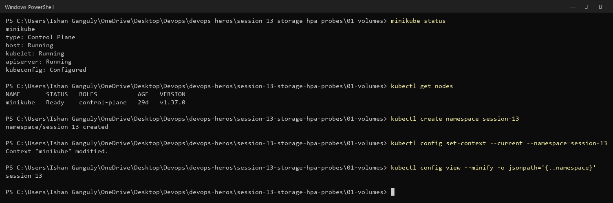

> The README uses `kubectl exec -it <pod> -- bash` and then types commands inside the container. Here the same commands run directly, as `kubectl exec <pod> -- sh -c '...'`, so that the input and output fit in one screenshot.

---

## 1. Volumes (`01-volumes`)

### emptyDir

The Pod creates an `emptyDir` at `/data`, and a file is written to it:

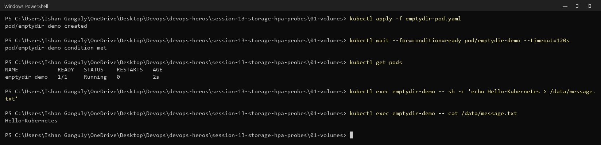

Next, only the **container** restarts, by killing PID 1. `RESTARTS` goes to 1, but the file is still there: an `emptyDir` lives as long as the **Pod**, not the container.

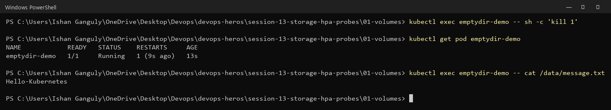

Deleting and recreating the **Pod** removes the data: `No such file or directory`.

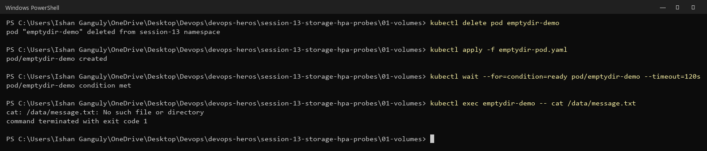

### hostPath

`hostPath` mounts `/tmp/hostpath-data` from the node. The file survives Pod deletion because it is stored on the node itself, and `minikube ssh` shows it there:

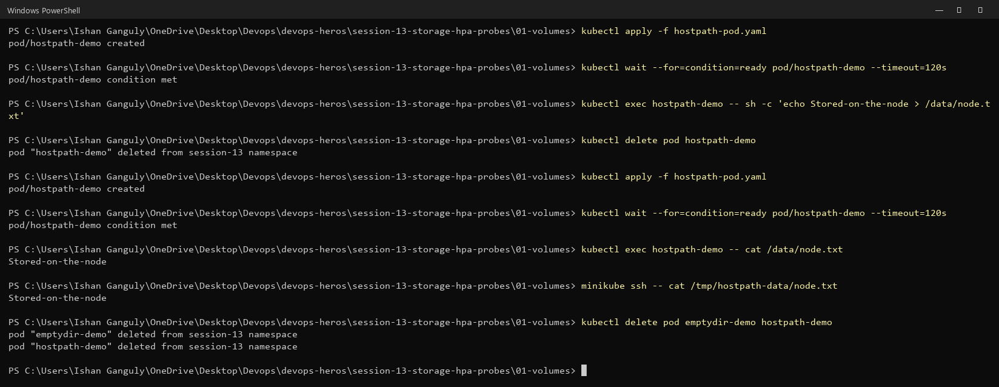

| Volume | Lifetime | Use |
| :--- | :--- | :--- |
| `emptyDir` | the Pod (survives container restarts) | scratch space, sharing files between containers in one Pod |
| `hostPath` | the node | learning/local testing, node agents. Tied to one node, so not for app data in production |

---

## 2. Persistent storage: PV + PVC (`02-persistent-storage`)

### What happened with the files as written

`student-pv` was created as `Available`, but `student-pvc` did **not** bind to it. It was bound to a new dynamically created volume, and `student-pv` stayed `Available`.

The reason: the PVC has no `storageClassName`, so minikube's **default StorageClass `standard`** is applied to it automatically. The PV has no class at all, and a PVC only binds to a PV with the same class.

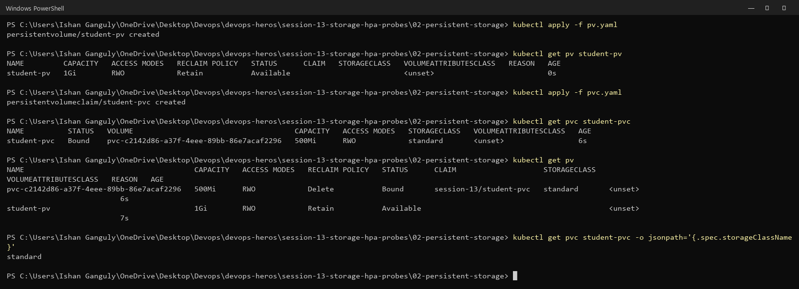

### Fix

Add `storageClassName: ""` to both [pv.yaml](02-persistent-storage/fixed/pv.yaml) and [pvc.yaml](02-persistent-storage/fixed/pvc.yaml); the original files are unchanged. An empty string means "no class, bind statically", and the PVC then binds to `student-pv`:

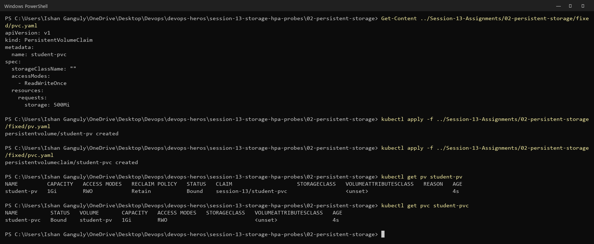

The PVC asked for 500Mi but shows **1Gi**: a claim gets the whole PV it binds to.

### Data survives Pod deletion

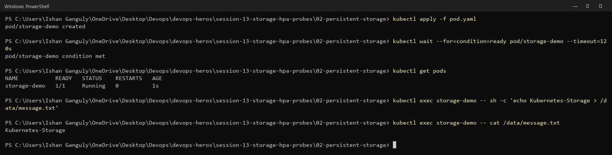

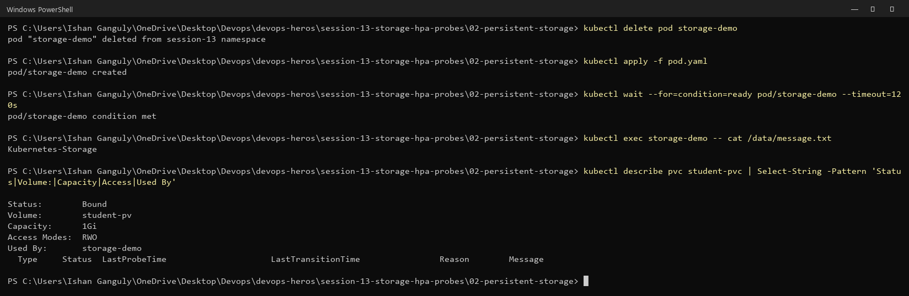

### Reclaim policy `Retain`

After the PVC was deleted, the PV moved to `Released` instead of being deleted, and the data was still on the node. An admin has to clean it up or reuse it by hand.

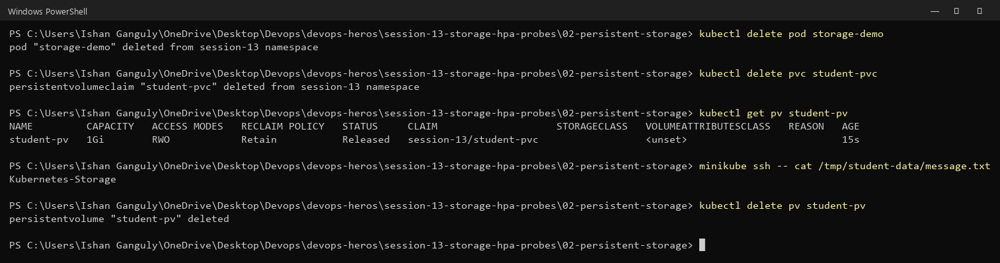

| Access mode | Code | Meaning |
| :--- | :--- | :--- |
| ReadWriteOnce | RWO | read/write by one node |
| ReadOnlyMany | ROX | read-only by many nodes |
| ReadWriteMany | RWX | read/write by many nodes |
| ReadWriteOncePod | RWOP | read/write by a single Pod |

**PV** = the storage, **PVC** = a request for storage, **Pod** = uses the PVC.

---

## 3. StorageClass (`03-storageclass`)

`standard` is the default class: provisioner `k8s.io/minikube-hostpath`, `ReclaimPolicy: Delete`, `VolumeBindingMode: Immediate`.

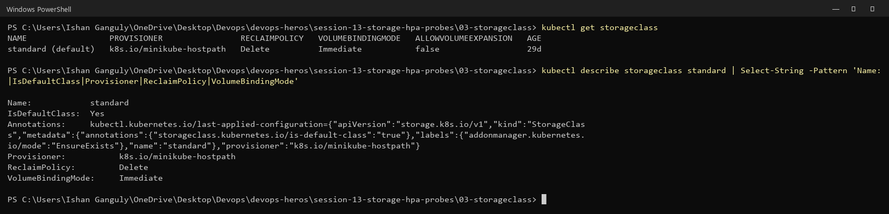

`dynamic-pvc` was `Bound` within seconds to a PV named `pvc-<uid>` that nobody created by hand. Because the reclaim policy is **Delete**, deleting the PVC removed the PV as well.

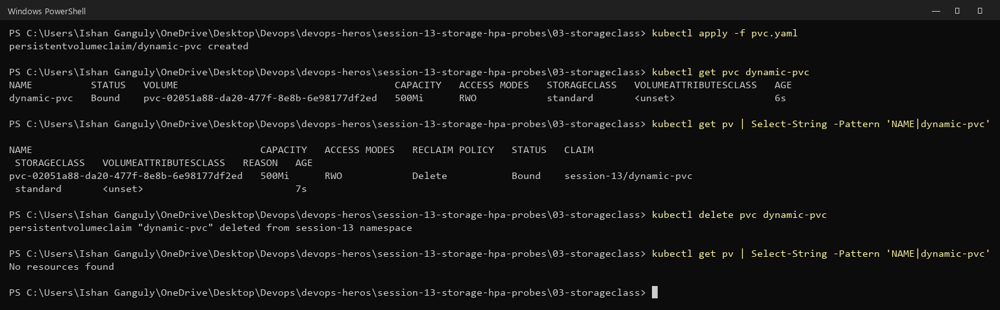

```text
PVC → StorageClass → Provisioner → PV (created automatically)
```

---

## 4. HPA (`04-hpa`)

The Deployment (nginx, `requests.cpu: 100m`, `limits.cpu: 200m`) and its Service:

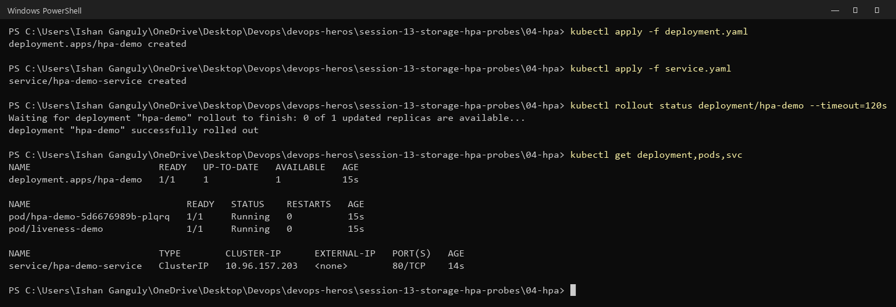

metrics-server is running, so `kubectl top` works:

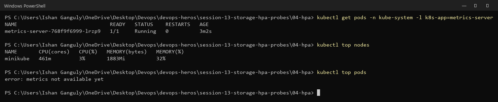

The HPA targets 50% CPU, with min 1 and max 5 replicas. The target shows `<unknown>` until the first metrics arrive, then `0%/50%`.

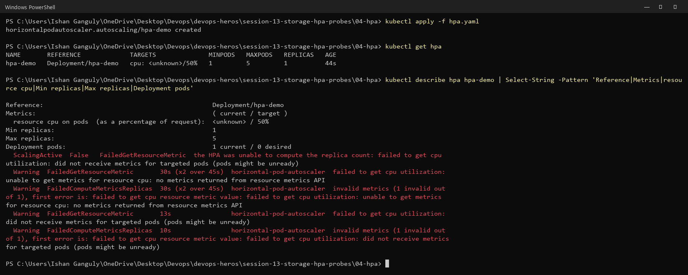

The load generator from the README:

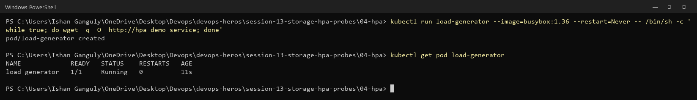

Samples every 30 seconds: CPU rose to **81%/50%** and the HPA scaled **1 → 2**. With 2 Pods, average CPU fell to about 50% and then 34%, which is at or under the target, so it did not add more.

```text
desired = ceil(1 × 81 / 50) = 2
```

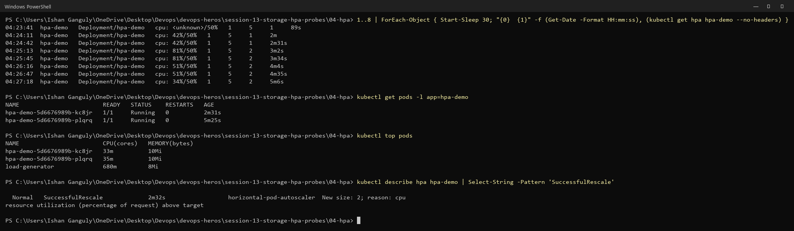

After the load generator was deleted, CPU dropped to 0%. After the ~5 minute scale-down stabilisation window, the HPA went back to **1** (`New size: 1; reason: All metrics below target`):

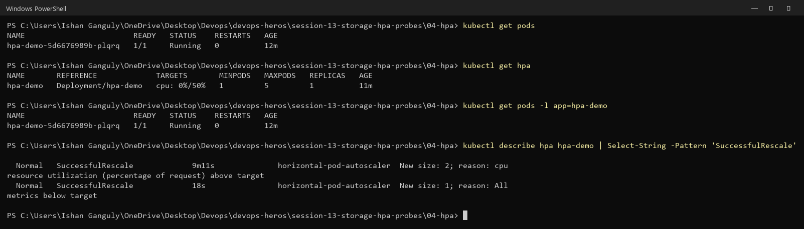

| Field | Meaning |
| :--- | :--- |
| `scaleTargetRef` | which workload to scale (`Deployment/hpa-demo`) |
| `minReplicas` / `maxReplicas` | bounds (1 / 5) |
| `metrics` | what to watch: CPU at 50% of the **request** (`100m`), so 50m per Pod |

Without a CPU request, the HPA cannot calculate a utilisation percentage.

---

## 5. Probes (`05-probes`)

### Liveness

The liveness probe checks `GET /` on port 80 every 5s, with a 2s timeout and failure threshold 3. The Pod is Running with 0 restarts.

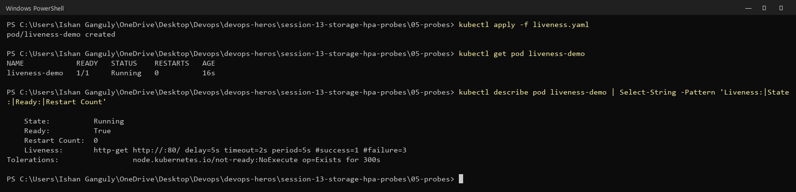

### Readiness + Service

The Pod becomes `1/1` and the Service gets its IP as an endpoint:

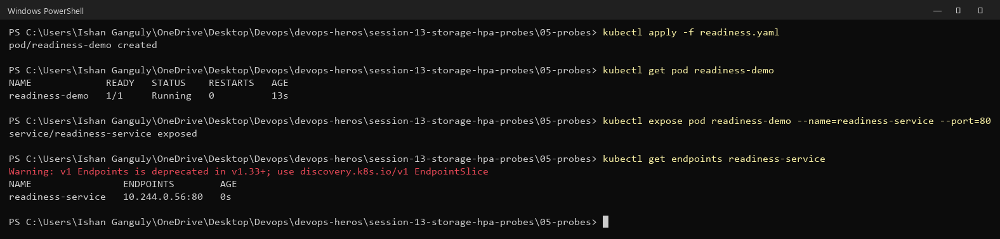

### Startup

The startup probe allows up to 30 × 2s = 60s to start. Liveness and readiness only begin after it passes.

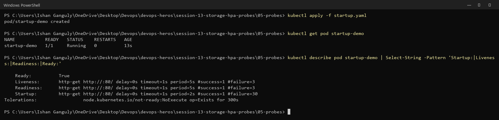

### Breaking readiness (`/wrong-path`)

`kubectl apply` on the running Pod was **rejected**: a Pod's probes cannot be changed after it is created (the "Forbidden: pod updates may not change fields" error). The Pod was deleted and recreated from the modified copy instead.

The result is `STATUS Running` but `READY 0/1`, **0 restarts**, and the Service has **no endpoints**: `Readiness probe failed: ... statuscode: 404`.

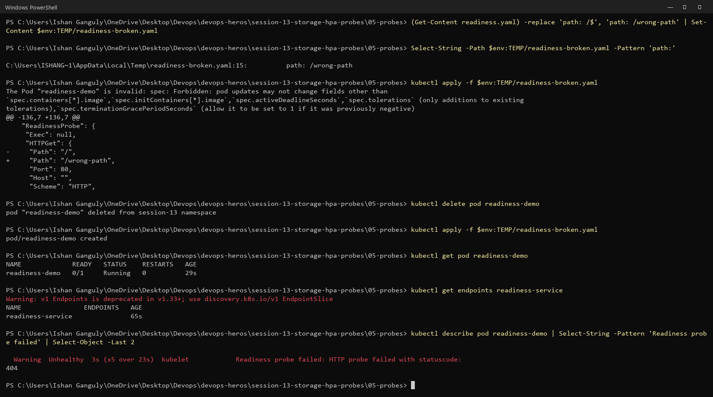

### Breaking liveness (`/wrong-path`)

Within 60s, the Pod had **3 restarts** (`Container nginx failed liveness probe, will be restarted`):

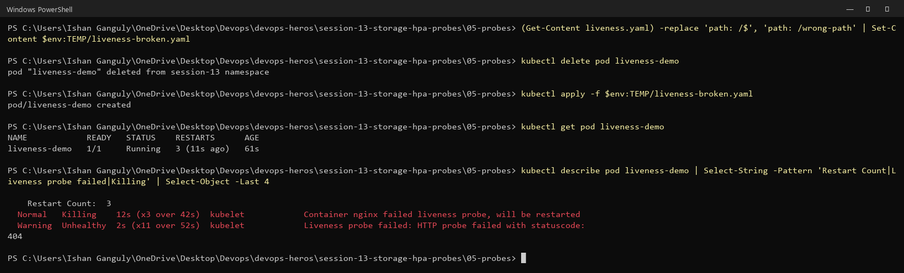

### Debugging

- Events show the `Unhealthy` and `Killing` reasons.
- The nginx logs show `kube-probe` requests to `/wrong-path` returning 404.
- Testing from inside the container confirms `/` → 200 and `/wrong-path` → 404, so the problem is the probe path, not the app.

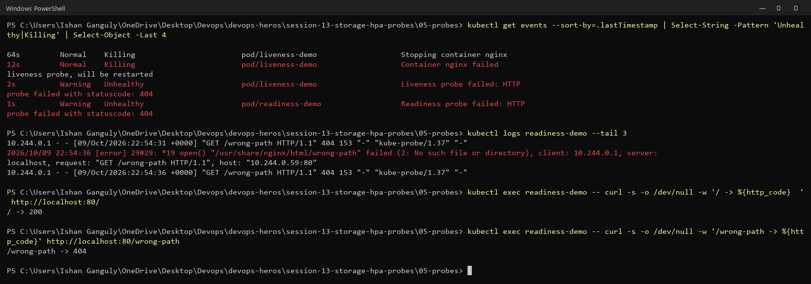

| Probe | Question | When it fails |
| :--- | :--- | :--- |
| Startup | Has the app started? | container restarted (other probes wait until it passes) |
| Readiness | Can it receive traffic? | Pod becomes `NotReady` and is removed from Service endpoints. **No restart** |
| Liveness | Is it still healthy? | container restarted |

---

## 6. Mini project (`mini-project`)

The mini project deploys these in the `production-webapp` namespace:

- a PVC (`web-data`, 500Mi RWO, dynamically provisioned);
- a Deployment with 2 replicas, all three probes, CPU/memory requests and limits, and `/data` mounted from the PVC;
- a ClusterIP Service;
- an HPA (2–5 replicas, 50% CPU).

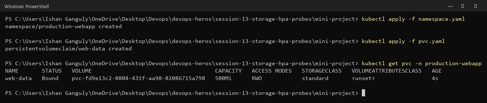

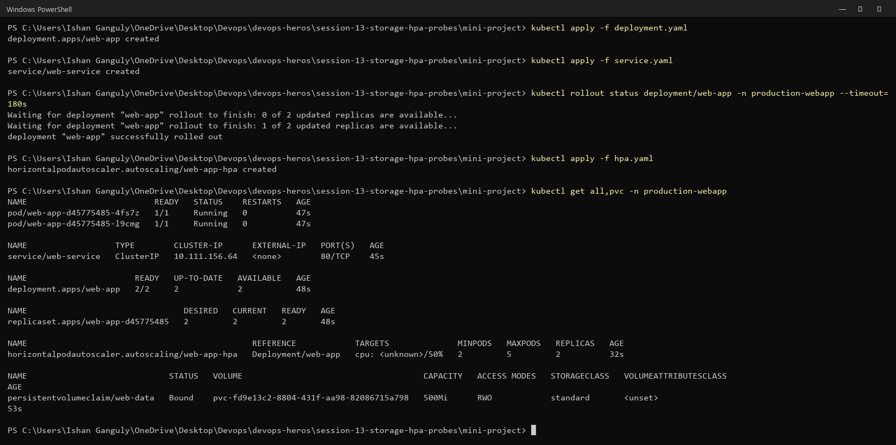

### Task 1: Storage persistence

`Student: Ishan Ganguly` was written to `/data/student.txt`, and that Pod was deleted. The replacement Pod reads the same file from the PVC.

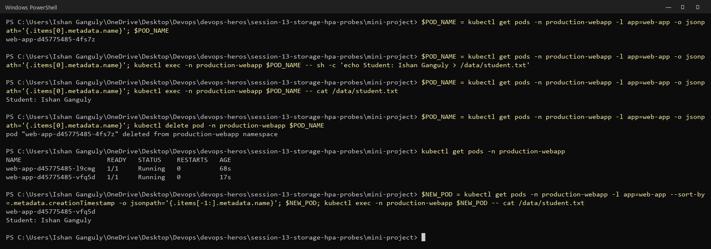

Both replicas share one ReadWriteOnce volume. That works on single-node minikube, because RWO is per **node**, not per Pod. This is also why the Deployment uses `strategy: Recreate`.

### Task 2: Service

The Service has both Pod IPs as endpoints and returns the nginx welcome page:

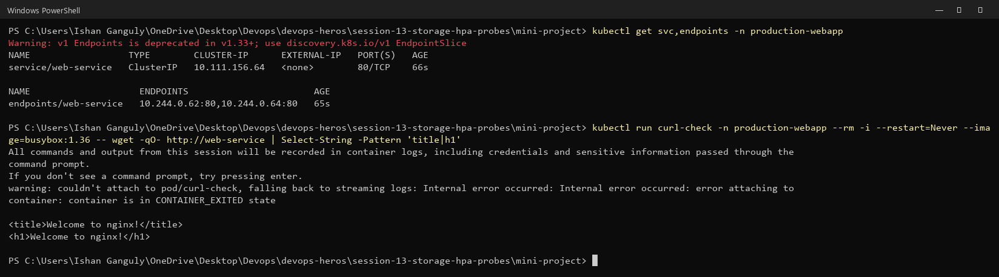

### Task 3: HPA under load

First, one load generator:

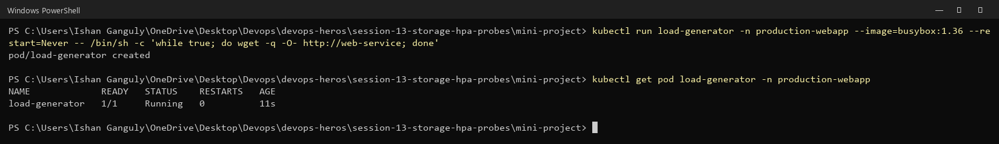

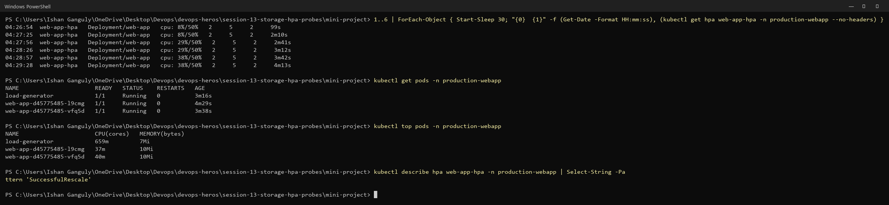

Then 6 load generators in total:

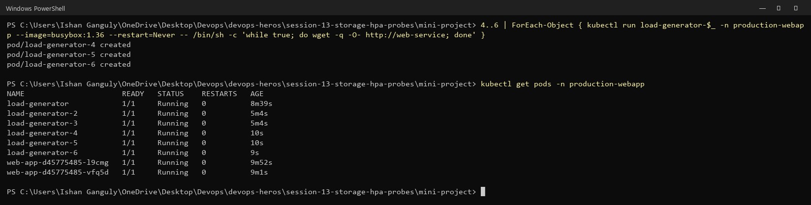

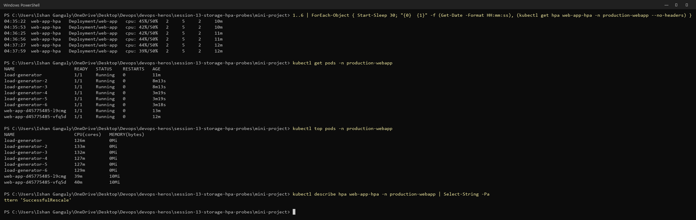

**Result: the HPA stayed at 2 replicas**, which is correct behaviour.

- CPU reached 39–48% against a **50%** target.
- Serving nginx's static welcome page costs very little CPU. Each web Pod used about 40m of its 100m request, while each busybox load generator used 125–250m on its own.
- The load spread across both replicas and never crossed 50%, so the HPA had no reason to scale.
- `kubectl describe hpa` shows no `SuccessfulRescale` event.

The `04-hpa` lab above shows actual scaling 1 → 2 → 1 with the same mechanism. Lowering the target (for example to 30%) or using a CPU-heavy endpoint would make the mini project scale too.

### Task 4: Probes

All three probes are configured on every replica, and both are `Ready: True`:

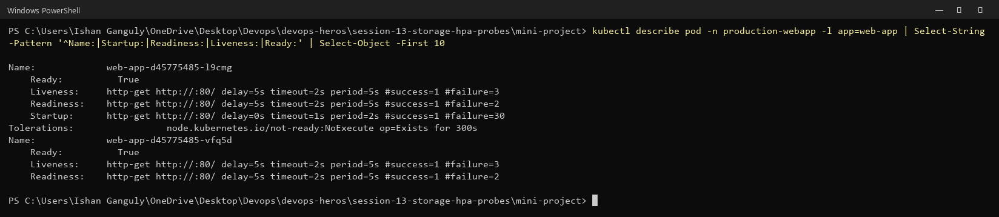

### Cleanup

The load generators and both namespaces were deleted, and the context was set back to `default`:

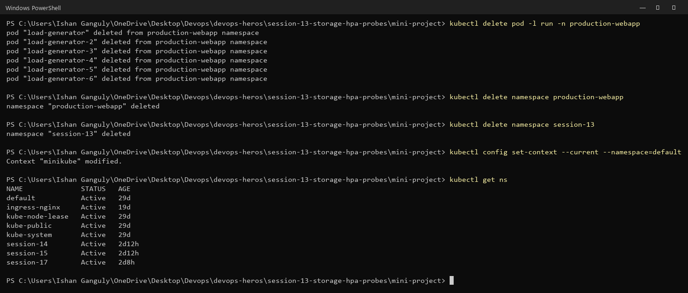

---

## Key learnings

- **emptyDir** survives container restarts but not Pod deletion. **hostPath** survives on one node. **PV/PVC** survive independently of Pods.
- **A PVC with no `storageClassName` gets the default StorageClass.** To bind it to a manually created PV, set `storageClassName: ""` on both.
- **Reclaim policy:** `Retain` keeps the PV and its data (`Released`) after the PVC is deleted. `Delete`, the usual default for dynamic classes, removes them.
- **HPA** needs metrics-server and CPU **requests**, and it scales on the *average* utilisation. Scale-up is quick; scale-down waits about 5 minutes. If the load never crosses the target, it correctly does nothing.
- **Readiness failure ≠ restart:** it only removes the Pod from Service endpoints. **Liveness** and **startup** failures restart the container.
- A Pod's probe configuration cannot be changed in place; the Pod must be recreated (a Deployment does this for you).
