# Session 14 - Kubernetes Troubleshooting

This assignment works through every Session 14 folder: the five core troubleshooting tools (`get`, `describe`, `logs`, `exec`, Events), the three common Pod failures (`CrashLoopBackOff`, `ImagePullBackOff`, `Pending`), Service and DNS debugging, and the final mini-project. Each broken workload was deployed to Minikube, diagnosed with the troubleshooting flow, fixed, and verified.

```text
GET → DESCRIBE → EVENTS → LOGS → EXEC → TEST → FIX → VERIFY
```

## Prerequisites

All commands were run in Git Bash from the `session-14-kubernetes-troubleshooting` folder. Because the `default` namespace already held resources from earlier sessions, a dedicated `session-14` namespace was created and set as the current namespace so the output stays clean:

```bash
minikube start
cd session-14-kubernetes-troubleshooting
kubectl config current-context
kubectl create namespace session-14
kubectl config set-context --current --namespace=session-14
kubectl get nodes
```

The expected context is `minikube`. The Kubernetes server version was `v1.37.0`.

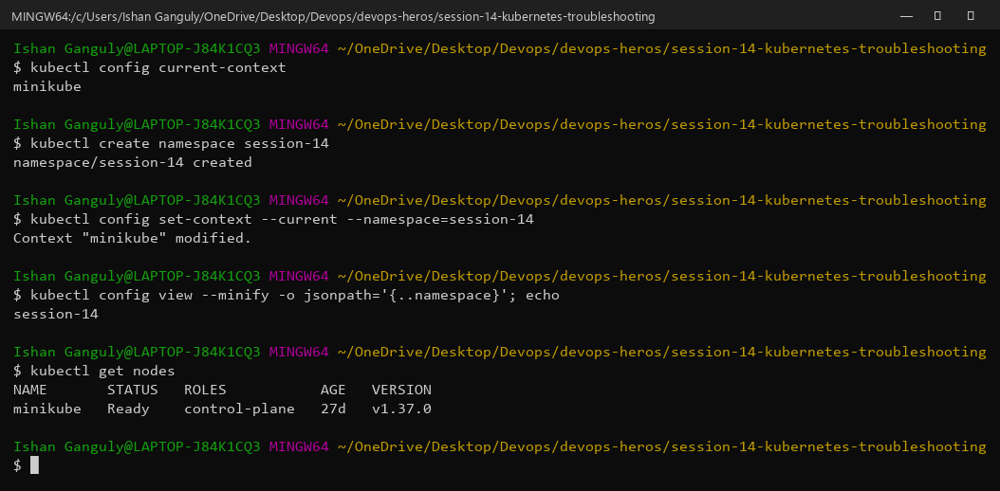

> Because of the namespace, the Service FQDN in this assignment is `web-service.session-14.svc.cluster.local` instead of `web-service.default.svc.cluster.local`.

## 1. kubectl get

`kubectl get` answers: **"What is happening?"** It shows the current state of resources.

```bash
kubectl apply -f 01-kubectl-get/pod.yaml
kubectl get pods
kubectl get pods -o wide
```

```text
NAME       READY   STATUS    RESTARTS   AGE   IP            NODE
get-demo   1/1     Running   0          2s    10.244.0.45   minikube
```

- **READY** – ready containers / total containers.
- **STATUS** – the Pod phase or container state.
- **RESTARTS** – a climbing number points to a crashing container.
- `-o wide` adds the Pod IP and the node.

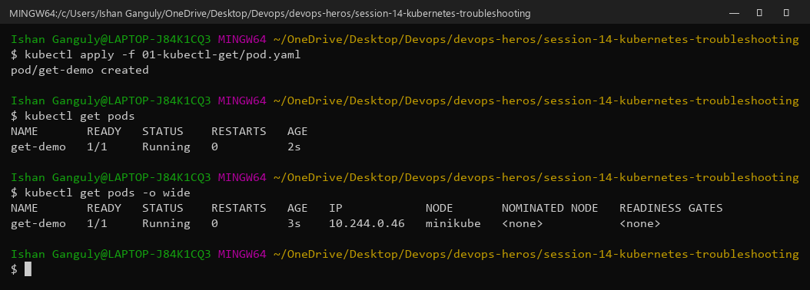

### Other resources

```bash
kubectl get services
kubectl get deployments
kubectl get nodes
kubectl get all
```

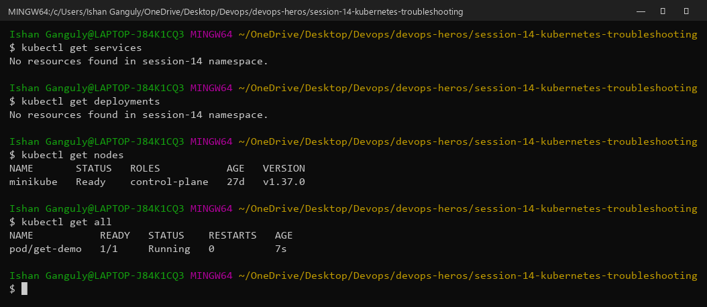

### Watch changes

`kubectl get pods -w` was left running in one terminal while the Pod was deleted from a second terminal. The watch streamed the transition `Running → Terminating → Completed`, and the Pod then disappeared.

```bash
kubectl get pods -w              # terminal 1
kubectl delete pod get-demo      # terminal 2
```

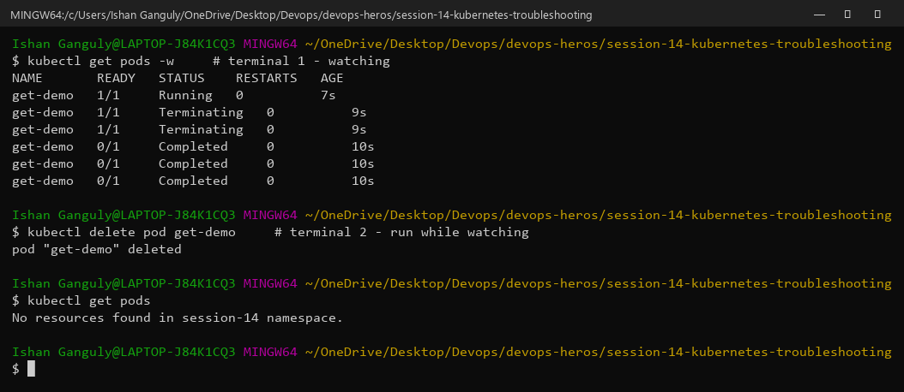

## 2. kubectl describe

`kubectl describe` answers: **"Why is it happening?"**

> The README refers to `pod.yaml`, but the file in this folder is named `demo-pod.yaml`.

```bash
kubectl apply -f 02-kubectl-describe/demo-pod.yaml
kubectl get pod
kubectl describe pod describe-demo
```

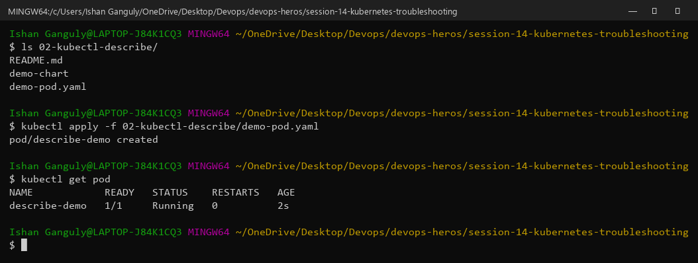

The important sections are **Status**, **IP**, **Containers** (image, `State: Running`, `Ready: True`), **Conditions**, and **Events** (`Scheduled → Pulled → Created → Started`).

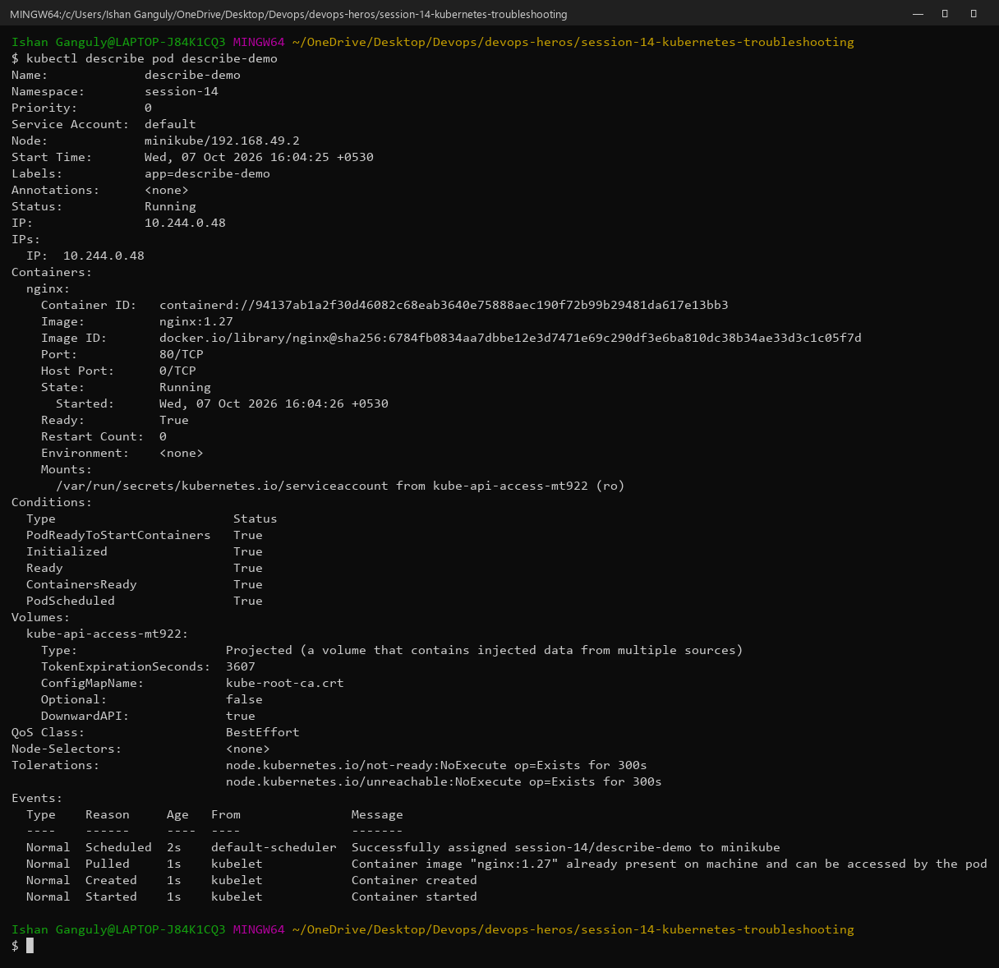

`describe` works for other resources too, for example the node:

```bash
kubectl describe node minikube
```

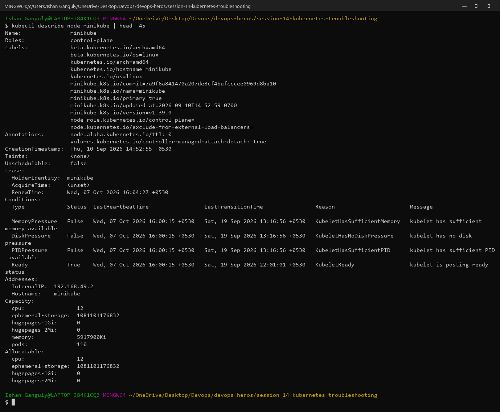

## 3. kubectl logs

`kubectl logs` answers: **"What is the application saying?"** It shows what the container wrote to stdout and stderr.

```bash
kubectl apply -f 03-kubectl-logs/pod.yaml
kubectl get pod logs-demo
kubectl logs logs-demo
```

```text
Application started
Connecting to database...
Database connection successful
Application is running
Application is healthy
Application is healthy
```

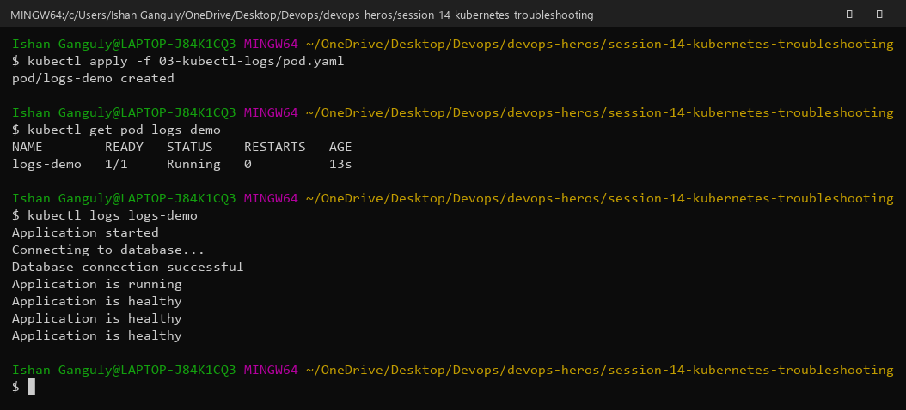

```bash
kubectl logs -f logs-demo            # follow; Ctrl+C to stop
kubectl logs logs-demo -c app        # pick a container
kubectl logs logs-demo --previous    # logs of the previous (crashed) container
```

`--previous` returns `previous terminated container "app" ... not found` here because this Pod has never restarted. It becomes useful in the CrashLoopBackOff task.

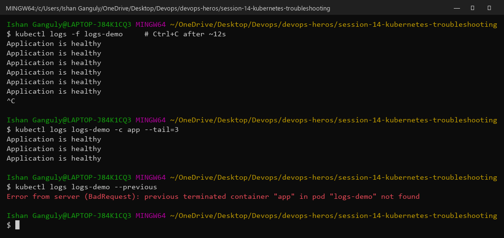

## 4. kubectl exec

`kubectl exec` answers: **"What can I see from inside the container?"**

```bash
kubectl apply -f 04-kubectl-exec/pod.yaml
kubectl get pod exec-demo
kubectl exec -it exec-demo -- bash
```

Inside the container:

```bash
ls
ls /usr/share/nginx/html     # 50x.html  index.html
curl localhost               # NGINX welcome page
nginx -T                     # NGINX config: listen 80, root /usr/share/nginx/html
exit
```

Because `curl localhost` works from inside the container, the application itself is healthy. If traffic still fails, the problem is in the Service, DNS, network, or port.

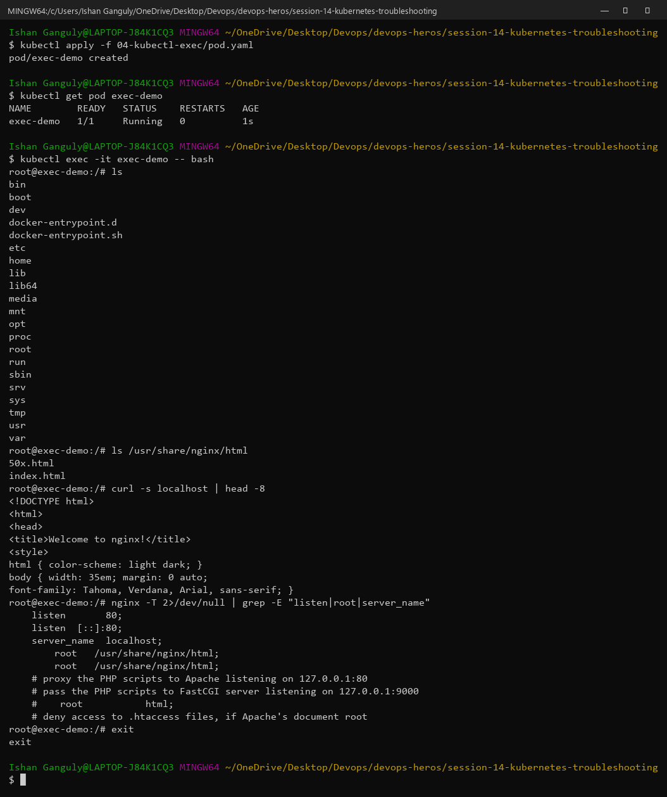

### Single commands without a shell

```bash
kubectl exec exec-demo -- hostname
kubectl exec exec-demo -- ls /usr/share/nginx/html
kubectl exec exec-demo -- ls
kubectl exec exec-demo -- cat /etc/hosts
```

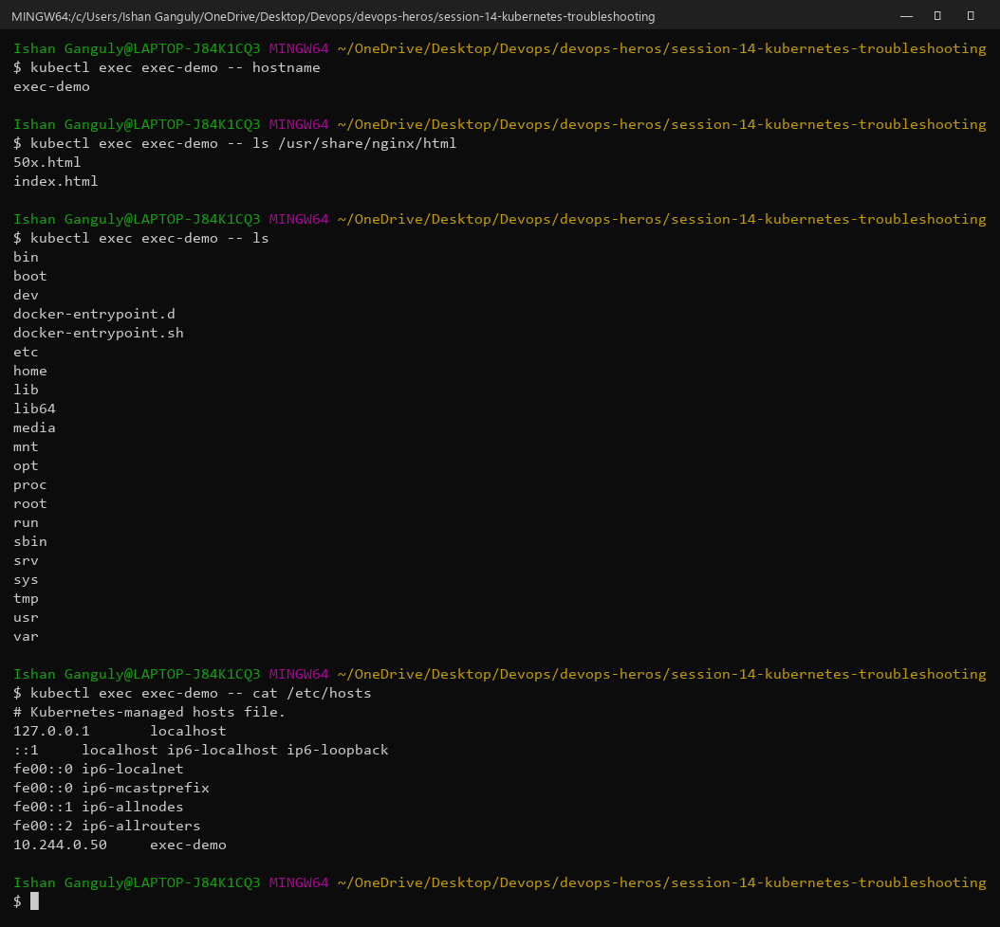

## 5. Events

Events are Kubernetes' activity log: **"What did Kubernetes try, and what happened?"**

```bash
kubectl apply -f 05-events/pod.yaml
kubectl get events --sort-by=.lastTimestamp
```

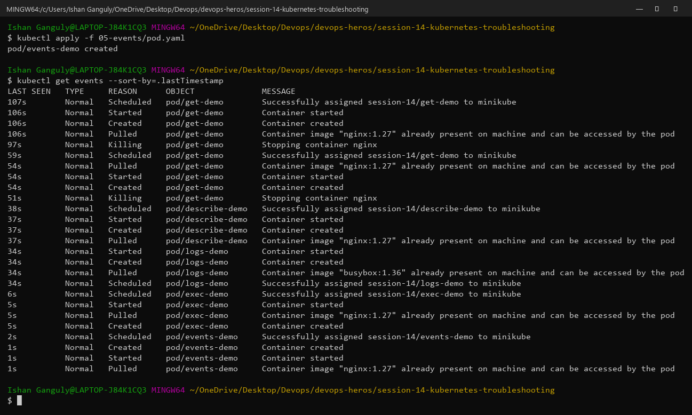

```bash
kubectl events --for pod/events-demo
kubectl describe pod events-demo            # Events section at the bottom
kubectl get events --field-selector type=Warning
```

A healthy Pod only has `Normal` events (`Scheduled`, `Pulled`, `Created`, `Started`), so the `type=Warning` filter returns nothing. During an incident, that filter cuts straight to the problems. Events expire after one hour by default.

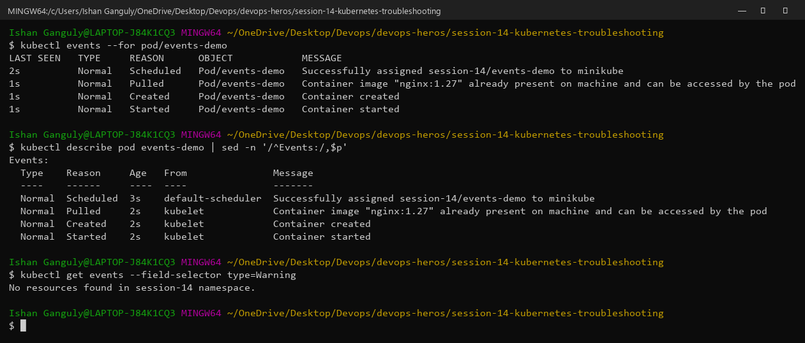

## 6. CrashLoopBackOff

### Observe

```bash
kubectl apply -f 06-crashloopbackoff/broken-pod.yaml
kubectl get pod crash-demo
```

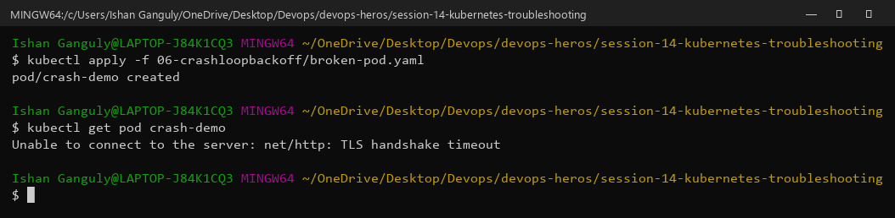

After a few minutes the Pod showed `CrashLoopBackOff` with 5 restarts.

### Describe

```bash
kubectl describe pod crash-demo
```

- `State: Waiting – Reason: CrashLoopBackOff`
- `Last State: Terminated – Reason: Error – Exit Code: 1`
- `Restart Count: 5`
- Event `Warning BackOff – Back-off restarting failed container app`

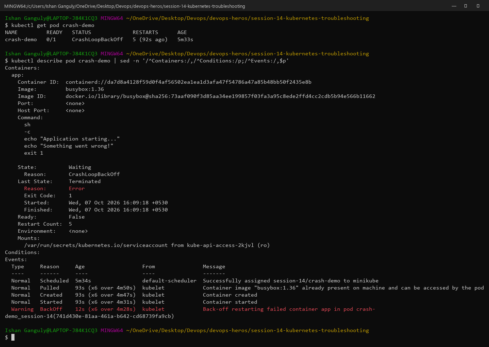

### Logs and root cause

```bash
kubectl logs crash-demo
kubectl logs crash-demo --previous
```

```text
Application starting...
Something went wrong!
```

The container command ends with `exit 1`, so the application exits with an error on every start, and Kubernetes keeps restarting it with an increasing back-off delay.

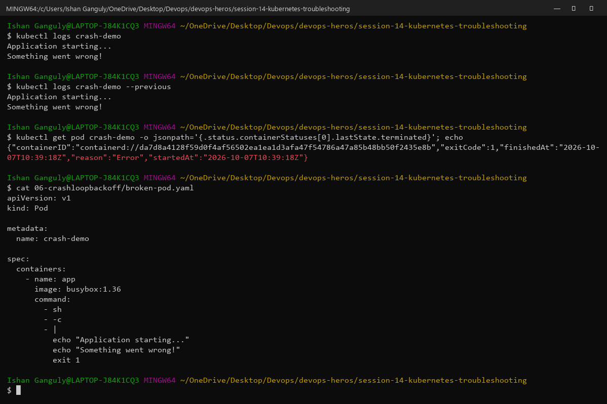

### Fix and verify

```bash
kubectl delete pod crash-demo
kubectl apply -f 06-crashloopbackoff/fixed-pod.yaml
kubectl get pod crash-demo
kubectl logs crash-demo
```

The fixed Pod replaces `exit 1` with a healthy message and `sleep 3600`. It is now `1/1 Running` and logs `Application is healthy`.

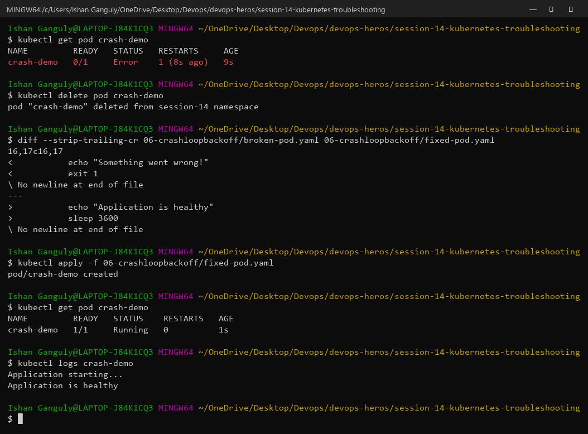

## 7. ImagePullBackOff

```bash
kubectl apply -f 07-imagepullbackoff/broken-pod.yaml
kubectl get pod image-demo
```

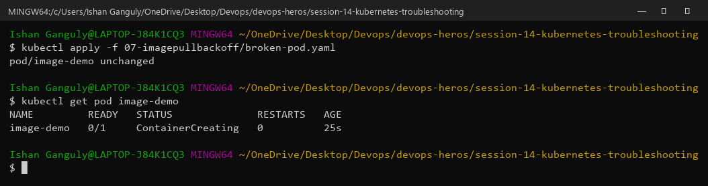

### Describe and read the Events

```bash
kubectl describe pod image-demo
```

```text
Warning  Failed   Failed to pull image "nginx:this-image-does-not-exist": ... not found
Warning  Failed   Error: ErrImagePull
Normal   BackOff  Back-off pulling image "nginx:this-image-does-not-exist"
Warning  Failed   Error: ImagePullBackOff
```

**Root cause:** the tag `this-image-does-not-exist` does not exist on Docker Hub. Kubernetes tries to pull it, fails with `ErrImagePull`, and then backs off (`ImagePullBackOff`).

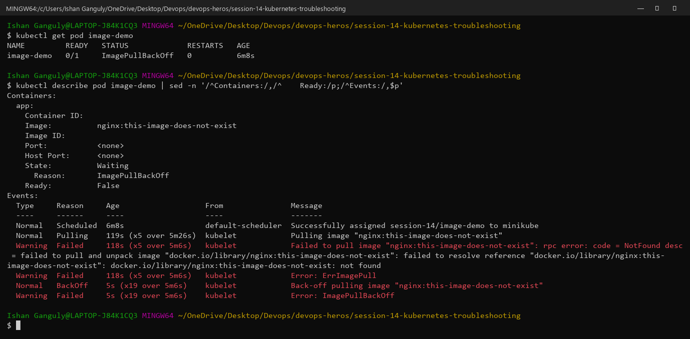

### Fix and verify

```bash
kubectl delete pod image-demo
kubectl apply -f 07-imagepullbackoff/fixed-pod.yaml    # image: nginx:1.27
kubectl get pod image-demo
```

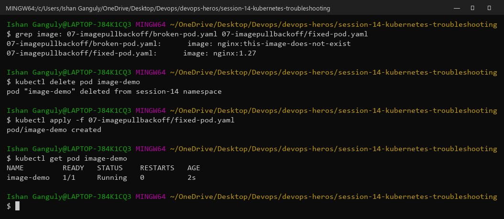

## 8. Pending Pods

```bash
kubectl apply -f 08-pending-pods/broken-pod.yaml
kubectl get pod pending-demo
```

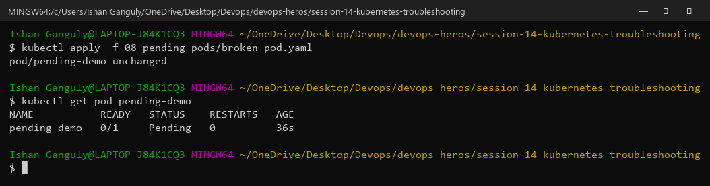

### Describe

```bash
kubectl get pod pending-demo -o wide
kubectl describe pod pending-demo
kubectl get nodes --show-labels
```

- `NODE: <none>` – the scheduler never placed the Pod.
- `PodScheduled: False`
- `Node-Selectors: kubernetes.io/hostname=node-that-does-not-exist`
- Event: `Warning FailedScheduling – 0/1 nodes are available: 1 node(s) didn't match Pod's node affinity/selector.`

The only node is labeled `kubernetes.io/hostname=minikube`, so no node matches the selector.

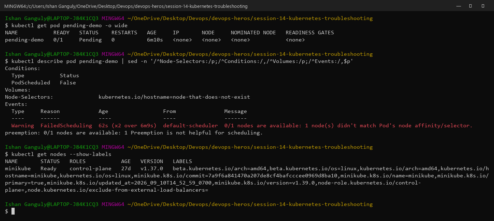

### Fix and verify

```bash
kubectl delete pod pending-demo
kubectl apply -f 08-pending-pods/fixed-pod.yaml     # nodeSelector removed
kubectl get pod pending-demo -o wide
```

The Pod is scheduled on `minikube` and is `Running`.

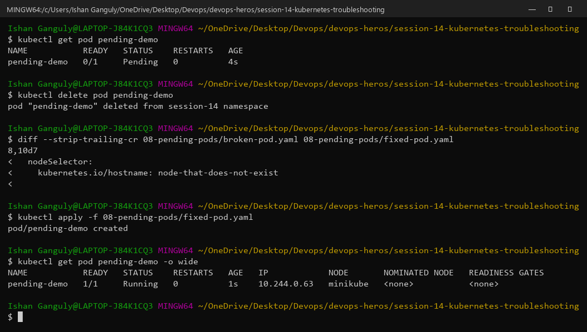

## 9. Service & DNS Troubleshooting

This task hit two real bugs in the provided files, which made it a genuine troubleshooting exercise:

| File | Bug | Fix (in this folder) |
| :--- | :--- | :--- |
| `service.yaml` | Selector `app: web-ahsgdf` does not match the Pod label `app=web`, so there are no endpoints | `09-service-dns-troubleshooting/service-fixed.yaml` (`app: web`) |
| `dns-test-pod.yaml` | Image `registry.k8s.io/e2e-test-images/dnsutils:1.3` does not exist | `09-service-dns-troubleshooting/dns-test-pod-fixed.yaml` (`jessie-dnsutils:1.3`, the image used in the Kubernetes DNS debugging docs) |

The original session files were left unchanged.

### Deployment

```bash
kubectl apply -f 09-service-dns-troubleshooting/deployment.yaml
kubectl get pods -l app=web -o wide
```

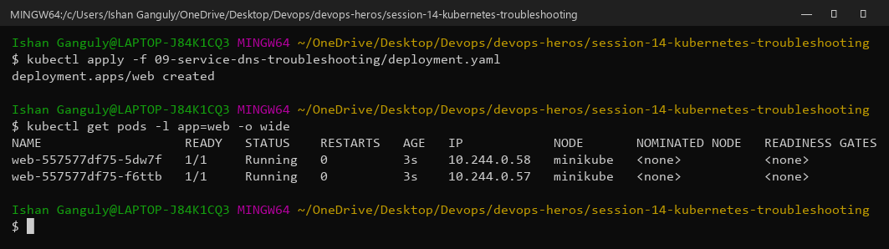

### Service with no endpoints

```bash
kubectl apply -f 09-service-dns-troubleshooting/service.yaml
kubectl get service web-service
kubectl describe service web-service
kubectl get endpoints web-service
```

The Service was created and has a ClusterIP, but `Endpoints` is empty.

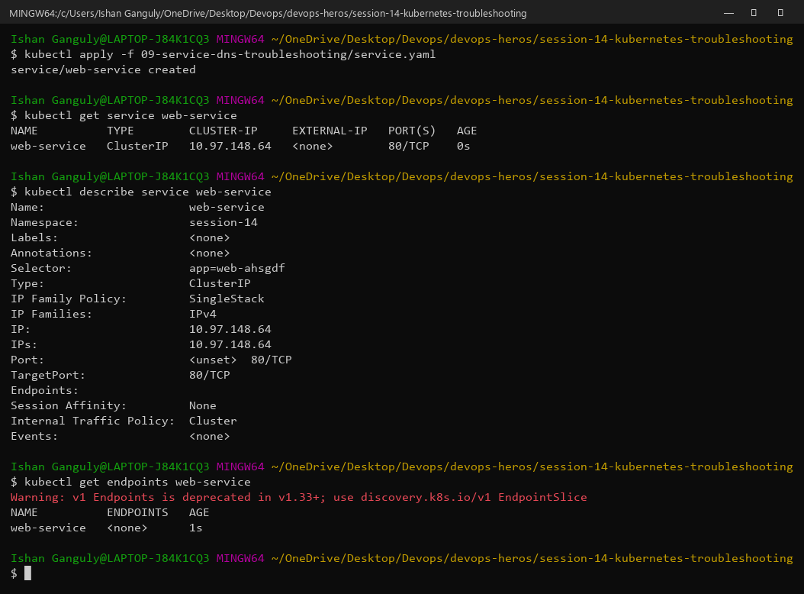

### Root cause: label vs selector

```bash
kubectl get pods -l app=web --show-labels                      # app=web
kubectl get svc web-service -o jsonpath='{.spec.selector}'     # {"app":"web-ahsgdf"}
kubectl apply -f Session-14-Assignments/09-service-dns-troubleshooting/service-fixed.yaml
kubectl get endpoints web-service
```

After the selector was corrected to `app=web`, the endpoints became `10.244.0.57:80,10.244.0.58:80`, which are the two Pod IPs.

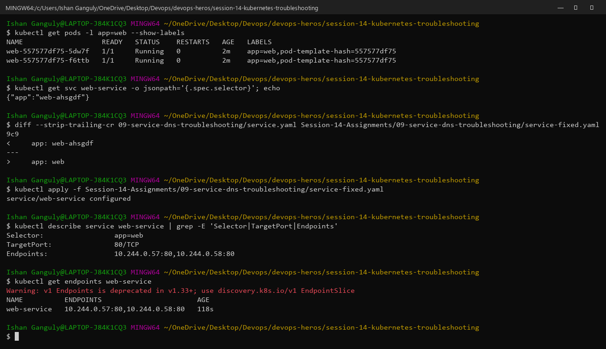

> `kubectl get endpoints` prints a deprecation warning on Kubernetes v1.33+. It still works; `kubectl get endpointslices` is the newer equivalent.

### DNS test Pod: ImagePullBackOff

```bash
kubectl apply -f 09-service-dns-troubleshooting/dns-test-pod.yaml
kubectl get pod dns-test
kubectl describe pod dns-test
```

The Events show `failed to resolve reference "registry.k8s.io/e2e-test-images/dnsutils:1.3": not found`. This is the same ImagePullBackOff pattern as task 7.

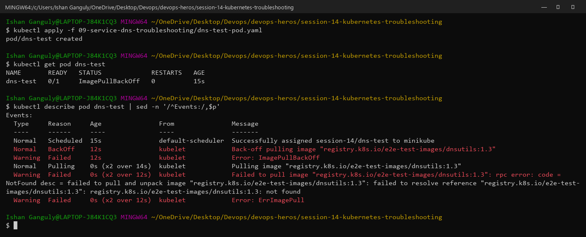

```bash
kubectl delete pod dns-test
kubectl apply -f Session-14-Assignments/09-service-dns-troubleshooting/dns-test-pod-fixed.yaml
kubectl get pod dns-test
```

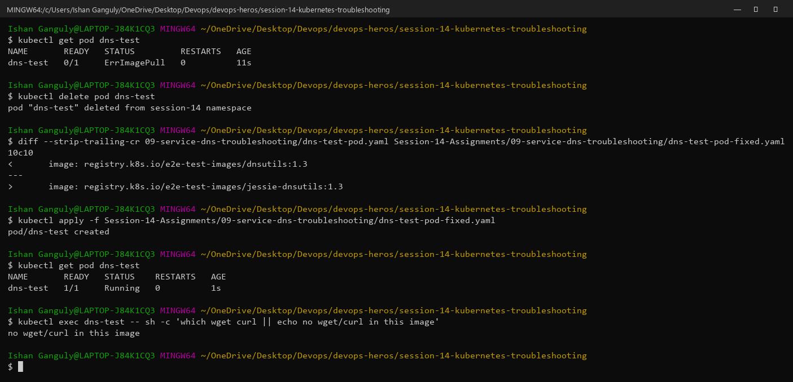

### DNS and HTTP test

```bash
kubectl exec -it dns-test -- nslookup web-service
kubectl exec -it dns-test -- nslookup web-service.session-14.svc.cluster.local
```

Both names resolve to the Service ClusterIP through the cluster DNS server `10.96.0.10`.

The `jessie-dnsutils` image does not include `wget` or `curl`, so the HTTP test was run from a temporary BusyBox Pod:

```bash
kubectl run http-test --rm -i --restart=Never --image=busybox:1.36 -- wget -qO- http://web-service
```

It returned the NGINX welcome page, which shows that DNS, the Service, and the Pods all work.

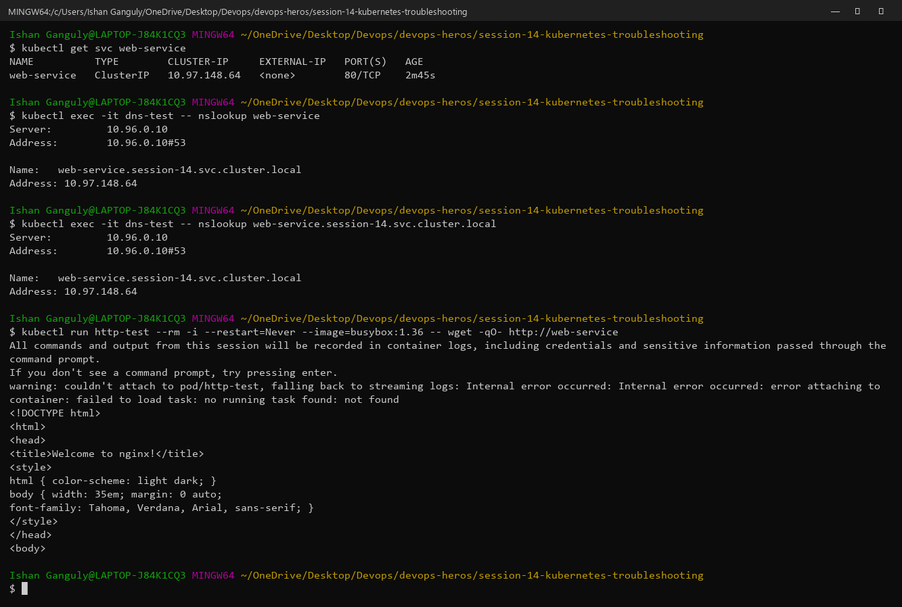

### Intentionally broken Service

```bash
kubectl apply -f 09-service-dns-troubleshooting/broken-service.yaml
kubectl get endpoints broken-service                     # <none>
kubectl describe service broken-service                  # Selector: app=does-not-exist
kubectl exec dns-test -- nslookup broken-service         # resolves fine
kubectl run http-test --rm -i --restart=Never --image=busybox:1.36 -- wget -qO- -T 3 http://broken-service
kubectl delete service broken-service
```

This shows the key point of the task: **DNS works** (`broken-service` resolves to `10.106.221.191`), but HTTP fails with `Connection refused` because the Service has no endpoints. The fault is the selector, not DNS.

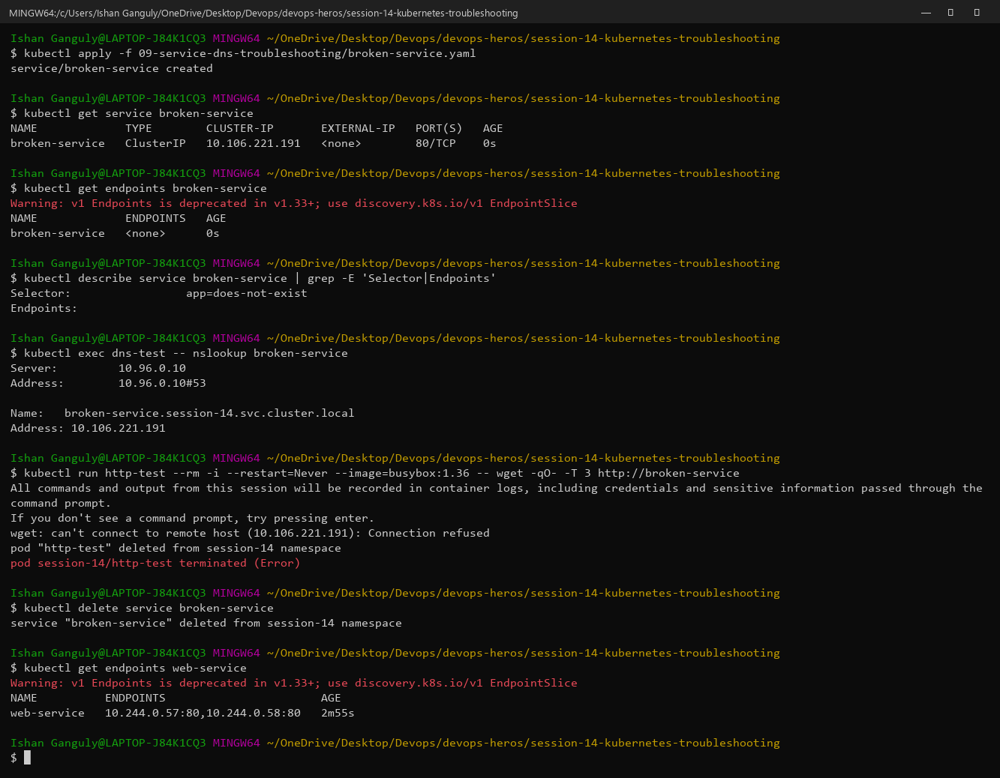

### CoreDNS

```bash
kubectl get pods -n kube-system -l k8s-app=kube-dns
kubectl exec -it dns-test -- cat /etc/resolv.conf
kubectl logs -n kube-system -l k8s-app=kube-dns
```

CoreDNS is `Running`. The Pod's `/etc/resolv.conf` points to `nameserver 10.96.0.10` with search domains `session-14.svc.cluster.local svc.cluster.local cluster.local`. That search list is why the short name `web-service` resolves.

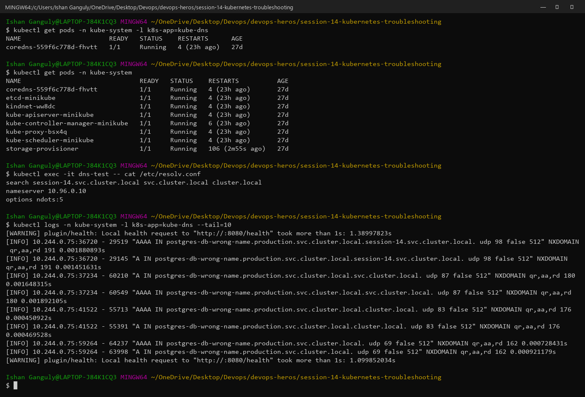

## 10. Mini-Project - Troubleshooting Challenge

### Deploy and check the application

```bash
kubectl apply -f mini-project/deployment.yaml
kubectl apply -f mini-project/service.yaml
kubectl get pods
kubectl get service
```

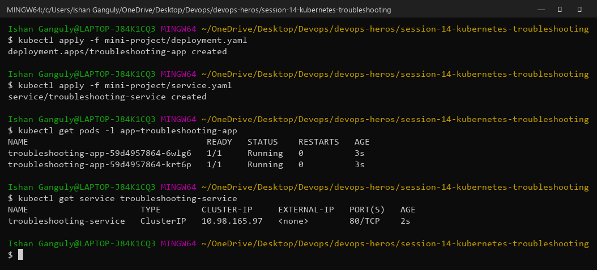

```bash
kubectl get pods -o wide
kubectl describe pod <pod-name>
kubectl logs <pod-name>
kubectl exec <pod-name> -- bash -c 'curl -s localhost | grep title'   # <title>Welcome to nginx!</title>
```

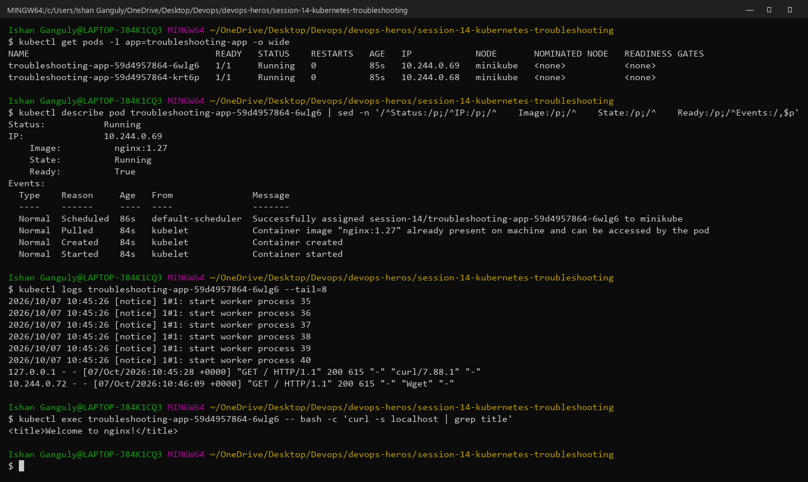

```bash
kubectl describe service troubleshooting-service
kubectl get endpoints troubleshooting-service
```

The Service selector `app=troubleshooting-app` matches both Pods, so both Pod IPs appear as endpoints.

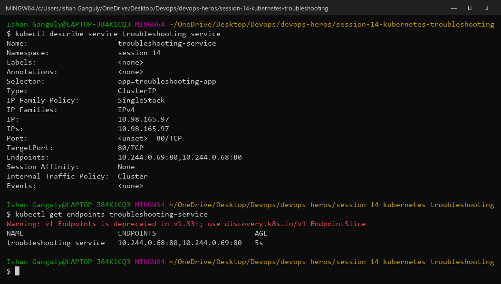

### Broken Pod

```bash
kubectl apply -f mini-project/broken-pod.yaml
kubectl get pod project-broken-pod
kubectl describe pod project-broken-pod
```

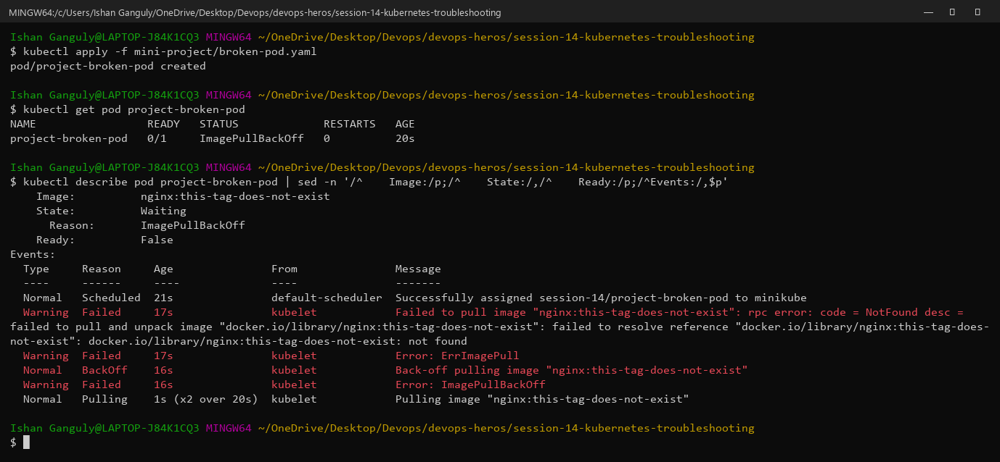

**Answers:**

1. **What is the Pod status?** `ImagePullBackOff` (first `ErrImagePull`), `READY 0/1`.
2. **What is the actual error?** `Failed to pull image "nginx:this-tag-does-not-exist": ... docker.io/library/nginx:this-tag-does-not-exist: not found`.
3. **Which command helped you find the reason?** `kubectl describe pod project-broken-pod`, specifically the Events section.
4. **What is wrong with the image?** The image name `nginx` is valid, but the tag `this-tag-does-not-exist` does not exist in the registry.
5. **How would you fix it?** Correct the tag to a valid one (`nginx:1.27`), then delete the Pod and apply the corrected YAML.

```bash
kubectl delete pod project-broken-pod
kubectl apply -f Session-14-Assignments/10-mini-project/broken-pod-fixed.yaml
kubectl get pod project-broken-pod      # 1/1 Running
```

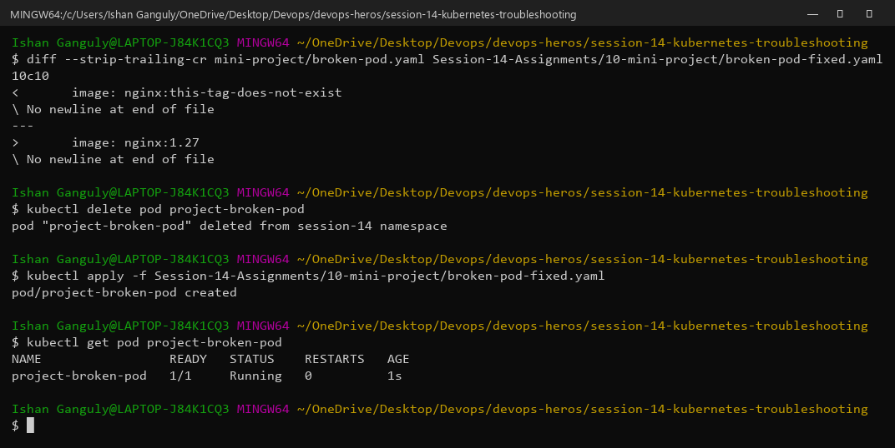

### Service selector challenge

The selector was changed to `app: wrong-app` in a copy (`10-mini-project/service-wrong-selector.yaml`) and applied:

```bash
kubectl apply -f Session-14-Assignments/10-mini-project/service-wrong-selector.yaml
kubectl get service
kubectl get endpoints troubleshooting-service      # <none>
```

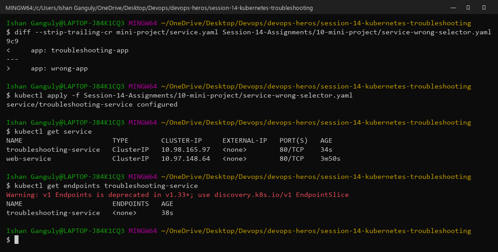

Root cause and fix:

```bash
kubectl get pods --show-labels                         # app=troubleshooting-app
kubectl describe service troubleshooting-service       # Selector: app=wrong-app, Endpoints: (empty)
kubectl apply -f mini-project/service.yaml             # restore app: troubleshooting-app
kubectl get endpoints troubleshooting-service          # both Pod IPs are back
kubectl run http-test --rm -i --restart=Never --image=busybox:1.36 -- wget -qO- http://troubleshooting-service
```

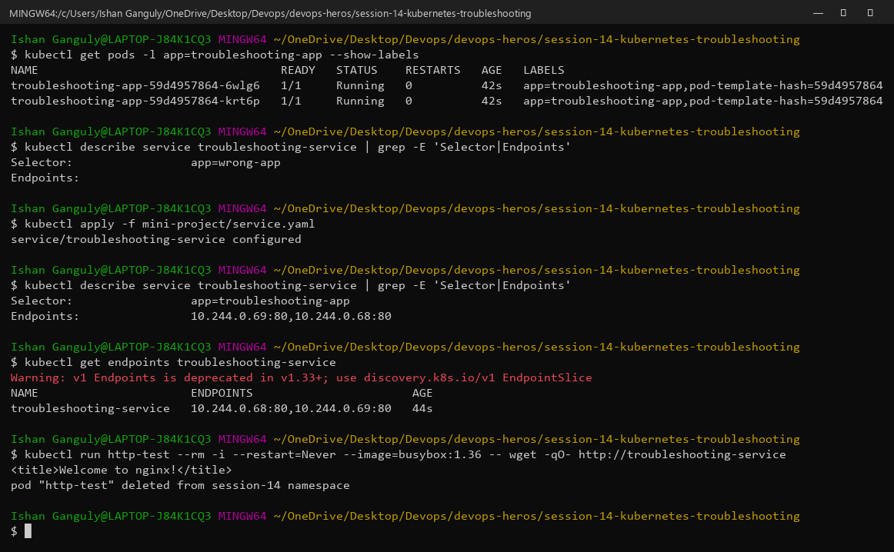

### Final checklist

```bash
kubectl get pods
kubectl get events --field-selector type=Warning --sort-by=.lastTimestamp
kubectl exec dns-test -- nslookup troubleshooting-service
```

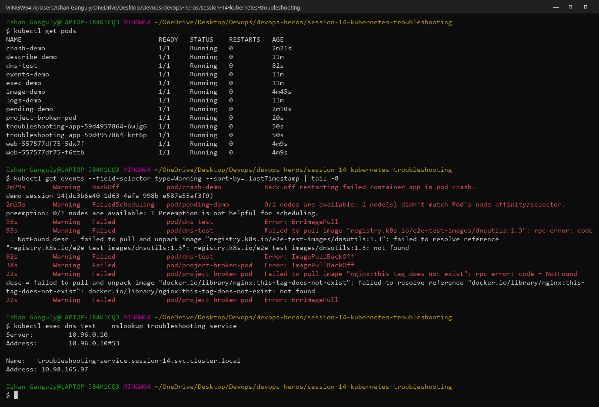

### Troubleshooting table

| Problem | What I Saw | Command I Used | Root Cause | Fix |
| :--- | :--- | :--- | :--- | :--- |
| **Broken Pod** (`crash-demo`) | `CrashLoopBackOff`, restarts climbing, `Exit Code: 1` | `kubectl describe pod`, `kubectl logs --previous` | The command ends with `exit 1` | Use `fixed-pod.yaml` (healthy command + `sleep 3600`) |
| **Service Problem** (`troubleshooting-service`) | Service exists but `Endpoints: <none>`, HTTP fails | `kubectl get endpoints`, `kubectl get pods --show-labels`, `kubectl describe service` | Selector `app=wrong-app` does not match the Pod label `app=troubleshooting-app` | Restore the selector to `app: troubleshooting-app` |
| **Image Problem** (`project-broken-pod`) | `ErrImagePull` → `ImagePullBackOff`, `0/1` | `kubectl describe pod` (Events) | Tag `nginx:this-tag-does-not-exist` does not exist | Use `nginx:1.27`, delete and re-create the Pod |

### README questions

1. **What does `kubectl get` tell us?** The current state of resources at a glance: name, ready count, status, restarts, and age. It shows *what* is happening.
2. **What is the difference between `get` and `describe`?** `get` is a one-line summary. `describe` is a detailed report with container state, last state, exit codes, conditions, and the Events that explain *why*.
3. **Why do we use `kubectl logs`?** To read what the application wrote to stdout/stderr, which is often the actual error message. `--previous` shows the logs of a crashed container.
4. **When would you use `kubectl exec`?** When the container is running and you need to test from inside it: `curl localhost`, check files or config, or run `nslookup`. It separates "the app is broken" from "the network or Service is broken".
5. **What does `CrashLoopBackOff` mean?** The container keeps starting and exiting, so Kubernetes restarts it with a growing delay. It is a symptom; the cause is in the logs and exit code.
6. **What does `ImagePullBackOff` mean?** Kubernetes cannot pull the image (wrong name or tag, private registry without credentials, or registry/network issues) and is backing off between retries.
7. **Why can a Pod remain `Pending`?** The scheduler cannot place it on a node: insufficient CPU or memory, node selector or affinity mismatch, taints without tolerations, or an unbound PVC. The `FailedScheduling` event gives the exact reason.
8. **Why can a Service have no endpoints?** The selector matches no Pods (label typo), or the matching Pods are not Ready.
9. **What is the relationship between a Service selector and Pod labels?** The Service selects every Ready Pod whose labels match its selector; those Pod IPs become its endpoints. If they do not match, the Service routes traffic nowhere.
10. **What is Kubernetes DNS?** CoreDNS running in `kube-system`. It gives every Service a name `<service>.<namespace>.svc.cluster.local` that resolves to its ClusterIP. Pods use it through `/etc/resolv.conf` (nameserver `10.96.0.10`).

### Final architecture

```text
                    Kubernetes Cluster (namespace: session-14)
                            │
                            ▼
                ┌─────────────────────────┐
                │ troubleshooting-service │
                └────────────┬────────────┘
                             │ selector app=troubleshooting-app
              ┌──────────────┴──────────────┐
              ▼                             ▼
            Pod 1                         Pod 2
              └──────────────┬──────────────┘
                             ▼
                         Nginx App
```

## 11. Triage Gauntlet (bonus scenarios)

The `scenarios/` folder has a script that deploys five broken Pods at once:

```bash
bash scenarios/triage_all.sh
```

```text
NAME                     READY   STATUS         RESTARTS     AGE
fail-1-crashloop-pod     0/1     Error          1 (5s ago)   7s
fail-2-imagepull-pod     0/1     ErrImagePull   0            7s
fail-3-pending-pod       0/1     Pending        0            6s
fail-4-dns-failure-pod   1/1     Running        0            6s
fail-5-oomkilled-pod     0/1     OOMKilled      1 (4s ago)   5s
```

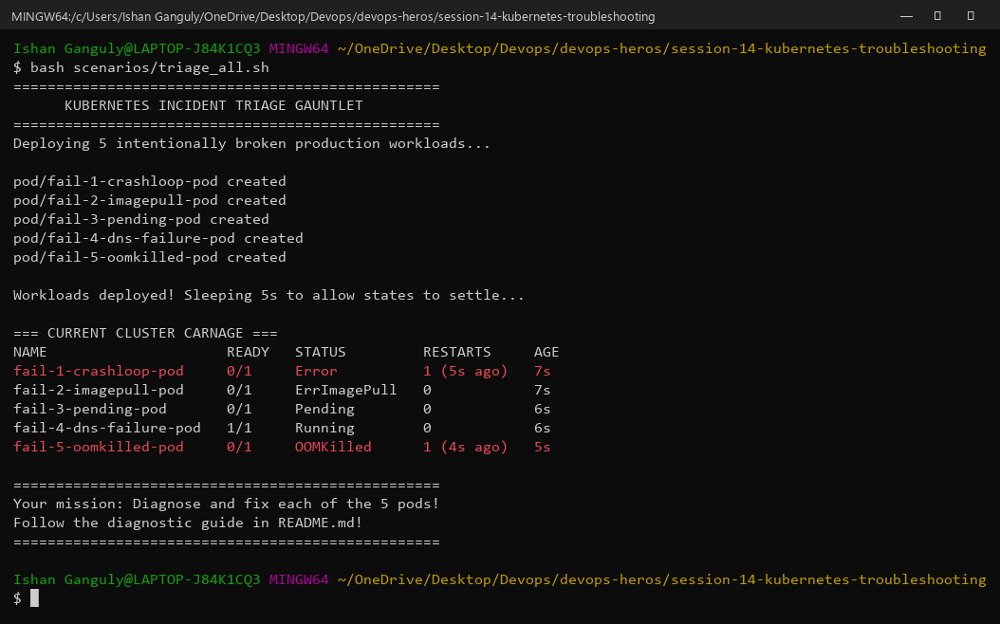

Root causes, read from the manifests and the statuses above:

| Pod | Symptom | Root cause | Fix |
| :--- | :--- | :--- | :--- |
| `fail-1-crashloop-pod` | `Error` → `CrashLoopBackOff` | `DATABASE_URL` env var is missing, so the app exits with code 1 (`kubectl logs` shows `[FATAL ERROR]`) | Add the `DATABASE_URL` env var |
| `fail-2-imagepull-pod` | `ErrImagePull` | `yatri-api-service:v999-invalid-tag-does-not-exist` does not exist in any registry | Use the correct image/tag (and `imagePullSecrets` for a private registry) |
| `fail-3-pending-pod` | `Pending` | Requests `cpu: 500` and `memory: 1000Gi`; the node has 12 CPUs and about 5.6Gi allocatable → `Insufficient cpu/memory` | Request realistic values, e.g. `100m` / `64Mi` |
| `fail-4-dns-failure-pod` | `Running` but cannot reach its database | Hostname `postgres-db-wrong-name.production.svc.cluster.local` does not exist (NXDOMAIN). `curl -s ... \|\| true` hides the error, so the Pod looks healthy | Use the correct Service name/namespace; do not swallow errors |
| `fail-5-oomkilled-pod` | `OOMKilled` | Holds about 1 GB of memory in a list while the limit is `20Mi` | Fix the memory leak, or set a limit that fits the real workload |

`fail-4` is the important one: a `Running` status does not mean the application works. Only logs, `exec` + `nslookup`, and a connectivity test reveal the problem.

## Cleanup

```bash
kubectl delete namespace session-14
kubectl config set-context --current --namespace=default
```

## Key Learnings

- Follow a process instead of guessing: **get → describe → events → logs → exec → test → fix → verify**.
- `CrashLoopBackOff`, `ImagePullBackOff`, and `Pending` are symptoms. The root cause is in the Events, the logs, or the exit code.
- `kubectl logs --previous` is essential when a container keeps restarting.
- `FailedScheduling` events say exactly why a Pod is `Pending` (selector mismatch, insufficient resources, taints).
- A Service with no endpoints almost always means a selector/label mismatch. Check `--show-labels` against the Service selector.
- If `nslookup` works but HTTP fails, DNS is fine. Look at endpoints, `targetPort`, or the application.
- A `Running` Pod is not necessarily a working application.
- The provided manifests had real bugs too (`service.yaml` selector, `dnsutils:1.3` image, `pod.yaml` vs `demo-pod.yaml`). They were diagnosed with the same flow and fixed in copies.
