# Session 15 - Helm

This assignment works through every Session 15 folder: installing Helm, creating and rendering charts, the chart files (`Chart.yaml`, `values.yaml`, `templates/`), value overrides, Go templates, install/upgrade, rollback, a full application deployment, and the Notes App mini-project. Every chart was linted or rendered locally first, then deployed to Minikube and verified.

```text
Chart    = the packaged template (recipe)
Release  = a running instance of a chart (cooked meal)
Values   = the variables you pass in (ingredients)
```

## Prerequisites

All commands were run in **Windows PowerShell** from the `session-15-helm` folder. A dedicated `session-15` namespace was created so that the output was not mixed with resources from earlier sessions:

```powershell
minikube start
cd session-15-helm
kubectl config current-context
kubectl create namespace session-15
kubectl config set-context --current --namespace=session-15
kubectl get nodes
```

The expected context is `minikube`. The Kubernetes server version was `v1.37.0`.

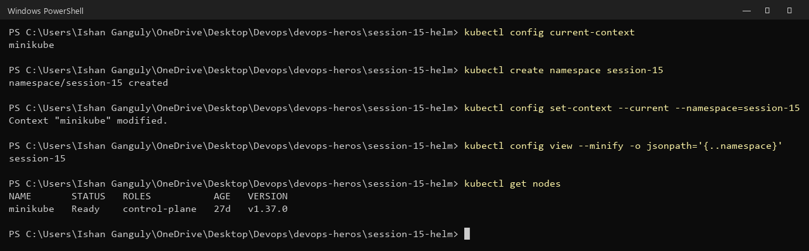

> **Helm 4 note:** `winget` installed the latest Helm, **v4.3.0**, while the session READMEs were written for Helm 3. Everything in the session works the same way, with three small differences that appear in the screenshots:
> - `--atomic` is deprecated and replaced by `--rollback-on-failure` (it still works, with a warning).
> - `helm list` shows releases in every status by default, and the `-a` shorthand was removed. Use `helm list --failed` to see failed releases.
> - `helm create` also generates a `templates/httproute.yaml` (Gateway API).

## 1. What is Helm?

Helm is the package manager for Kubernetes. Instead of maintaining a separate set of YAML files for each environment, you write one chart and pass different values.

### Install Helm

The README uses the Linux install script (`curl ... get-helm-3 | bash`). On Windows PowerShell, the equivalent is:

```powershell
winget install --id Helm.Helm -e
helm version
helm list
```

Open a new terminal after installing so the updated `PATH` is picked up. `helm list` is empty because no releases exist yet.

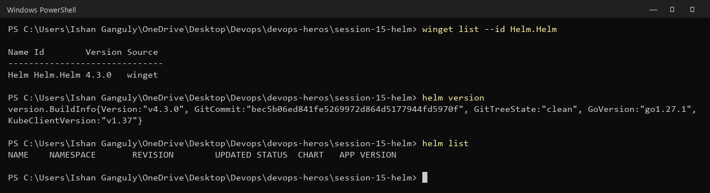

### Add a repository and search it

```powershell
helm repo add bitnami https://charts.bitnami.com/bitnami
helm repo update
helm search repo bitnami/nginx
```

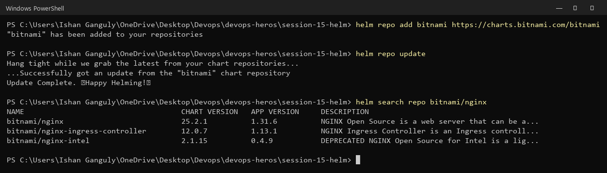

### Install a public chart

```powershell
helm install my-nginx bitnami/nginx
helm list
```

```text
NAME: my-nginx
NAMESPACE: session-15
STATUS: deployed
REVISION: 1
CHART VERSION: 25.2.1
APP VERSION: 1.31.6
```

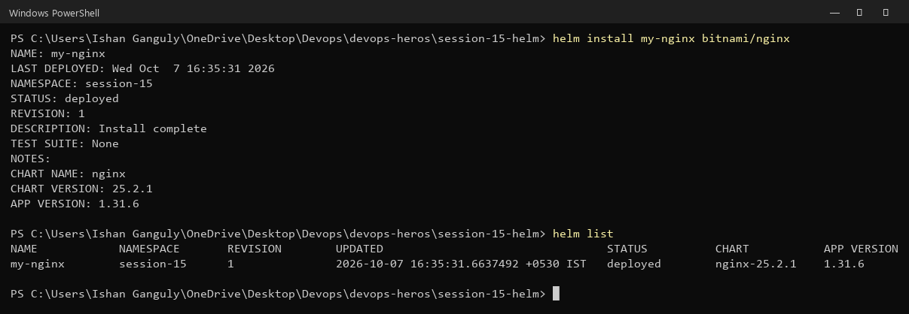

### Check what was created, then remove the release

```powershell
kubectl get pods
kubectl get services
helm uninstall my-nginx
helm list
kubectl get all
```

The chart created an NGINX Pod and a `LoadBalancer` Service. After `helm uninstall`, `kubectl get all` returns `No resources found`: every resource the release created was deleted.

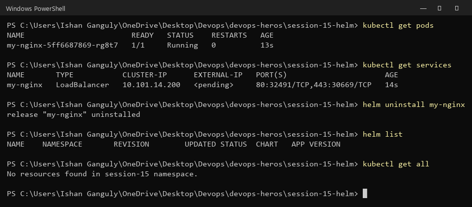

**Helm 2 vs Helm 3+:** Helm 2 needed **Tiller**, a server Pod with cluster-admin rights, which was a security risk. Helm 3 and later are client-only, use your kubeconfig permissions, and store release state as Kubernetes Secrets.

## 2. Helm Charts

### Create a chart

```powershell
helm create .\Session-15-Assignments\02-helm-charts\demo-chart
Get-ChildItem .\Session-15-Assignments\02-helm-charts\demo-chart -Name
Get-ChildItem .\Session-15-Assignments\02-helm-charts\demo-chart\templates -Name
```

`helm create` generates a complete working chart: `Chart.yaml`, `values.yaml`, `charts/`, `.helmignore`, and `templates/` (deployment, service, serviceaccount, ingress, httproute, hpa, `_helpers.tpl`, `NOTES.txt`, and a test). The generated chart is saved in [02-helm-charts/demo-chart](02-helm-charts/demo-chart).

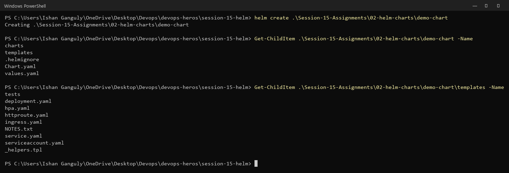

### Render without deploying

```powershell
helm template my-release .\Session-15-Assignments\02-helm-charts\demo-chart
```

This prints the final Kubernetes YAML (ServiceAccount, Service, Deployment) with every `{{ }}` replaced, for example `name: my-release-demo-chart`. Nothing is sent to the cluster.

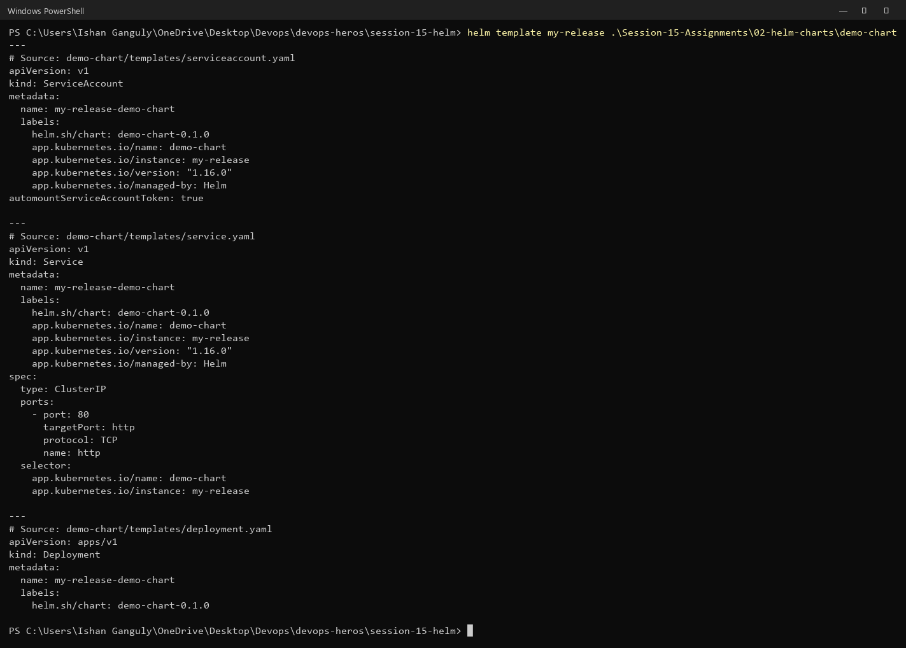

### Install, list, uninstall

```powershell
helm install demo-release .\Session-15-Assignments\02-helm-charts\demo-chart
kubectl get pods
helm list
helm uninstall demo-release
```

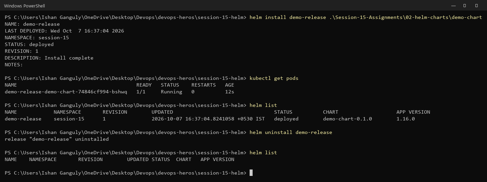

## 3. Chart Structure

```text
simple-chart/
  Chart.yaml          <-- who is this chart?
  values.yaml         <-- what are the defaults?
  templates/          <-- what does it create?
    deployment.yaml
    service.yaml
```

```powershell
tree /F 03-chart-structure\simple-chart
helm template my-release 03-chart-structure\simple-chart
```

In the rendered output, `{{ .Release.Name }}-app` became `my-release-app`, `{{ .Values.replicaCount }}` became `1`, and the image became `nginx:latest`.

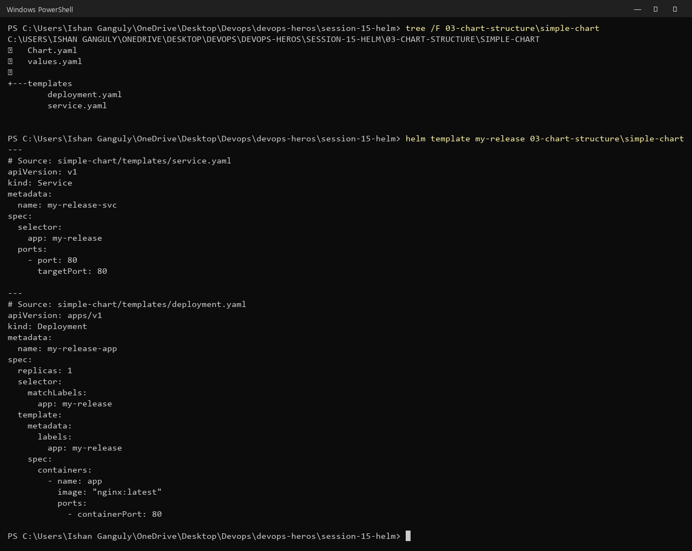

```powershell
helm install my-release 03-chart-structure\simple-chart
kubectl get pods
kubectl get services
helm uninstall my-release
```

The release created `my-release-app` (Deployment) and `my-release-svc` (ClusterIP Service).

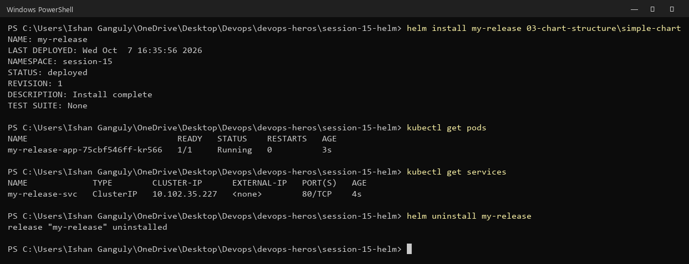

## 4. Chart.yaml

```powershell
Get-Content 04-chart-yaml\Chart.yaml
helm lint 04-chart-yaml
helm show chart 04-chart-yaml
```

| Field | Meaning |
| :--- | :--- |
| `apiVersion: v2` | Required for Helm 3+ |
| `name` | Chart name (`my-app`) |
| `version` | Version of the **chart** (`0.1.0`); bump it when the chart files change |
| `appVersion` | Version of the **application** it deploys (`"1.0"`), usually the image tag |
| `type` | `application` (deployable) or `library` (shared templates only) |

The chart passes lint (`1 chart(s) linted, 0 chart(s) failed`). The `templates/` warning is expected because this folder only demonstrates `Chart.yaml`.

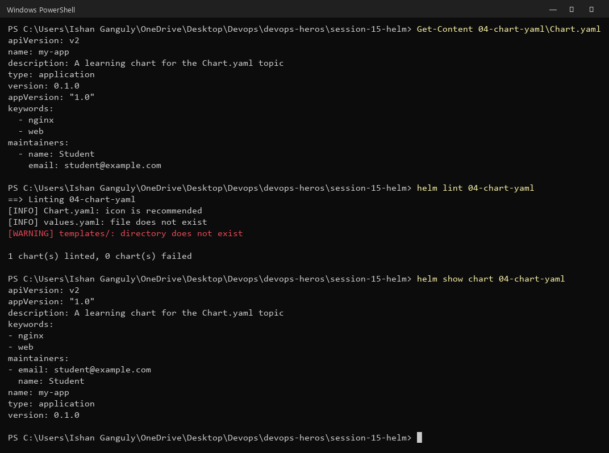

### Lint a broken Chart.yaml

To see the error described in the README, a copy without the `apiVersion` line was linted ([04-chart-yaml/broken-chart/Chart.yaml](04-chart-yaml/broken-chart/Chart.yaml)):

```powershell
helm lint Session-15-Assignments\04-chart-yaml\broken-chart
```

```text
[ERROR] Chart.yaml: apiVersion is required. The value must be either "v1" or "v2"
Error: 1 chart(s) linted, 1 chart(s) failed
```

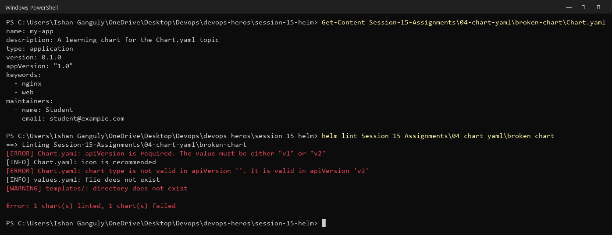

### Chart metadata in templates

The `my-app` chart's `_helpers.tpl` uses `.Chart.Name`, `.Chart.Version`, and `.Chart.AppVersion`, so the rendered labels contain `helm.sh/chart: my-app-0.1.0` and `app.kubernetes.io/version: "1.16.0"`.

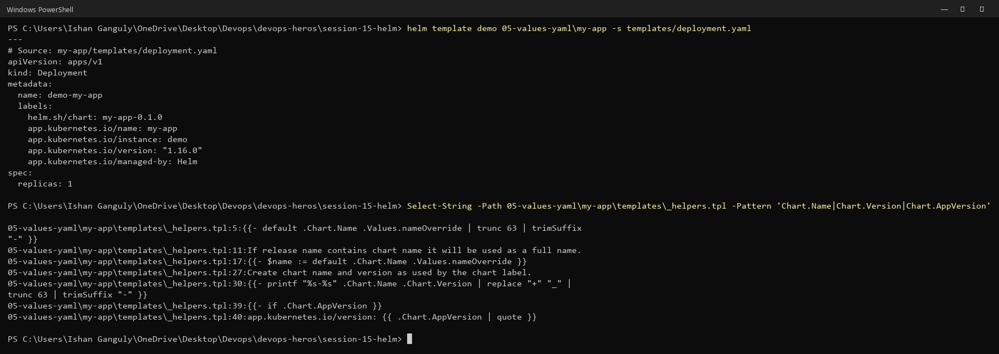

## 5. values.yaml

`values.yaml` holds the defaults; `values-prod.yaml` holds environment-specific overrides.

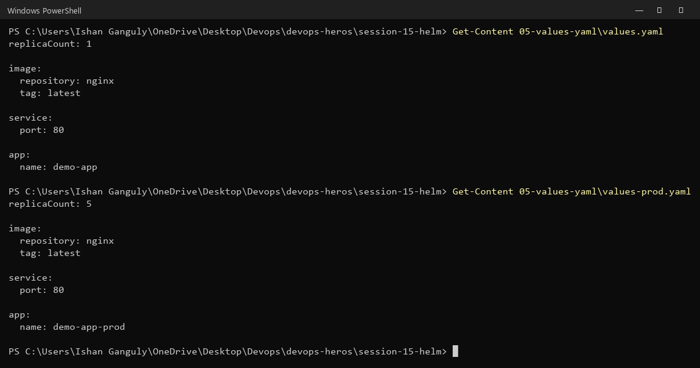

### Override priority

```powershell
helm template my-app 05-values-yaml\my-app | Select-String 'replicas:'
helm template my-app 05-values-yaml\my-app --set replicaCount=3 | Select-String 'replicas:'
helm template my-app 05-values-yaml\my-app -f 05-values-yaml\values-prod.yaml | Select-String 'replicas:'
helm template my-app 05-values-yaml\my-app -f 05-values-yaml\values-prod.yaml --set replicaCount=2 | Select-String 'replicas:'
```

| Command | replicas |
| :--- | :--- |
| defaults (`values.yaml`) | 1 |
| `--set replicaCount=3` | 3 |
| `-f values-prod.yaml` | 5 |
| `-f values-prod.yaml --set replicaCount=2` | **2** |

The last row shows the priority order: `values.yaml` → `-f file` → `--set`. `--set` always wins.

> PowerShell has no `grep`; `Select-String` is the equivalent.

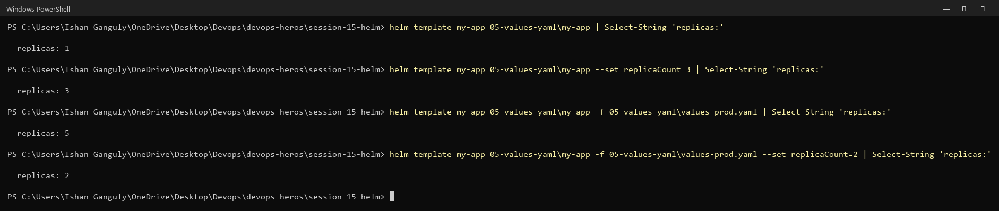

### Install with production values

```powershell
helm install my-app 05-values-yaml\my-app -f 05-values-yaml\values-prod.yaml
kubectl get pods
helm get values my-app
helm uninstall my-app
```

Five Pods were created, and `helm get values` shows the user-supplied values (`replicaCount: 5`).

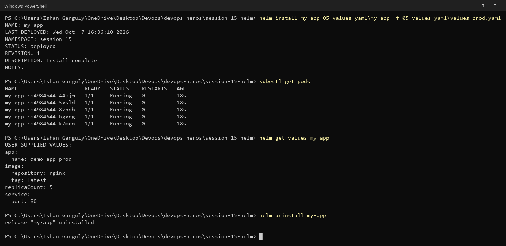

## 6. Templates

```powershell
helm template my-release 06-templates\template-demo
```

`{{ .Release.Name }}` → `my-release`, `{{ .Values.replicaCount }}` → `2`, and the image is `nginx:latest`.

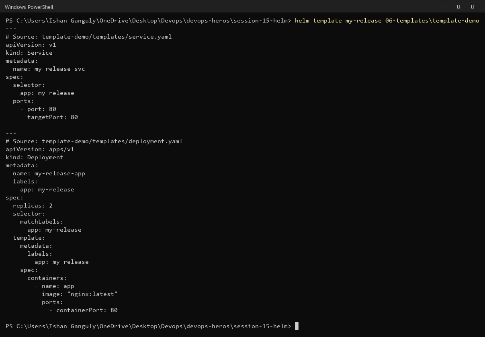

### `--set` and conditionals

```powershell
helm template my-release 06-templates\template-demo --set replicaCount=5 | Select-String 'replicas:'
helm template my-release 06-templates\template-demo | Select-String '^kind:'
helm template my-release 06-templates\template-demo --set service.enabled=false | Select-String '^kind:'
```

The Service template is wrapped in `{{- if .Values.service.enabled }} ... {{- end }}`. With the default `enabled: true`, the chart renders a Service and a Deployment. With `service.enabled=false`, it renders only the Deployment.

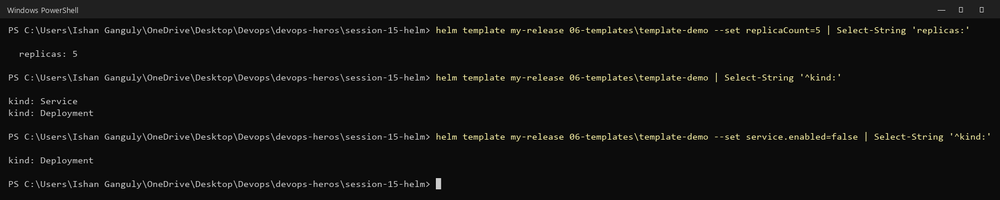

## 7. Install and Upgrade

```powershell
helm install web-app .\07-install-upgrade\app-chart
kubectl get pods
helm list
```

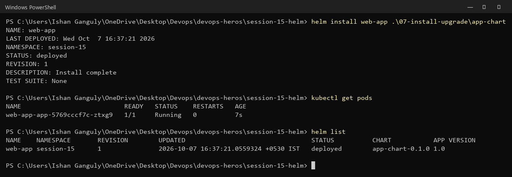

```powershell
helm upgrade web-app .\07-install-upgrade\app-chart --set replicaCount=3
kubectl get pods
helm history web-app
```

The upgrade created **REVISION 2**, and three Pods are running.

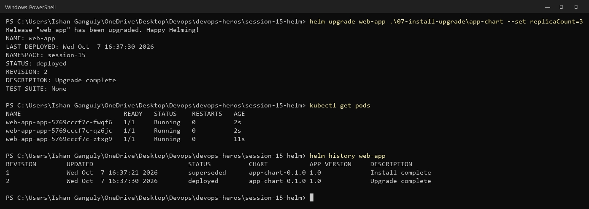

### install vs upgrade vs upgrade --install

```powershell
helm install web-app .\07-install-upgrade\app-chart          # fails: name already in use
helm upgrade new-app .\07-install-upgrade\app-chart          # fails: "new-app" has no deployed releases
helm upgrade --install web-app .\07-install-upgrade\app-chart  # works either way -> REVISION 3
helm uninstall web-app
```

```text
helm install           = fails if the release already exists
helm upgrade           = fails if the release does not exist
helm upgrade --install = installs if new, upgrades if it exists (best for CI/CD)
```

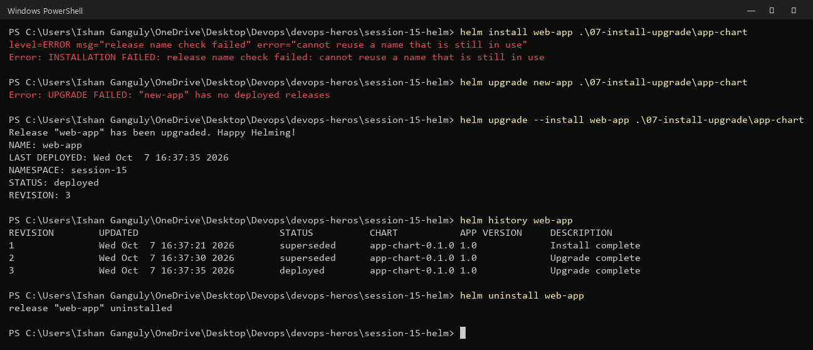

## 8. Rollback

### Break the release

```powershell
helm install rollback-demo .\07-install-upgrade\app-chart
helm upgrade rollback-demo .\07-install-upgrade\app-chart --set image.tag=doesnotexist
kubectl get pods
helm history rollback-demo
```

The new Pod goes into `ImagePullBackOff`. The old Pod keeps running, because the Deployment's rolling update does not remove it until the new Pod is Ready, so users are not affected. Helm still marks revision 2 as `deployed`: plain `helm upgrade` does not wait for Pods to become healthy.

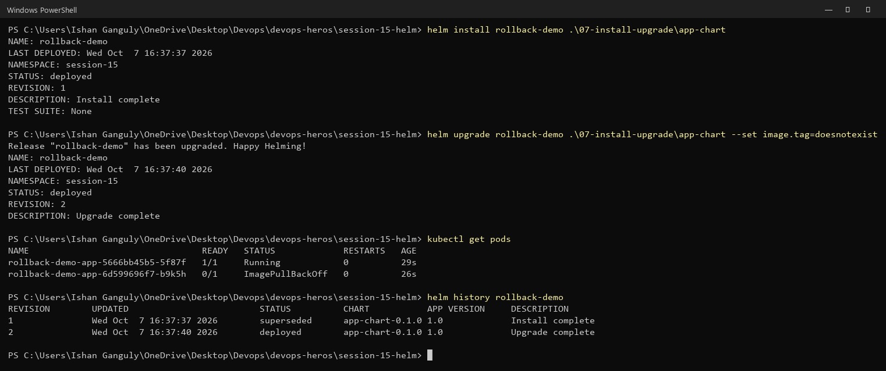

### Roll back

```powershell
helm rollback rollback-demo 1
kubectl get pods
helm history rollback-demo
```

```text
REVISION   STATUS       DESCRIPTION
1          superseded   Install complete
2          superseded   Upgrade complete
3          deployed     Rollback to 1
```

The rollback is recorded as a **new revision (3)**; the history is kept.

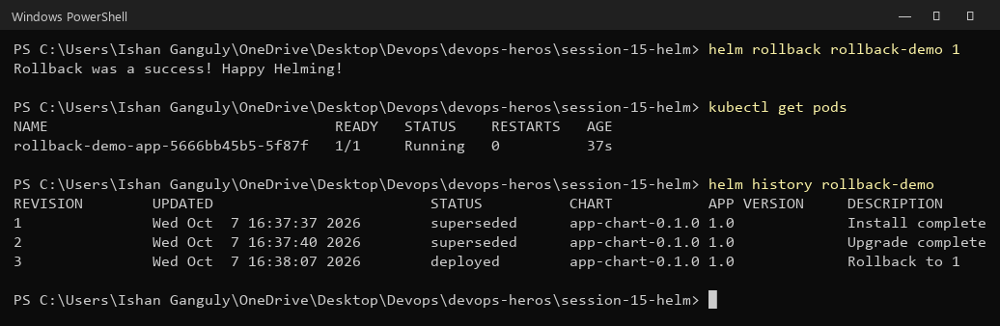

### Automatic rollback with `--atomic`

```powershell
helm upgrade rollback-demo .\07-install-upgrade\app-chart --set image.tag=doesnotexist --atomic --timeout 60s
helm history rollback-demo
helm uninstall rollback-demo
```

Helm waited 60 seconds for the new Pod to become Ready, then failed the upgrade and rolled back automatically: revision 4 is `failed`, revision 5 is `Rollback to 3`, and the healthy Pod keeps running. Helm 4 prints `Flag --atomic has been deprecated, use --rollback-on-failure instead`.

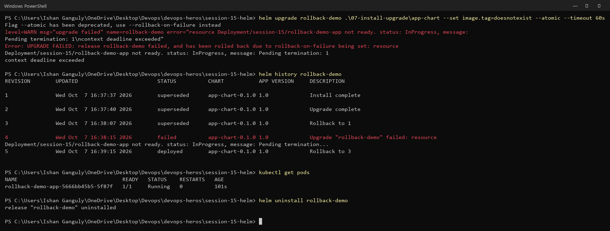

## 9. Deploying an Application (Guestbook)

### Lint and render

```powershell
helm lint 09-deploying-application\guestbook-chart
helm template my-guestbook 09-deploying-application\guestbook-chart
```

The render produces a ConfigMap (`welcome`, `appName`), a NodePort Service, and a Deployment that loads the ConfigMap with `envFrom`.

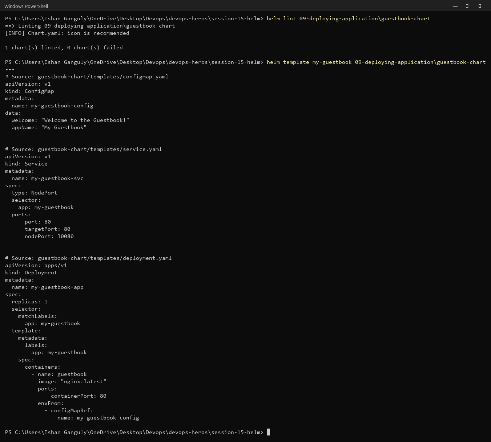

### Install failed: NodePort already allocated

```powershell
helm install my-guestbook 09-deploying-application\guestbook-chart
helm list --failed
kubectl get svc -A | Select-String '30080'
```

```text
Error: INSTALLATION FAILED: ... Service "my-guestbook-svc" is invalid:
spec.ports[0].nodePort: Invalid value: 30080: provided port is already allocated
```

**Root cause:** NodePorts are cluster-wide, and `30080` is hardcoded in `templates/service.yaml`. The Session 11 Service `web-service-nodeport` in the `default` namespace already uses `30080`. Because the port is hardcoded, neither `--set` nor a values file can change it.

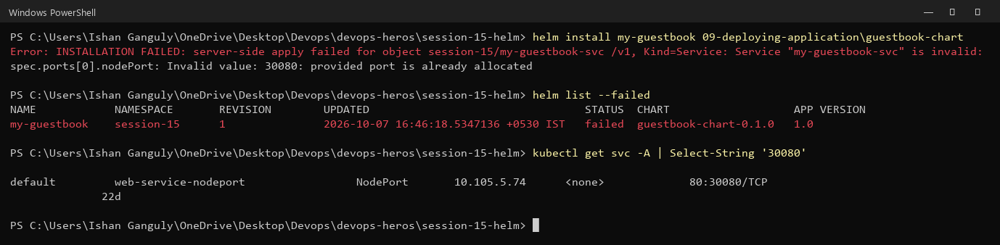

### Fix: make the NodePort a value

A copy of the chart was made in [09-deploying-application/guestbook-chart](09-deploying-application/guestbook-chart) with the port moved into `values.yaml`, which is also the better design:

```diff
# templates/service.yaml
-      nodePort: 30080
+      nodePort: {{ .Values.service.nodePort }}
# values.yaml
+  nodePort: 30081
```

```powershell
helm uninstall my-guestbook
helm lint Session-15-Assignments\09-deploying-application\guestbook-chart
helm install my-guestbook Session-15-Assignments\09-deploying-application\guestbook-chart
```

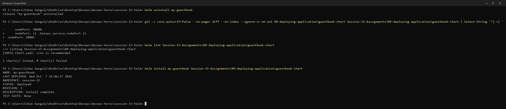

### Verify

```powershell
kubectl get pods
kubectl get services
kubectl get configmaps
kubectl exec deploy/my-guestbook-app -- printenv welcome appName
kubectl run http-test --restart=Never --image=busybox:1.36 -- wget -qO- http://my-guestbook-svc
kubectl logs http-test | Select-String 'title'
kubectl delete pod http-test
```

The Service is `NodePort 80:30081/TCP`. The ConfigMap values reached the container as environment variables (`Welcome to the Guestbook!`, `My Guestbook`), and the Service returns the NGINX page.

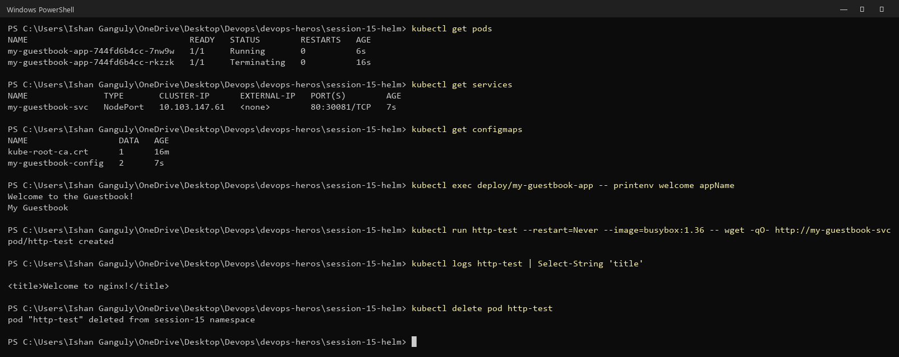

### Upgrade, history, rollback

```powershell
helm upgrade my-guestbook Session-15-Assignments\09-deploying-application\guestbook-chart --set replicaCount=3
kubectl get pods
helm history my-guestbook
helm rollback my-guestbook 1
kubectl get pods
```

The upgrade scaled to 3 Pods (revision 2), and the rollback to revision 1 scaled back to 1 Pod.

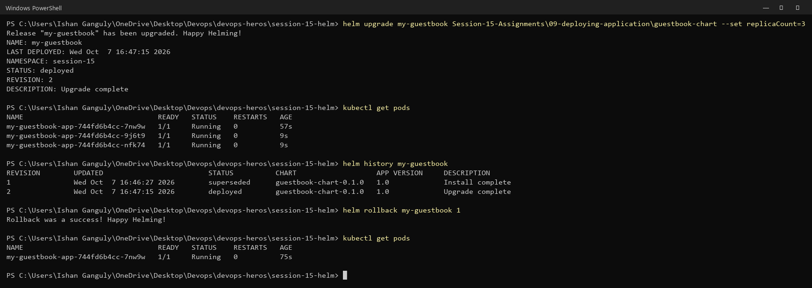

### Cleanup

```powershell
helm history my-guestbook
helm uninstall my-guestbook
kubectl get all,configmaps
```

The Deployment, Service, and ConfigMap were all removed by one `helm uninstall`. The last Pod is shown as `Completed` while it finishes terminating, and the only ConfigMap left is the namespace's built-in `kube-root-ca.crt`.

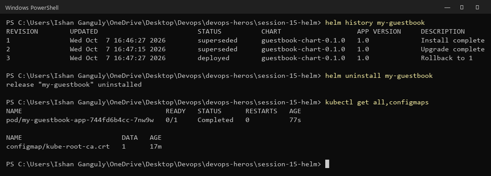

## 10. Mini-Project - Notes App with Helm

```text
notes-chart/
  Chart.yaml
  values.yaml          (dev:  1 replica,  nginx:1.24, ENVIRONMENT=development)
  values-prod.yaml     (prod: 3 replicas, nginx:1.25, ENVIRONMENT=production)
  templates/
    configmap.yaml
    deployment.yaml
    service.yaml       (NodePort 30090)
```

### Steps 8–9: Lint and render

```powershell
helm lint mini-project\notes-chart
helm template notes-dev mini-project\notes-chart
```

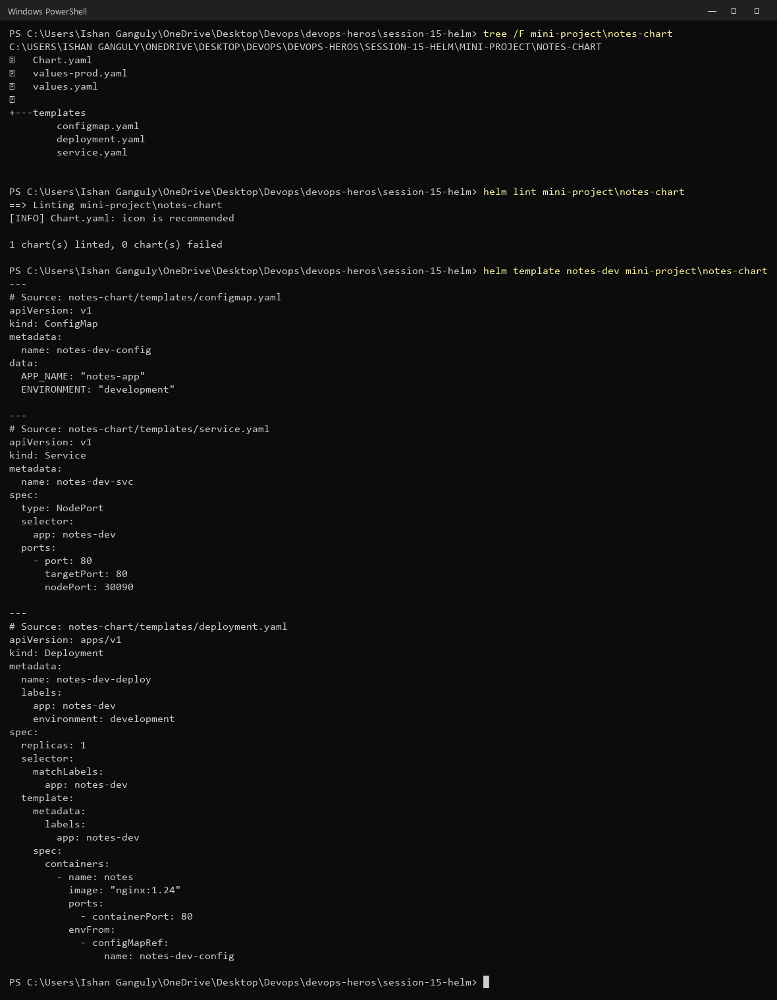

### Step 10: Install (development)

```powershell
helm install notes-dev mini-project\notes-chart
kubectl get pods
kubectl get services
kubectl get configmap notes-dev-config -o jsonpath='{.data}'
kubectl exec deploy/notes-dev-deploy -- printenv APP_NAME ENVIRONMENT
```

There is 1 Pod, the Service is `NodePort 80:30090`, and the ConfigMap is `{"APP_NAME":"notes-app","ENVIRONMENT":"development"}`, which reaches the container as environment variables.

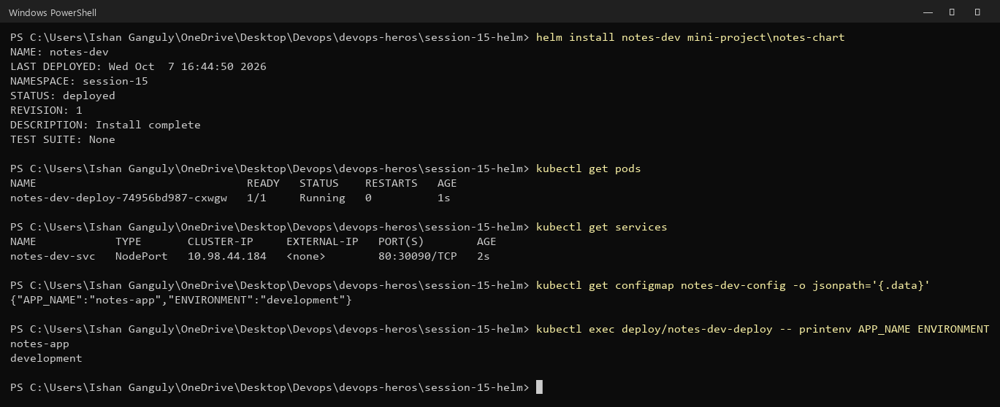

### Steps 11–12: Upgrade to production values

```powershell
helm upgrade notes-dev mini-project\notes-chart -f mini-project\notes-chart\values-prod.yaml
kubectl get pods
kubectl get deploy notes-dev-deploy -o wide
kubectl exec deploy/notes-dev-deploy -- printenv ENVIRONMENT
helm history notes-dev
```

Revision 2 has **3/3** Pods on `nginx:1.25`, and `ENVIRONMENT=production`.

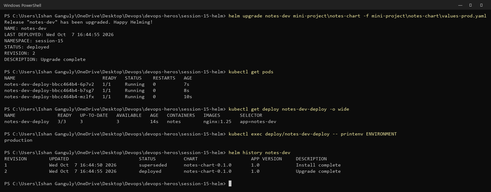

### Step 13: Simulate a bad upgrade

```powershell
helm upgrade notes-dev mini-project\notes-chart --set image.tag=broken-tag-does-not-exist
kubectl get pods
kubectl get deploy notes-dev-deploy -o wide
helm history notes-dev
```

The new Pod is in `ImagePullBackOff` and the image is `nginx:broken-tag-does-not-exist`.

**Something to watch out for:** the Deployment also dropped from 3 replicas to **1**. `helm upgrade` without `-f` does not keep the values from the previous revision. It starts again from the chart's `values.yaml` (1 replica) and applies only the new `--set`, so the production settings were silently lost. In real upgrades, always pass the same `-f values-prod.yaml`, or use `--reuse-values` / `--reset-then-reuse-values`.

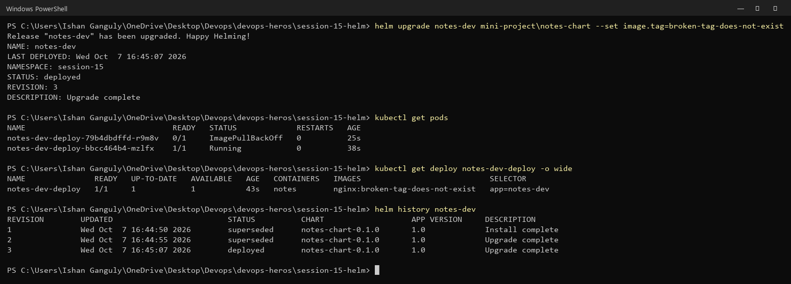

### Step 14: Roll back to revision 2

```powershell
helm rollback notes-dev 2
kubectl get pods
kubectl get deploy notes-dev-deploy -o wide
helm history notes-dev
```

The rollback restored all of revision 2: 3/3 Pods, image `nginx:1.25`, and the production values. It was recorded as revision 4, `Rollback to 2`.

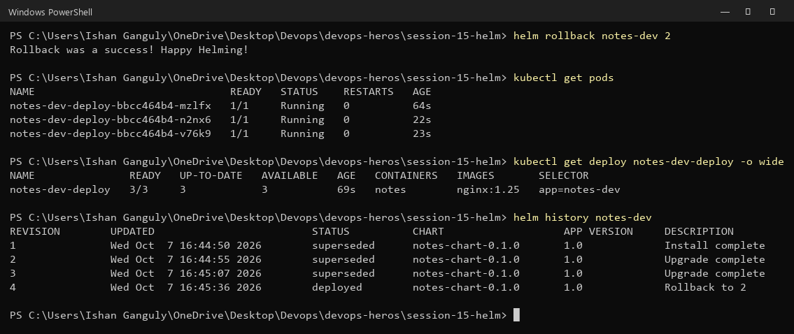

### Step 15: Clean up

```powershell
helm uninstall notes-dev
kubectl get pods
kubectl get services
helm list
```

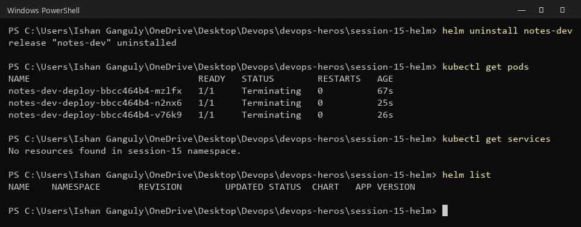

### What I practiced

```text
[PASS] Created a Helm chart from scratch
[PASS] Used values.yaml and values-prod.yaml
[PASS] Deployed to Kubernetes with helm install
[PASS] Upgraded the release with different values
[PASS] Simulated a bad upgrade (broken image tag)
[PASS] Rolled back to a healthy revision
[PASS] Cleaned up with helm uninstall
```

## Cleanup

```powershell
kubectl delete namespace session-15
kubectl config set-context --current --namespace=default
helm repo remove bitnami     # optional
```

## Key Learnings

- A **chart** is a template, a **release** is an installed instance, and **values** customise it. One chart can serve dev, staging, and prod.
- Use `helm lint` and `helm template` before installing. They catch errors and show the final YAML without touching the cluster.
- Value priority is `values.yaml` < `-f file` < `--set`. Use values files in pipelines so configuration is reviewable in Git.
- Every install, upgrade, and rollback creates a new revision. A rollback adds a revision and never deletes history.
- A plain `helm upgrade` reports `deployed` even when Pods fail. `--atomic` (`--rollback-on-failure` in Helm 4) waits and rolls back automatically.
- `helm upgrade` without `-f` resets to chart defaults. Pass the same values file every time, or use `--reuse-values`.
- Do not hardcode cluster-wide resources such as NodePorts in templates. Expose them as values so different installs do not conflict.
- `helm uninstall` removes every resource the release created in one command.
