# Session 16 - CI/CD with GitHub Actions

This assignment covers every Session 16 folder: CI vs CD, pipeline stages, GitHub Actions workflows, jobs and steps, runners, secrets, artifacts, a build-and-test pipeline, and the final multi-job CI/CD pipeline. Local parts (the calculator app, `pytest`, the build scripts) were run on my machine. Every workflow was then pushed to a real GitHub repository and run on GitHub-hosted runners, with everything driven from the terminal through the GitHub CLI (`gh`).

**Repository used for the workflow runs:** https://github.com/Ishan007-bot/session16-cicd-github-actions

```text
git push → GitHub Actions → Test → Security Check → Build → Artifact → Ready for CD
```

## Prerequisites

All commands were run in **Windows PowerShell**. Tools used:

| Tool | Version / note |
| :--- | :--- |
| Python | 3.12.10 (local), 3.12 on the runner |
| pytest | 8.3.3 |
| Git | Git for Windows |
| GitHub CLI | `gh` 2.92.0, logged in with `gh auth login` (scopes `repo`, `workflow`) |

> **Running `.sh` scripts from PowerShell:** in PowerShell, `bash` points to WSL, and this machine's WSL only has the `docker-desktop` distro, so `bash ./build.sh` fails with `execvpe(/bin/bash) failed`. The scripts were run with Git's bash instead: `& "C:\Program Files\Git\bin\bash.exe" ./build.sh`. `chmod +x` is not needed on Windows; on the Linux runner the workflows run `chmod +x build.sh` themselves.

### Why a separate repository?

GitHub only runs workflows stored in the **repository root** `.github/workflows/`. The session's workflows are inside each topic folder (e.g. `03-github-actions/.github/workflows/`), so pushing `devops-heros` would not run them. Following section 9 of the `10-final-cicd-pipeline` README, a new repository `session16-cicd-github-actions` was created, with all workflows in its root `.github/workflows/` and the 08/09/10 projects in their own folders:

```text
session16-cicd-github-actions/
├── .github/workflows/
│   ├── hello-actions.yml      (03)     ├── secrets-demo.yml     (07)
│   ├── workflow-demo.yml      (04)     ├── artifact-demo.yml    (08)
│   ├── jobs-steps.yml         (05)     ├── build-and-test.yml   (09)
│   └── runner-demo.yml        (06)     └── final-ci.yml         (10)
├── 08-artifacts/build.sh
├── 09-build-and-test/  (app/, tests/, build.sh, requirements.txt)
└── 10-final-cicd-pipeline/  (app/, tests/, build.sh, requirements.txt)
```

Workflows 03–07 are unchanged copies. Because 08/09/10 now live in subfolders, those three workflows got two small additions:
- `defaults.run.working-directory: <folder>`, and the artifact `path:` prefixed with the folder.
- For 09 and 10, a `paths:` filter (`09-build-and-test/**`, `10-final-cicd-pipeline/**`). Without it, pushing a change to 09 would also run 10's pipeline.

### Create the repository and push

```powershell
git init -b main
git add .
git commit -m "Add Session 16 GitHub Actions workflows"
gh repo create session16-cicd-github-actions --public --source . --remote origin --push
gh workflow list
```

`gh repo create ... --push` printed the repository URL and `* [new branch] HEAD -> main`. GitHub registered all 8 workflows:

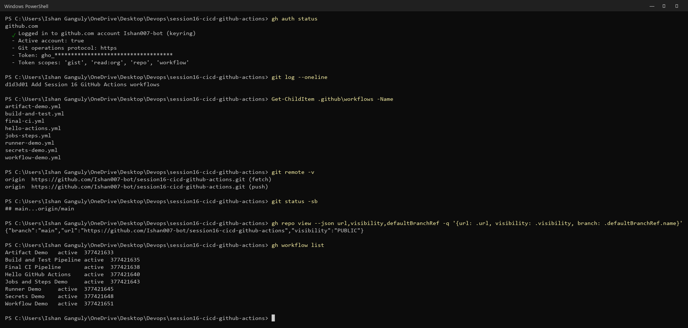

## 1. CI vs CD

| | Continuous Integration (CI) | Continuous Delivery / Deployment (CD) |
| :--- | :--- | :--- |
| Goal | Make sure every change is healthy | Get healthy changes to users |
| Steps | Checkout → Build → Test | Package → Deploy |
| Trigger | Every push / pull request | After CI passes |
| Focus | Find problems early | Automate the release |

- **Continuous Delivery:** after CI passes, the app is always *ready* to deploy; a person presses the button.
- **Continuous Deployment:** after CI passes, the app is deployed to production *automatically*.

The pipelines in tasks 9 and 10 are CI: build + test + artifact. The uploaded artifact is the hand-off point for CD.

## 2. CI/CD Pipeline

A pipeline is an automated sequence of stages; if a stage fails, the rest do not run.

```text
Checkout → Build → Test ──FAIL──► STOP
                     └──PASS──► Package → Deploy
```

| Stage | Session example |
| :--- | :--- |
| Checkout | `actions/checkout@v6` |
| Build | `./build.sh` |
| Test | `pytest -v` |
| Package | `build/` folder (`calculator.py`, `build-info.txt`) uploaded as an artifact |
| Deploy | next step after this session (Docker / Kubernetes / cloud) |

Tasks 9 and 10 show the "FAIL → STOP" behaviour on a real run.

## 3. GitHub Actions - Hello Workflow

`hello-actions.yml` uses `on: workflow_dispatch`, so it is started manually. From the terminal, that is `gh workflow run` (the same as the **Run workflow** button in the Actions tab):

```powershell
gh workflow run hello-actions.yml
gh run list --workflow hello-actions.yml --limit 3
```

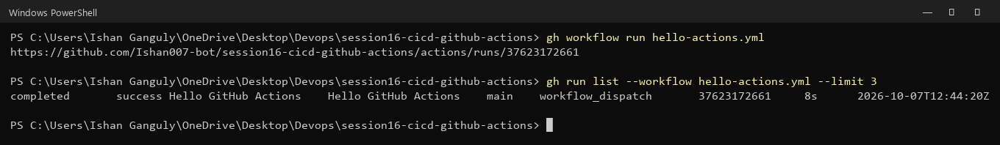

```powershell
gh run view <run-id>
gh run view <run-id> --log | Select-String -Pattern 'Z (Hello from|.* UTC 20|Linux)'
```

| Step | Output |
| :--- | :--- |
| Print message | `Hello from GitHub Actions!` |
| Show date | `Wed Oct  7 12:44:24 UTC 2026` |
| Show operating system | `Linux runnervm8df0l 6.17.0-1022-azure #22-Ubuntu SMP ... x86_64 GNU/Linux` |

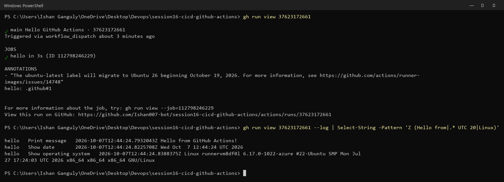

> The **ANNOTATIONS** section in every run shows a GitHub notice that `ubuntu-latest` will move to Ubuntu 26 from 19 October 2026. It is informational and did not affect any run.

## 4. Workflows

A workflow is a YAML file in `.github/workflows/` that defines **WHEN** (trigger, `on:`) and **WHAT** (jobs and steps).

```powershell
gh workflow run workflow-demo.yml
gh run view <run-id> --log | Select-String -Pattern 'Z (Workflow started|Running application task|Running tests|Workflow completed)'
```

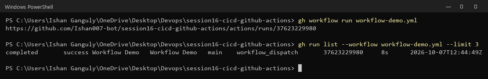

The four steps ran in order and printed exactly the expected output:

```text
Workflow started
Running application task
Running tests
Workflow completed
```

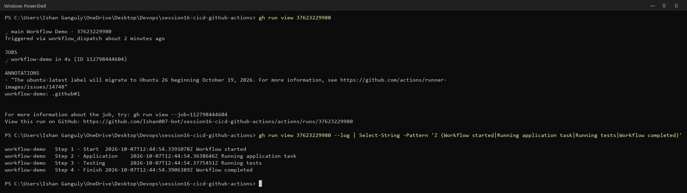

Triggers used in this assignment: `workflow_dispatch` (manual, tasks 3–8), and `push` / `pull_request` to `main` (tasks 9–10).

## 5. Jobs and Steps

```powershell
gh workflow run jobs-steps.yml
gh run view <run-id>
gh run view <run-id> --log | Select-String -Pattern 'Z (Building application|Build successful|Running test|All tests passed)'
```

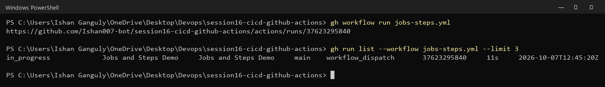

The run has two jobs, **Build Job** and **Test Job**, and both succeeded. The log timestamps show that they ran **in parallel**: `Running test 1` (`12:45:26.46`) was logged *before* `Building application...` (`12:45:26.59`). That is because there is no `needs:` between them. Steps *inside* each job ran in order.

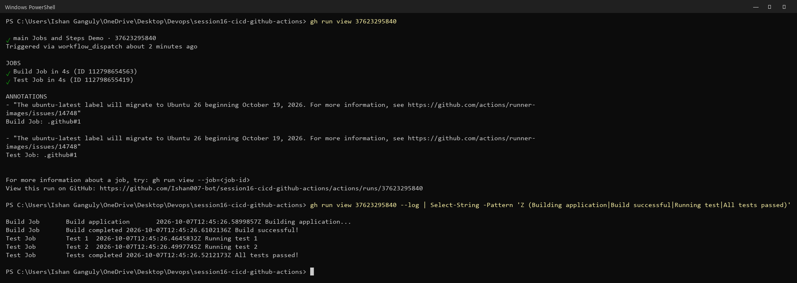

| Job | Step |
| :--- | :--- |
| Larger unit; gets its own runner | Smaller unit; one command or action |
| Jobs run in parallel unless `needs:` is set | Steps in a job always run in sequence |

Adding `needs: build` to the test job would make it wait for the build job. Task 10 uses exactly that.

## 6. Runners

```powershell
gh workflow run runner-demo.yml
gh run view <run-id> --log | Select-String -Pattern 'Z (runner|Linux|/home/runner|Python 3)'
```


| Command | Output on the GitHub-hosted `ubuntu-latest` runner |
| :--- | :--- |
| `hostname` | `runnervm8df0l` |
| `uname -a` | `Linux runnervm8df0l 6.17.0-1022-azure ... x86_64 GNU/Linux` |
| `pwd` | `/home/runner/work/session16-cicd-github-actions/session16-cicd-github-actions` |
| `python --version` | `Python 3.12.3` |

The runner is a fresh Azure Linux VM created for the job and thrown away afterwards. `pwd` shows where `actions/checkout` puts the repository (`/home/runner/work/<repo>/<repo>`).

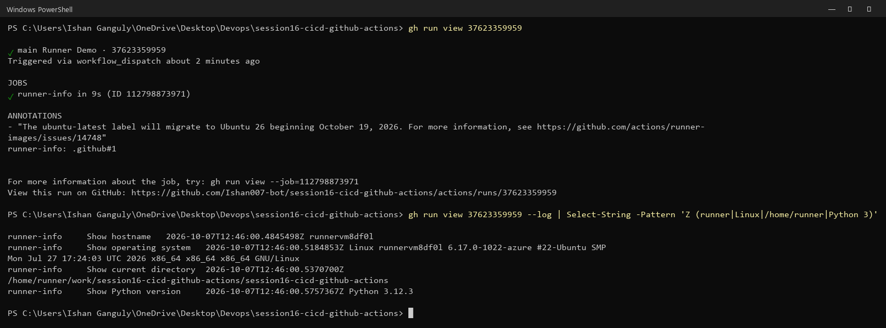

## 7. Secrets

The workflow reads `secrets.DEMO_SECRET` into an env var, and only checks whether it is set. It never prints the value.

### Run without the secret

```powershell
gh workflow run secrets-demo.yml
gh run view <run-id> --log | Select-String -Pattern 'Z (Secret is|##\[error\])'
```

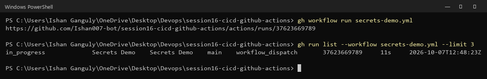

The run **failed**, as the README expects: `Secret is not configured.`, then `Process completed with exit code 1`.

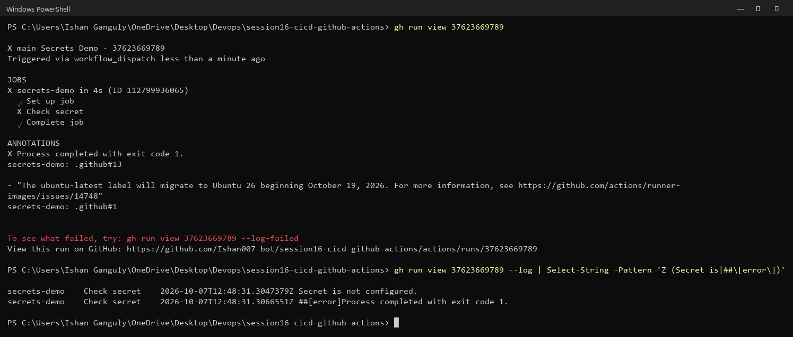

### Create the repository secret

In the README this is done in **Settings → Secrets and variables → Actions → New repository secret**. From the terminal:

```powershell
gh secret set DEMO_SECRET --body hello-github-actions
gh secret list
```

The value is a fake classroom value. `gh secret list` shows only the name and update time, never the value.

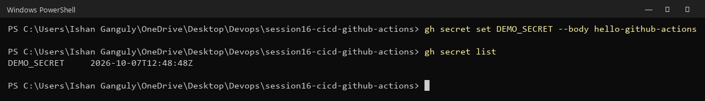

### Run with the secret

```powershell
gh workflow run secrets-demo.yml
```

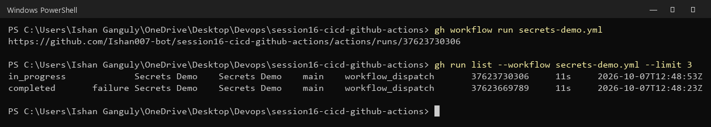

The run **succeeded** with `Secret is available.`

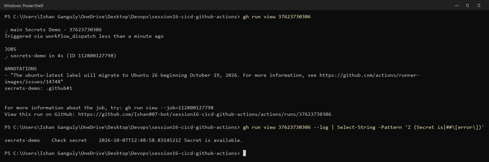

Rules: never hardcode secrets in YAML; inject them with `${{ secrets.NAME }}`; never `echo` them. GitHub masks secret values as `***` in logs, but you should not rely on that.

## 8. Artifacts

### Build locally

```powershell
& "C:\Program Files\Git\bin\bash.exe" ./build.sh
Get-ChildItem build
Get-Content build\version.txt, build\build-info.txt, build\app.txt
```

The build creates `app.txt`, `build-info.txt`, and `version.txt`. The first command in the screenshot shows the WSL `bash` error explained in Prerequisites.

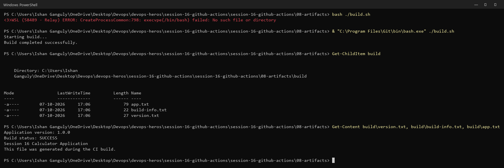

### Upload in the workflow

```powershell
gh workflow run artifact-demo.yml
gh run view <run-id>
```

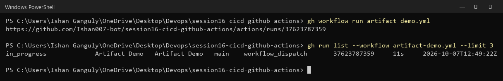

The run built the three files, listed them, and `actions/upload-artifact@v4` uploaded them: `Artifact session16-build has been successfully uploaded!`. `gh run view` lists it under **ARTIFACTS**.

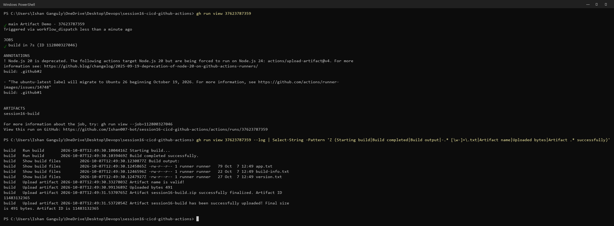

### Download the artifact

In the README this is **Summary → Artifacts → session16-build → Download**. From the terminal:

```powershell
gh run download <run-id> -n session16-build -D Session-16-Assignments\08-artifacts\session16-build
```

The downloaded files are saved in [08-artifacts/session16-build](08-artifacts/session16-build).

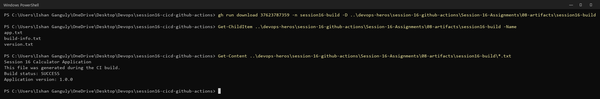

**Git stores source code; artifacts store what a workflow *produced*.**

## 9. Build & Test Pipeline

### Run locally

```powershell
python app\calculator.py
python -m pip install -r requirements.txt
python -m pytest -v
& "C:\Program Files\Git\bin\bash.exe" ./build.sh
```

> The current `calculator.py` is an **interactive** calculator. It asks for input such as `10 + 5`, which differs from the fixed output shown in the README. The inputs were piped in from PowerShell. Results: `10 + 5 = 15.0`, `10 - 5 = 5.0`, `10 * 5 = 50.0`, `10 / 5 = 2.0`, and `10 / 0` → `Error: Cannot divide by zero`.

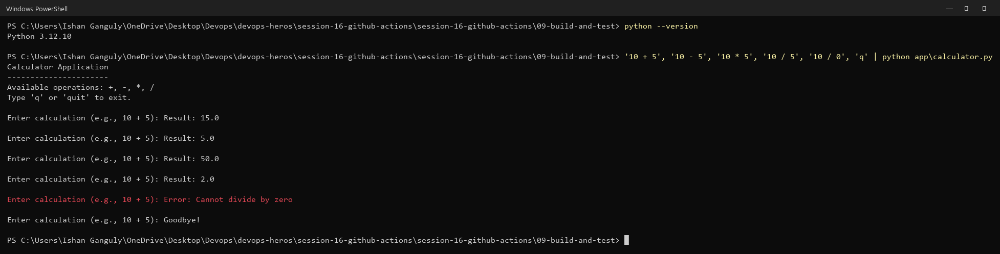

All 5 tests passed locally:

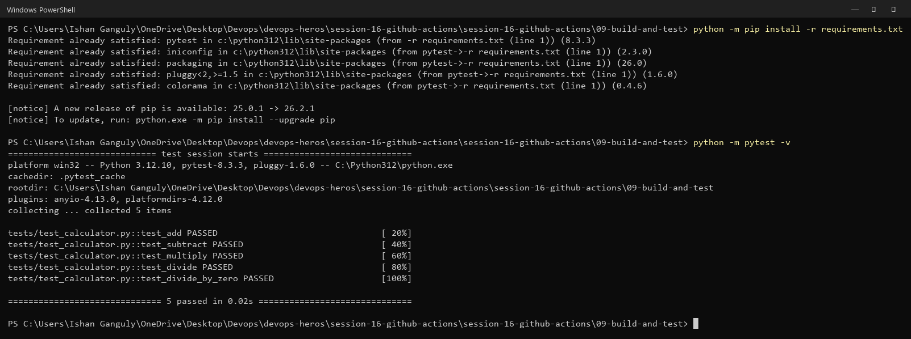

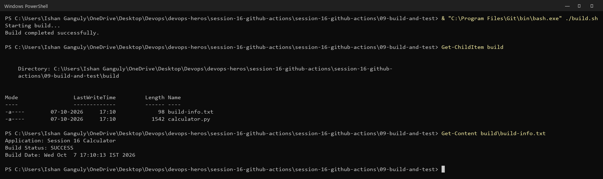

### Pipeline on GitHub (triggered by push)

The first push to `main` triggered **Build and Test Pipeline** automatically. Every step passed: Checkout → Setup Python → Show Python version → Install dependencies → Run tests (`5 passed`) → Build application → Show build output → Upload artifact.

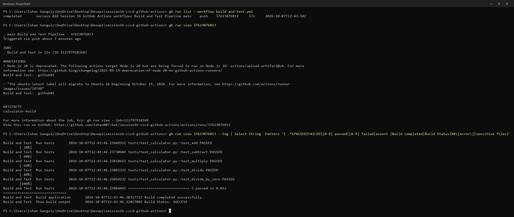

```powershell
gh run download <run-id> -n calculator-build -D Session-16-Assignments\09-build-and-test\calculator-build
```

The downloaded artifact is in [09-build-and-test/calculator-build](09-build-and-test/calculator-build).

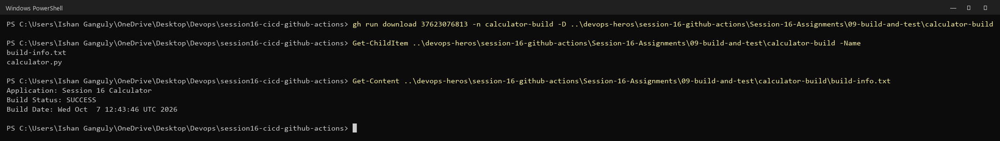

### Failure test

`add()` was broken to `return a + b + 1`, checked locally (`1 failed, 4 passed`), committed, and pushed:

```powershell
(Get-Content 09-build-and-test\app\calculator.py) -replace 'return a \+ b$', 'return a + b + 1' | Set-Content 09-build-and-test\app\calculator.py
python -m pytest 09-build-and-test\tests -q
git add 09-build-and-test
git commit -m "Test pipeline failure" --trailer "Co-Authored-By: Ishan <ishanganguly10a12@gmail.com>"
git push
```

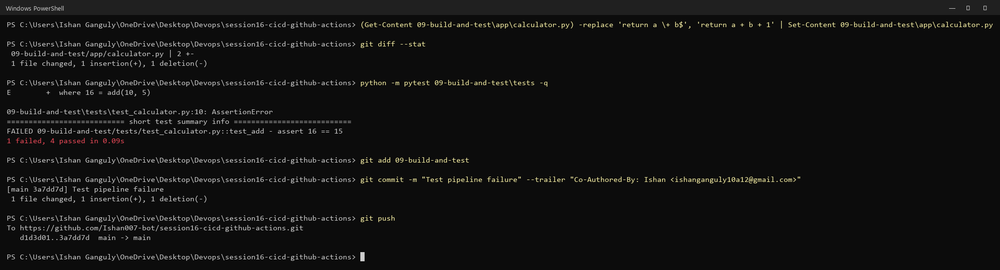

The push-triggered run **failed at `Run tests`** (`FAILED tests/test_calculator.py::test_add - assert 16 == 15`). The later steps, **Build application, Show build output and Upload artifact, show `-` (skipped)**: the pipeline stopped, so no broken build was published.

```text
✓ Checkout source code
✓ Setup Python
✓ Install dependencies
X Run tests
- Build application
- Upload artifact
```

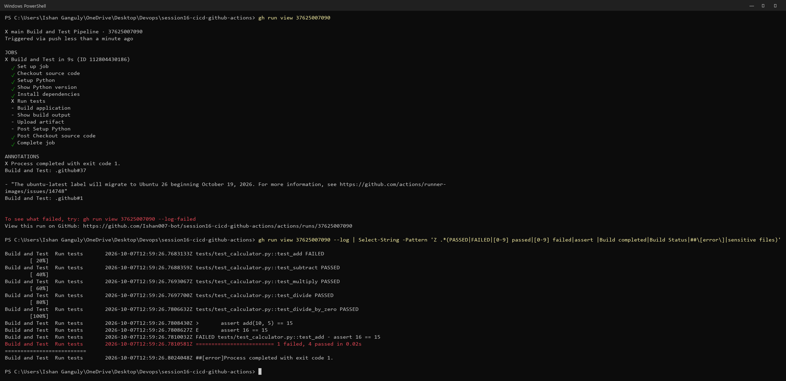

### Fix

```powershell
(Get-Content 09-build-and-test\app\calculator.py) -replace 'return a \+ b \+ 1$', 'return a + b' | Set-Content 09-build-and-test\app\calculator.py
git add 09-build-and-test
git commit -m "Fix calculator" --trailer "Co-Authored-By: Ishan <ishanganguly10a12@gmail.com>"
git push
```

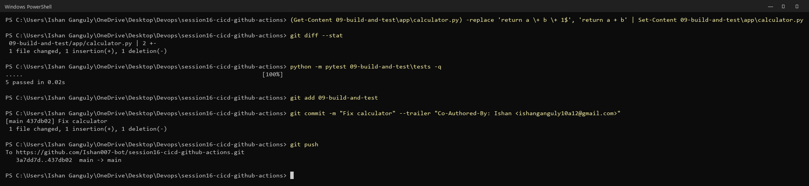

The pipeline is green again: `5 passed`, Build application ✓, Upload artifact ✓.

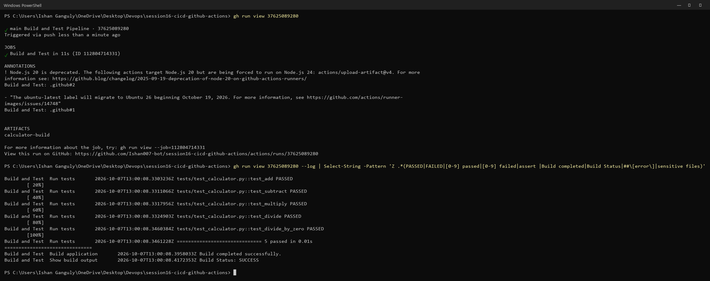

## 10. Final CI/CD Pipeline

```text
                git push
                   │
                   ▼
            ┌─────────────┐
            │    test     │
            └──────┬──────┘
          needs: test (both)
           ┌───────┴────────┐
           ▼                ▼
   ┌───────────────┐ ┌───────────────┐
   │ security-check│ │     build     │──► calculator-build artifact
   └───────────────┘ └───────────────┘
```

### Run locally

```powershell
python -m pip install -r requirements.txt
python -m pytest -v
& "C:\Program Files\Git\bin\bash.exe" ./build.sh
```

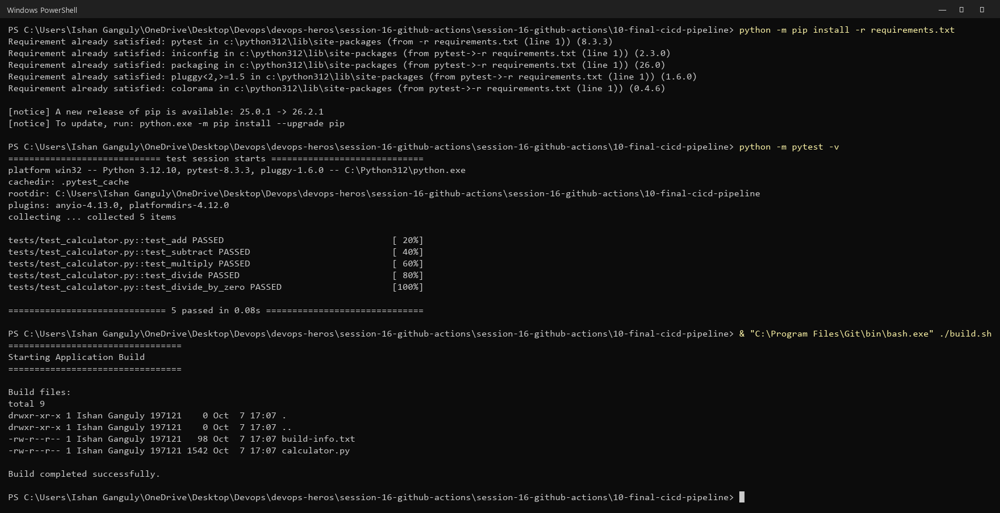

### First push run

All three jobs passed: **Test Application** (5 tests passed), then **Security Check** (`No common sensitive files found.`) and **Build Application** (`Build Status: SUCCESS`, artifact uploaded). Both later jobs started only after `test` finished.

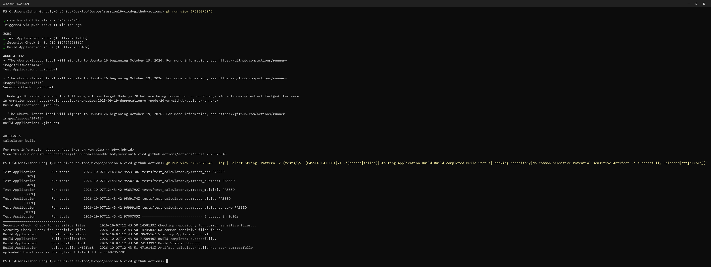

### Failure scenario

```powershell
(Get-Content 10-final-cicd-pipeline\app\calculator.py) -replace 'return a \+ b$', 'return a + b + 1' | Set-Content 10-final-cicd-pipeline\app\calculator.py
git add 10-final-cicd-pipeline
git commit -m "Break application" --trailer "Co-Authored-By: Ishan <ishanganguly10a12@gmail.com>"
git push
```

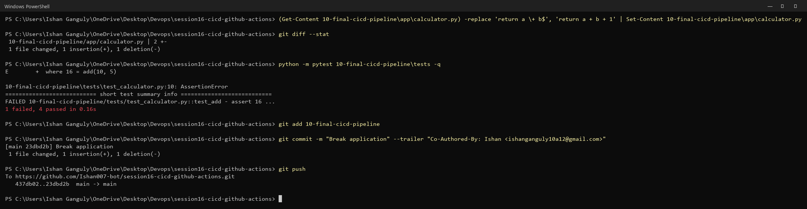

```text
X Test Application
- Build Application    (0s, skipped)
- Security Check       (0s, skipped)
```

Because both jobs have `needs: test`, they did not run once the test job failed, so no artifact was produced from broken code.

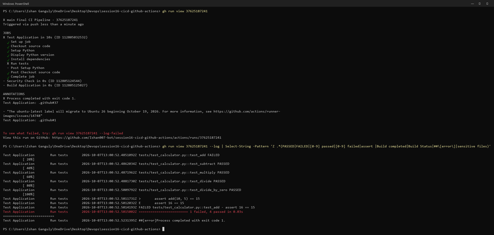

### Fix

```powershell
(Get-Content 10-final-cicd-pipeline\app\calculator.py) -replace 'return a \+ b \+ 1$', 'return a + b' | Set-Content 10-final-cicd-pipeline\app\calculator.py
git add 10-final-cicd-pipeline
git commit -m "Fix application" --trailer "Co-Authored-By: Ishan <ishanganguly10a12@gmail.com>"
git push
```

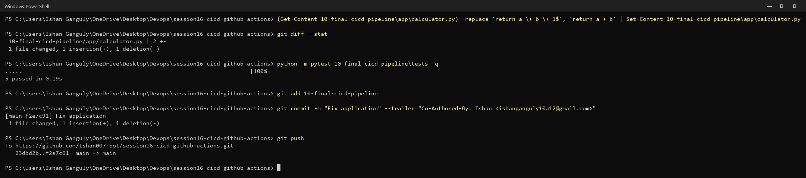

```text
✓ Test Application
✓ Security Check
✓ Build Application
✓ Upload build artifact
```

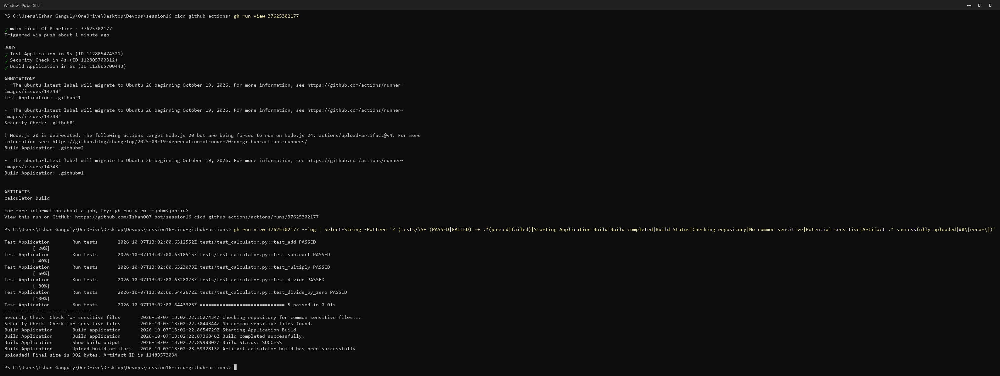

### Download the artifact and review all runs

```powershell
gh run download <run-id> -n calculator-build -D Session-16-Assignments\10-final-cicd-pipeline\calculator-build
gh run list --limit 20
```

The artifact contains `calculator.py` and `build-info.txt` (`Build Status: SUCCESS`). It is saved in [10-final-cicd-pipeline/calculator-build](10-final-cicd-pipeline/calculator-build).

`gh run list` shows every run in the assignment. Every failure in it was expected: the secret before it was set, and the deliberate test failures.

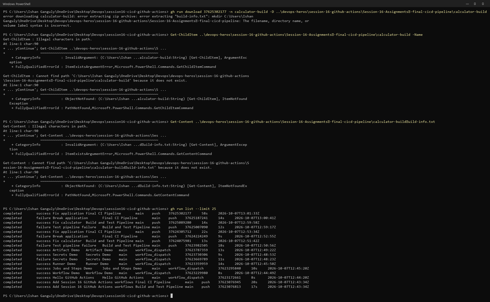

### Commit history

```powershell
git log --format='%h %an <%ae>%n    %s%n    %(trailers:key=Co-Authored-By,valueonly,separator=)'
```

All five commits on `main` are authored by `Ishan <ishanganguly10a12@gmail.com>`, with the same co-author trailer.

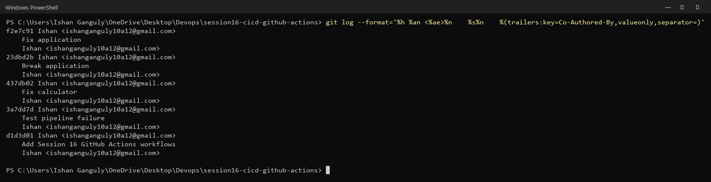

## Summary of Runs

| Workflow | Trigger | Result |
| :--- | :--- | :--- |
| Build and Test Pipeline | push (initial commit) | ✓ success |
| Final CI Pipeline | push (initial commit) | ✓ success |
| Hello GitHub Actions | workflow_dispatch | ✓ success |
| Workflow Demo | workflow_dispatch | ✓ success |
| Jobs and Steps Demo | workflow_dispatch | ✓ success |
| Runner Demo | workflow_dispatch | ✓ success |
| Secrets Demo (no secret) | workflow_dispatch | X failure (expected) |
| Secrets Demo (secret set) | workflow_dispatch | ✓ success |
| Artifact Demo | workflow_dispatch | ✓ success |
| Build and Test Pipeline | push "Test pipeline failure" | X failure (expected) |
| Build and Test Pipeline | push "Fix calculator" | ✓ success |
| Final CI Pipeline | push "Break application" | X failure (expected) |
| Final CI Pipeline | push "Fix application" | ✓ success |

## Concept Map

```text
CI/CD
├── CI  → Build + Test (tasks 9, 10)
├── CD  → Deliver / Deploy (artifact is the hand-off)
└── GitHub Actions
    ├── Workflow   (.github/workflows/*.yml, `on:` trigger)
    ├── Jobs       (parallel by default, `needs:` for order)
    ├── Steps      (`uses:` an action or `run:` a command)
    ├── Runner     (ubuntu-latest VM)
    ├── Secrets    (${{ secrets.NAME }}, never printed)
    └── Artifacts  (upload-artifact / gh run download)
```

## Key Learnings

- GitHub only runs workflows from the repository root `.github/workflows/`.
- `workflow_dispatch` workflows can be run from the terminal with `gh workflow run`, inspected with `gh run view --log`, and their artifacts fetched with `gh run download`.
- Jobs run in parallel by default; `needs:` creates the order `test → build`, and a failed job skips everything that depends on it.
- A failing test stops the pipeline, so a broken build is never packaged or uploaded. That is the main point of CI.
- Secrets live in the repository settings (or `gh secret set`), are injected with `${{ secrets.NAME }}`, and should be checked, never printed.
- Artifacts keep build output after the runner VM is destroyed. Git is for source code, artifacts are for what the pipeline produced.
- `paths:` filters keep a monorepo's pipelines independent.
- On Windows, run `.sh` scripts from PowerShell through Git's bash when WSL has no Linux distro installed.
