# Session 17 - DevSecOps

This assignment builds a complete DevSecOps pipeline for the Session 17 Flask app (`demo/`). It runs unit tests, SAST (CodeQL), SCA (pip-audit), secret scanning, a Docker build, a Trivy image scan used as a **security gate**, a push to **GitHub Container Registry (GHCR)**, and a Kubernetes deployment. Every security tool was first run locally, then wired into a real GitHub Actions pipeline. Every finding the tools reported was investigated and remediated.

**Repository used for the pipeline:** https://github.com/Ishan007-bot/session17-devsecops-python
**Published image:** `ghcr.io/ishan007-bot/session17-devsecops-python`

```text
Git Push
   ↓
Unit Tests ─┐
SAST ───────┼──► Docker Build ──► Trivy Image Scan ──► Security Gate ──► GHCR Push ──► Kubernetes Deploy ──► Rollout check
SCA ────────┘                                          ├── FAIL → STOP
                                                       └── PASS → continue
```

## Prerequisites

All commands were run in **Windows PowerShell**.

| Tool | Version |
| :--- | :--- |
| Python | 3.12.10 (virtual environment `.venv`) |
| Docker | Docker Desktop, engine 28.5.2 |
| Trivy | 0.75.0 (`winget install AquaSecurity.Trivy`) |
| pip-audit | latest from PyPI |
| GitHub CLI | `gh`, logged in as `Ishan007-bot` |
| Kubernetes | Minikube (v1.37.0), namespace `session-17` |

### The pipeline repository

The `demo/` app was copied into a new repository, `session17-devsecops-python` (the name used in the 02 README), so that GitHub Actions could run its workflow from the repository root. Changes compared with the demo:

| Change | Reason |
| :--- | :--- |
| Push to **GHCR** instead of `nensiravaliya28/hey-cicd` on Docker Hub | The demo pushes to the instructor's Docker Hub account. Task 02 asks for GHCR, which uses the built-in `GITHUB_TOKEN` (no extra secret) |
| Image name lowercased with `${GITHUB_REPOSITORY,,}` | GHCR only accepts lowercase names, and the owner is `Ishan007-bot` |
| `--exit-code 1` added to the Trivy step | Without it, the demo's scan only *reports* findings and never blocks the pipeline (task 08) |
| Deploy job pulls the image from GHCR and loads it into the Kind cluster | The deployment uses the exact image that passed the gate and was published |
| `readinessProbe` / `livenessProbe` on `/health` added to `k8s/deployment.yaml` | As shown in the 03 README |
| New `.dockerignore` and `.gitignore` | The demo's ignore file is broken: it is named `.dockerignore  │`, so Docker ignores nothing. `.coverage` and `__pycache__` were also committed in `demo/` |

```powershell
git init -b main
git add .
git commit -m "Add Session 17 DevSecOps pipeline"
gh repo create session17-devsecops-python --public --source . --remote origin --push
```

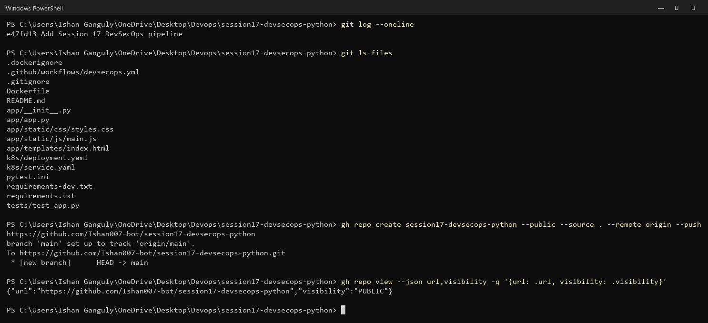

## 1. The Application and Unit Tests

```powershell
python -m venv .venv
.venv\Scripts\python -m pip install -r requirements-dev.txt
.venv\Scripts\python -m pytest --cov=app --cov-report=term-missing
```

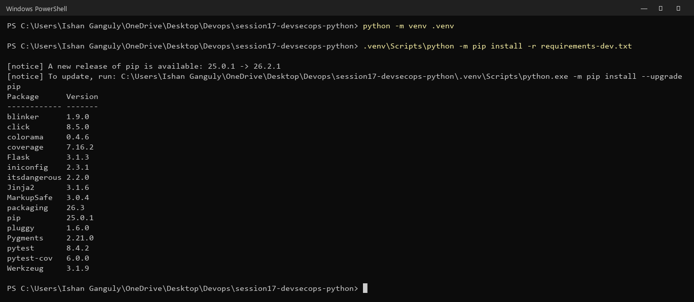

All **8 tests passed**, with **69 %** coverage of `app/app.py`. The warnings are `datetime.utcnow()` deprecation notices from Python 3.12.

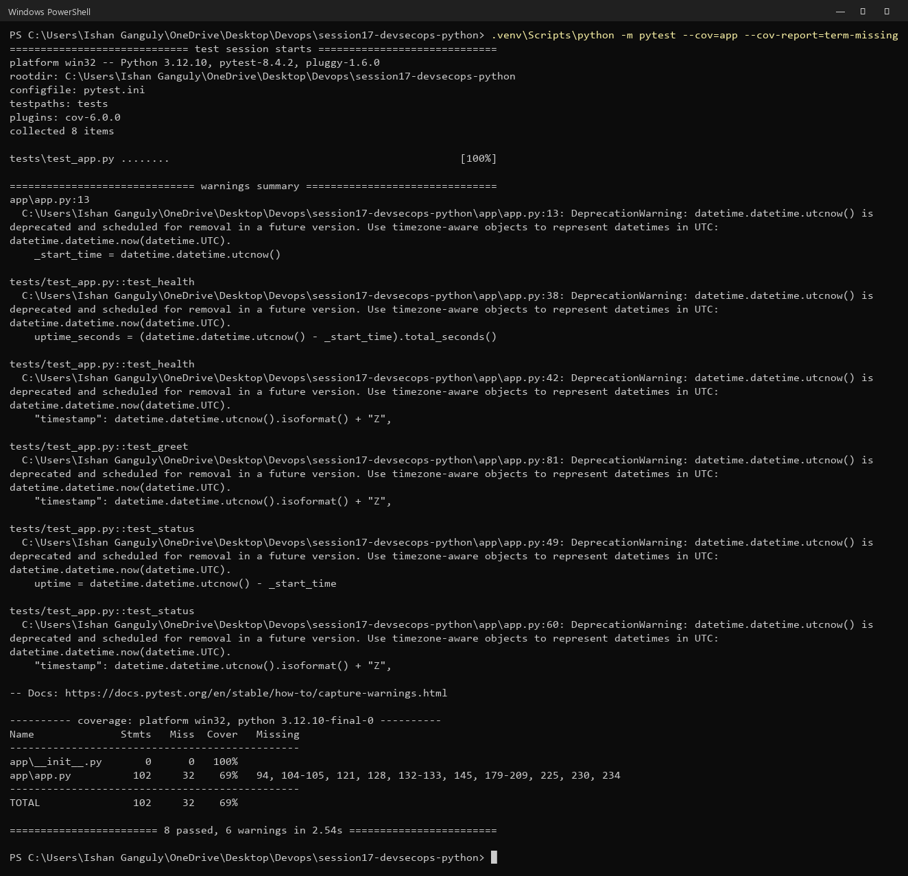

The app runs on port 5001:

```powershell
Invoke-RestMethod http://localhost:5001/health
Invoke-RestMethod http://localhost:5001/api/status
Invoke-RestMethod http://localhost:5001/api/greet/Ishan
Invoke-RestMethod http://localhost:5001/api/add -Method Post -ContentType 'application/json' -Body '{"number1": 10, "number2": 20}'
```

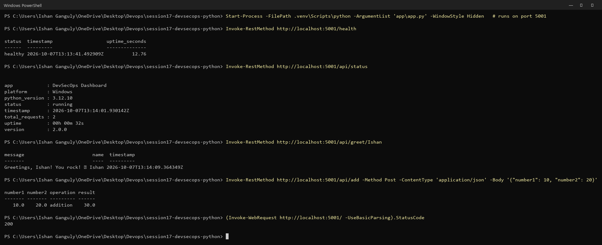

## 2. Container Registry (GHCR)

The `push` job logs in with the built-in token and pushes two tags, the commit SHA and `latest`:

```yaml
push:
  needs: [image-scan]
  permissions:
    contents: read
    packages: write
  steps:
    - run: echo "IMAGE=ghcr.io/${GITHUB_REPOSITORY,,}" >> "$GITHUB_ENV"
    - uses: docker/login-action@v3
      with:
        registry: ghcr.io
        username: ${{ github.actor }}
        password: ${{ secrets.GITHUB_TOKEN }}
    - run: docker build -t $IMAGE:${{ github.sha }} -t $IMAGE:latest .
    - run: |
        docker push $IMAGE:${{ github.sha }}
        docker push $IMAGE:latest
```

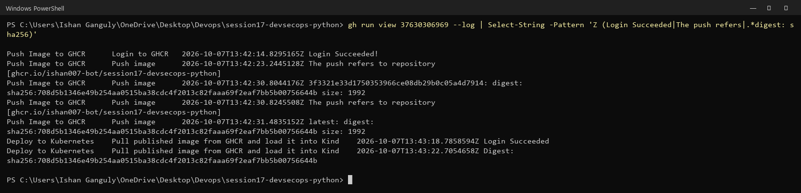

**Verify:** after `docker logout ghcr.io`, the image could still be pulled anonymously, because the package is public like the repository. The package page also responds with HTTP 200.

```powershell
docker logout ghcr.io
docker pull ghcr.io/ishan007-bot/session17-devsecops-python:3f3321e33d1750353966ce08db29b0c05a4d7914
```

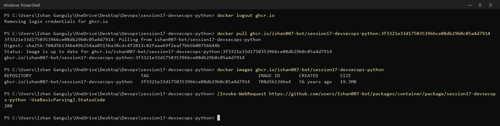

**Practice answers:**
1–3. The image was built, the pipeline logged in to GHCR with `GITHUB_TOKEN`, and it pushed the image (digest `sha256:708d5b13…`).
4. Package: https://github.com/users/Ishan007-bot/packages/container/package/session17-devsecops-python
5. Exact image: `ghcr.io/ishan007-bot/session17-devsecops-python:3f3321e33d1750353966ce08db29b0c05a4d7914`

## 3. Kubernetes Deployment

### From GitHub Actions (Kind inside the runner)

A GitHub-hosted runner cannot reach Minikube on a laptop, so the pipeline's `deploy` job creates a throwaway **Kind** cluster on the runner. It loads the published GHCR image into it, applies `k8s/`, waits for the rollout, and smoke-tests the app:

```text
deployment.apps/session17-python created
service/session17-python created
deployment "session17-python" successfully rolled out
pod/session17-python-ccb648cfd-pcpt2   1/1   Running
pod/session17-python-ccb648cfd-zxj76   1/1   Running
{"status":"healthy", ...}
```

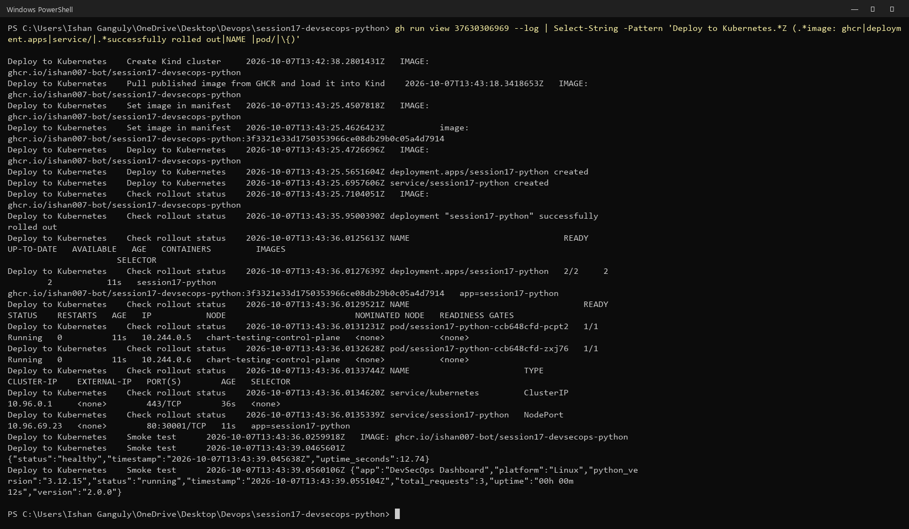

### Manual deployment to Minikube

The same GHCR image was deployed to the local cluster:

```powershell
kubectl create namespace session-17
kubectl config set-context --current --namespace=session-17
(Get-Content k8s\deployment.yaml) -replace '__IMAGE__', 'ghcr.io/ishan007-bot/session17-devsecops-python:3f3321e33d1750353966ce08db29b0c05a4d7914' | kubectl apply -f -
kubectl apply -f k8s/service.yaml
kubectl rollout status deployment/session17-python --timeout=180s
kubectl get deployment,pods,service -o wide
```

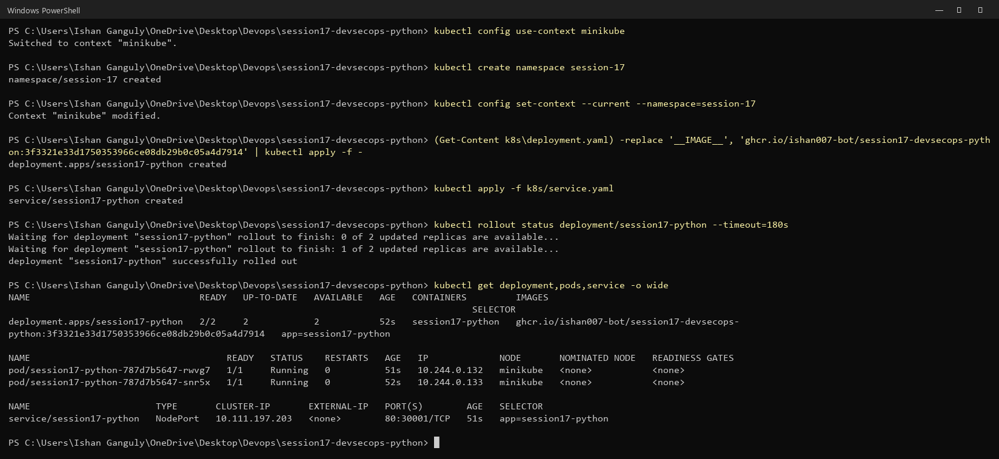

```powershell
Start-Process kubectl -ArgumentList 'port-forward','svc/session17-python','8081:80' -WindowStyle Hidden
Invoke-RestMethod http://localhost:8081/health
Invoke-RestMethod http://localhost:8081/api/status
```

The app reported `healthy` and **version 2.0.0**. The Service maps port 80 to container port 5001, with NodePort 30001.

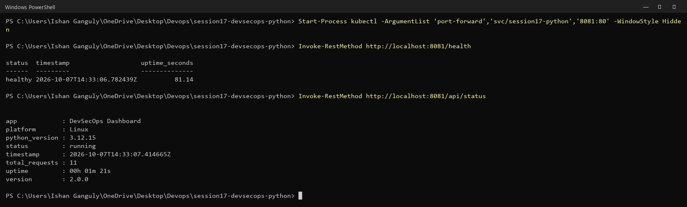

### Change the image tag and roll out

To practise updating a deployment, a new version was shipped through the full pipeline first: the app version changed from `2.0.0` to `2.1.0`.

```powershell
git commit -m "Bump application version to 2.1.0"
git push
```

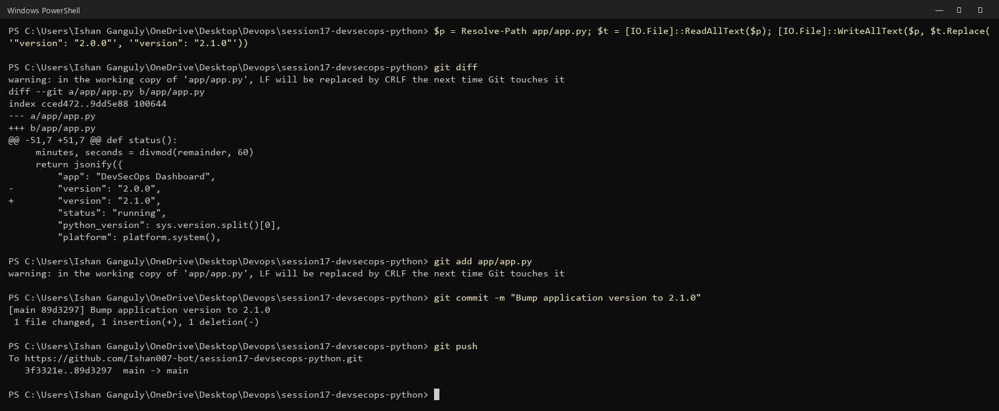

All 7 jobs passed and the new tag `89d3297…` was published to GHCR.

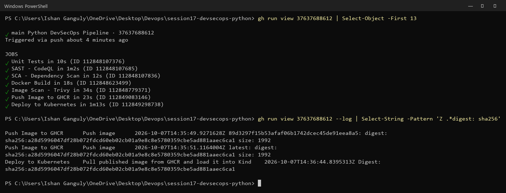

Then the local Deployment was switched to the new tag:

```powershell
kubectl set image deployment/session17-python session17-python=ghcr.io/ishan007-bot/session17-devsecops-python:89d3297f15b53afaf06b1742dcec45de91eea8a5
kubectl rollout status deployment/session17-python --timeout=180s
kubectl get pods -o wide
kubectl rollout history deployment/session17-python
```

`kubectl set image` started a rolling update: new Pods were created one at a time while the old ones terminated. `rollout history` now shows revisions 1 and 2.

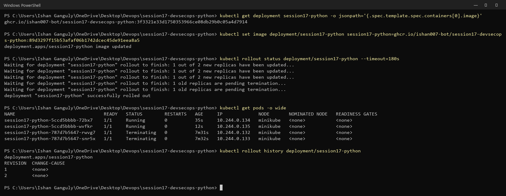

The new Pods report **version 2.1.0**:

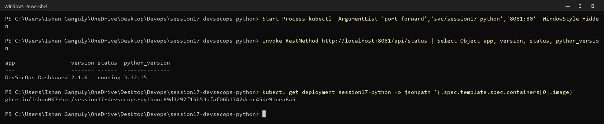

## 4. SAST - CodeQL

The `sast` job runs CodeQL on the Python code and uploads the results to the repository's **Security → Code scanning** page. They can also be read from the terminal:

```powershell
gh api repos/Ishan007-bot/session17-devsecops-python/code-scanning/alerts | ConvertFrom-Json | Format-Table number, @{n='rule';e={$_.rule.id}}, ...
```

CodeQL reported one **HIGH** finding:

| # | Rule | Severity | Location | Description |
| :--- | :--- | :--- | :--- | :--- |
| 1 | `py/flask-debug` | high | `app/app.py:234` | Flask app is run in debug mode |

`app.run(host="0.0.0.0", port=5001, debug=True)` enables the Werkzeug interactive debugger. On a reachable host, that lets anyone who triggers an error run arbitrary Python code on the server.

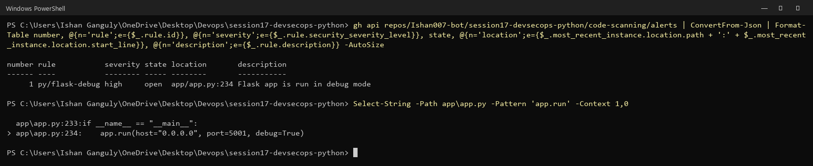

### Fix and push again

Debug mode is now off by default, and only enabled when `FLASK_DEBUG=1` is set for local development:

```diff
-    app.run(host="0.0.0.0", port=5001, debug=True)
+    app.run(host="0.0.0.0", port=5001, debug=os.getenv("FLASK_DEBUG") == "1")
```

```powershell
git add app/app.py
git commit -m "Disable Flask debug mode by default (CodeQL py/flask-debug)"
git push
```

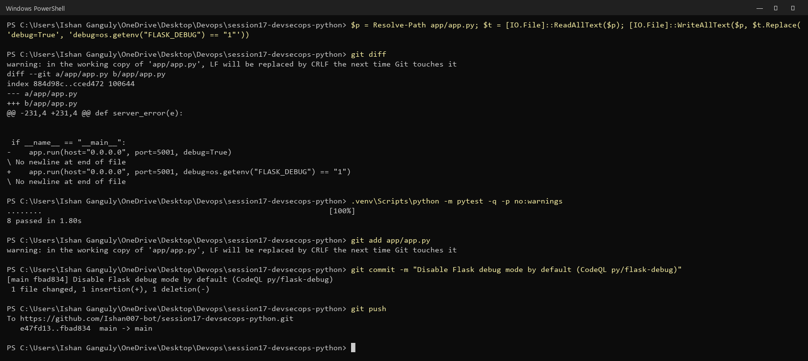

After the next CodeQL analysis of `main`, GitHub closed the alert automatically. Its state changed from **`open`** to **`fixed`**:

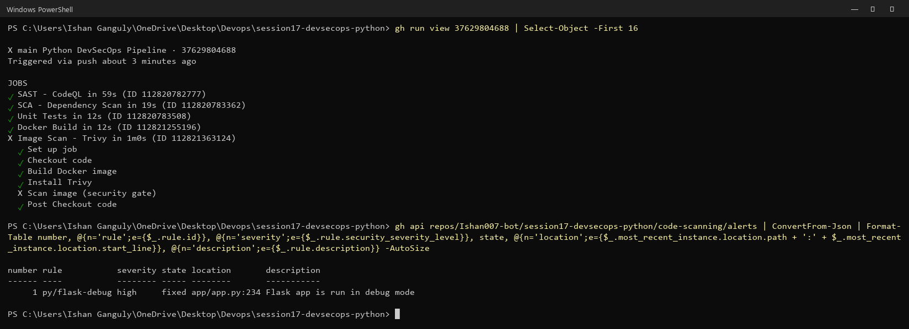

> The CodeQL job uploads findings but does **not** fail the pipeline by itself. To block on SAST findings, add a code-scanning check in branch protection, or fail the job based on alert severity.

## 5. SCA - pip-audit

```powershell
.venv\Scripts\python -m pip install pip-audit
.venv\Scripts\python -m pip_audit -r requirements.txt
.venv\Scripts\python -m pip_audit
```

- `pip-audit -r requirements.txt` (only the app's runtime dependency, Flask 3.1.3): **no known vulnerabilities**.
- `pip-audit` on the whole environment found **14 known vulnerabilities in 2 packages**:

| Package | Version | Advisories | Fixed in |
| :--- | :--- | :--- | :--- |
| `pip` | 25.0.1 (bundled with the venv) | PYSEC-2026-1795, -1796, -2875, -2876, -196, -3721 | 26.2 |
| `pytest` | 8.4.2 (pinned in `requirements-dev.txt`) | PYSEC-2026-1845 | 9.0.3 |

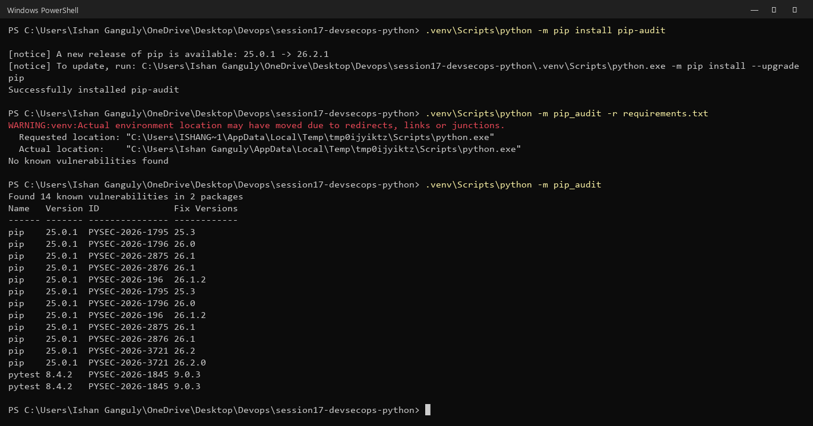

### Remediation

Following the README flow (identify package/version → check the fixed version → update → run tests → run SCA again):

```powershell
.venv\Scripts\python -m pip install --upgrade pip
(Get-Content requirements-dev.txt) -replace 'pytest==8.4.2', 'pytest==9.0.3' | Set-Content requirements-dev.txt
.venv\Scripts\python -m pip install -r requirements-dev.txt
```

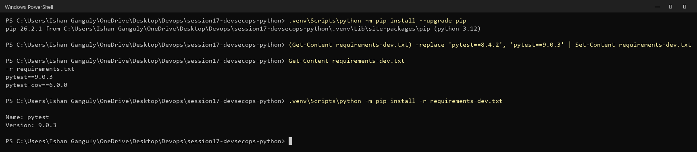

The tests still pass (8 passed) with pytest 9.0.3, and `pip-audit` now reports **No known vulnerabilities found**. The pinned `pytest==9.0.3` is what the pipeline repository uses.

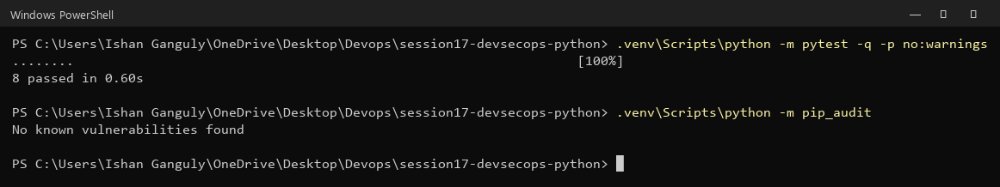

In the pipeline, the `sca` job upgrades pip, installs `requirements.txt` and `pip-audit`, and runs `pip-audit`. That job passed in every run.

## 6. Secret Scanning

GitHub turns on **secret scanning** and **push protection** automatically for public repositories:

```powershell
(gh api repos/Ishan007-bot/session17-devsecops-python | ConvertFrom-Json).security_and_analysis | Format-List
gh api repos/Ishan007-bot/session17-devsecops-python/secret-scanning/alerts      # []
```

The alert list is empty: no secrets were ever committed.

Classroom demo with a **fake** value: the key is kept in a local `.env` file, which `.gitignore` keeps out of Git, and the app code is checked for hardcoded credentials:

```powershell
Set-Content .env 'DEMO_API_KEY=replace-with-test-value'
git status --short --ignored        # !! .env  -> ignored, never committed
git check-ignore -v .env            # .gitignore:6:.env
```

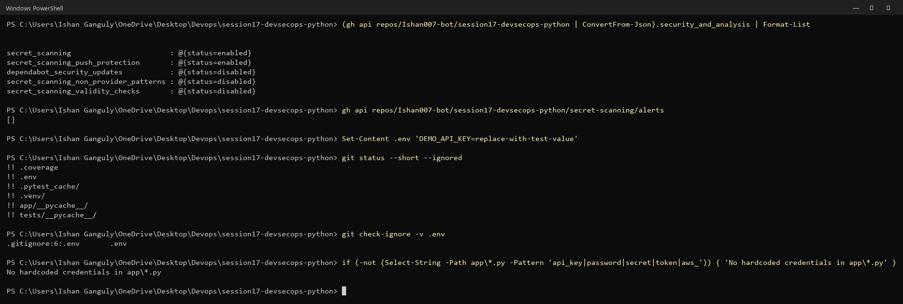

**Practice answers:**

1. **Why should secrets not be stored in source code?** Everyone with read access to the repository can see them: collaborators, forks, CI logs, and for a public repo the whole internet. Git keeps every old version, so a secret stays in the history even after the line is deleted.
2. **GitHub Actions secret vs source-code secret?** An Actions secret is stored encrypted in the repository settings. It is injected only at runtime (`${{ secrets.NAME }}`) and masked as `***` in logs. A source-code secret is plain text inside a tracked file, visible to anyone who can read the code or its history.
3. **What if a real cloud key is pushed by accident?** Treat it as compromised. **Revoke or rotate it immediately** (deleting the line is not enough). Remove it from the code, and from history if required (e.g. `git filter-repo`). Check the provider's logs for unauthorised use. Store the replacement in a secret manager or GitHub secret.

## 7. Container Image Scanning - Trivy

```powershell
docker build -t session17-python:1.0 .
docker images session17-python
```

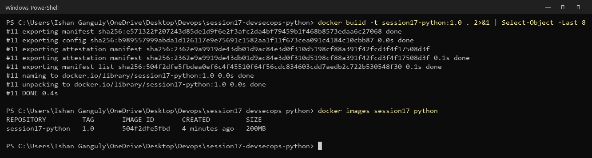

### Normal scan

```powershell
trivy image --quiet session17-python:1.0
```

| Target | Vulnerabilities |
| :--- | :--- |
| `session17-python:1.0` (Debian 13.7, from `python:3.12-slim`) | **165** |
| Python packages (Flask, Werkzeug, Jinja2, ...) | 0 |
| `pip-25.0.1` bundled in the base image | 6 |

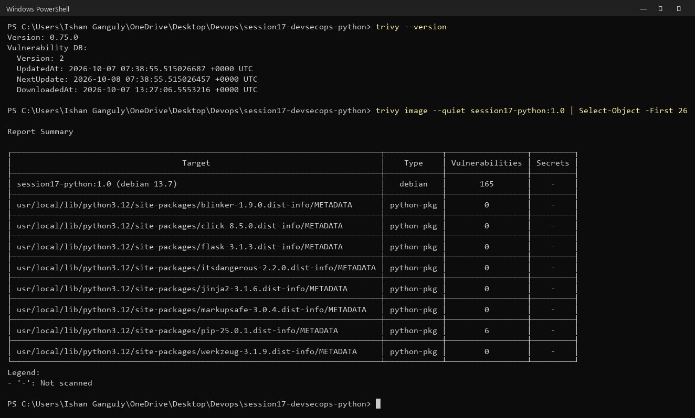

### HIGH / CRITICAL only

```powershell
trivy image --quiet --severity HIGH,CRITICAL session17-python:1.0
```

`Total: 44 (HIGH: 44, CRITICAL: 0)`. All 44 are in Debian base packages (`util-linux`, `mount`, `login`, `ncurses`, `libsystemd0`, `perl-base`, ...) and have **no fix available** (`affected` / `fix_deferred`). Without `--exit-code`, Trivy only reports, so the exit code is still `0`.

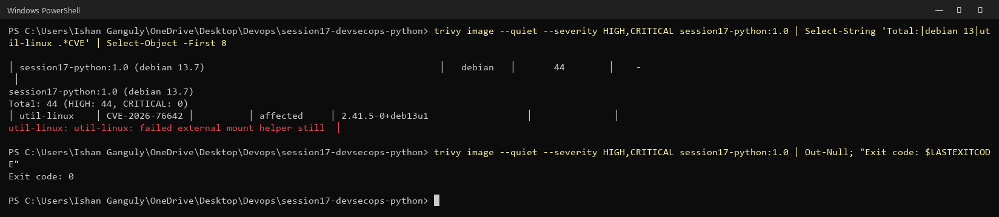

**`--exit-code 1`:** Trivy exits with status `1` when it finds vulnerabilities at the selected severities. A non-zero exit fails the GitHub Actions step, and every job that depends on it (`needs:`) is skipped. That turns a scan into a gate.

## 8. Security Gates

### The gate locally

```powershell
trivy image --quiet --severity HIGH,CRITICAL --exit-code 1 session17-python:1.0
```

44 HIGH findings → **exit code 1** → the gate fails.

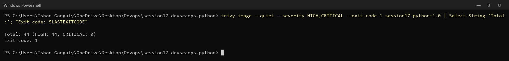

### The gate in the pipeline

The first pipeline run (initial commit) shows the gate working:

```text
✓ Unit Tests          ✓ SAST - CodeQL        ✓ SCA - Dependency Scan
✓ Docker Build
X Image Scan - Trivy  (Total: 44 (HIGH: 44, CRITICAL: 0), exit code 1)
- Push Image to GHCR      (skipped)
- Deploy to Kubernetes    (skipped)
```

Nothing was pushed or deployed, because the image did not meet the policy.

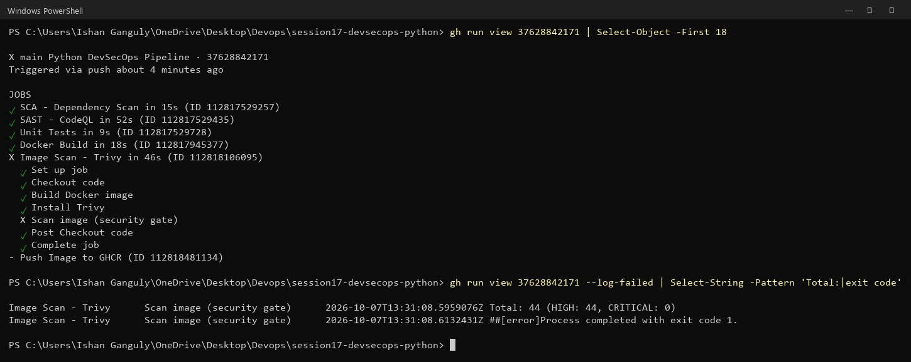

### Evaluate → decide the policy → enforce

None of the 44 findings can be fixed by upgrading: Debian has not released fixes. Blocking on them would block every release with no way to remediate. The policy chosen is a common one: **block on HIGH/CRITICAL vulnerabilities that have a fix available** (`--ignore-unfixed`). Unfixed findings remain visible in the full scan and get picked up once Debian ships a fix and the base image is rebuilt.

```powershell
trivy image --quiet --severity HIGH,CRITICAL --ignore-unfixed --exit-code 1 session17-python:1.0
```

Debian row: **0** → **exit code 0** → the gate passes.

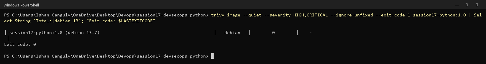

```diff
         run: |
           trivy image \
-            --severity HIGH,CRITICAL \
+            --severity HIGH,CRITICAL --ignore-unfixed \
             --exit-code 1 \
             session17-python:${{ github.sha }}
```

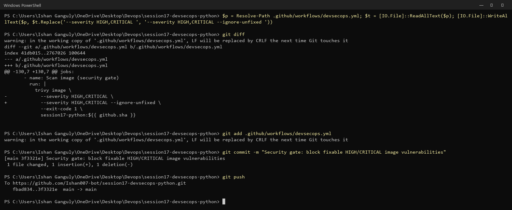

With the policy in place, **every stage passed**. The image was published to GHCR only after all gates passed, and Kubernetes deployed it only after it was published:

```text
✓ Unit Tests   ✓ SAST - CodeQL   ✓ SCA - Dependency Scan
✓ Docker Build
✓ Image Scan - Trivy
✓ Push Image to GHCR
✓ Deploy to Kubernetes
```

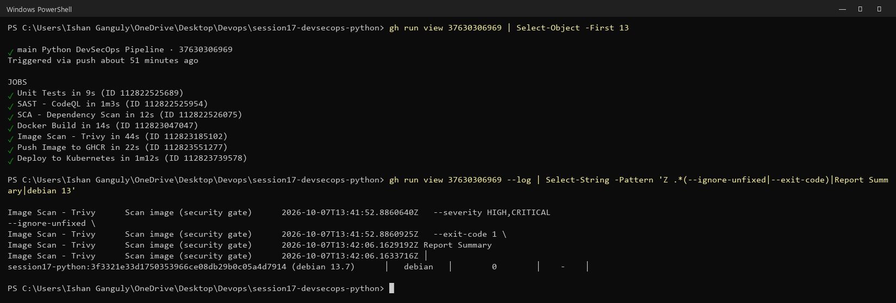

### What is gated in this pipeline

| Check | Behaviour in this pipeline |
| :--- | :--- |
| Unit tests | Failure blocks Docker Build (`needs: test`) |
| SAST (CodeQL) | Job failure blocks Docker Build; findings go to Code scanning |
| SCA (pip-audit) | Any known vulnerability fails the job and blocks Docker Build |
| Secret scanning | Push protection blocks supported secrets before they reach GitHub |
| Image scan (Trivy) | Fixable HIGH/CRITICAL fails the job and blocks Push |
| Registry push | Failure blocks Deploy |
| Kubernetes rollout | `kubectl rollout status --timeout=120s` fails the job if Pods never become Ready |

### Practice: the complete pipeline

| # | Requirement | Where |
| :--- | :--- | :--- |
| 1 | Unit tests run | `test` job |
| 2 | SAST runs | `sast` job (CodeQL) |
| 3 | SCA runs | `sca` job (pip-audit) |
| 4 | Docker image is built | `docker-build` (`needs: [test, sast, sca]`) |
| 5 | Image is scanned | `image-scan` (`needs: docker-build`) |
| 6 | Security gates are enforced | `--exit-code 1` + `needs:` chain |
| 7 | Image is pushed to GHCR only after the gates pass | `push` (`needs: image-scan`) |
| 8 | Kubernetes deployment only after the image is published | `deploy` (`needs: push`) |
| 9 | Deployment waits for rollout completion | `kubectl rollout status` |

## Pipeline Runs

| Commit | Result | What happened |
| :--- | :--- | :--- |
| Add Session 17 DevSecOps pipeline | X failure | Tests, SAST and SCA passed; the Trivy gate blocked on 44 HIGH; push/deploy skipped; CodeQL opened `py/flask-debug` |
| Disable Flask debug mode by default | X failure | CodeQL alert closed (`fixed`); the image gate still blocked |
| Security gate: block fixable HIGH/CRITICAL | ✓ success | All 7 jobs passed; image pushed to GHCR and deployed to Kind |
| Bump application version to 2.1.0 | ✓ success | New image published; rolled out locally with `kubectl set image` |

## Cleanup

```powershell
kubectl delete namespace session-17
kubectl config set-context --current --namespace=default
docker rmi session17-python:1.0
```

## Key Learnings

- DevSecOps adds security checks to the same pipeline as build and test: **SAST** for our code, **SCA** for our dependencies, **secret scanning** for credentials, and **image scanning** for the final container.
- A scan only *finds* problems; a **gate** (`--exit-code 1` + `needs:`) decides whether delivery continues.
- A gate threshold is a **policy decision**. Blocking on unfixable OS findings stops all releases; blocking on fixable HIGH/CRITICAL is a practical starting point.
- `pip-audit -r requirements.txt` checks only the app; `pip-audit` on the environment also catches tooling such as pip and pytest.
- CodeQL found a real issue (Flask debug mode) that the unit tests could not catch.
- GHCR needs lowercase image names; `GITHUB_TOKEN` with `packages: write` is enough to publish.
- A GitHub-hosted runner can't reach a laptop cluster, so the pipeline proves the deployment in Kind. The same image was then deployed to Minikube and updated with `kubectl set image`.
- **Recommended next step:** add `RUN pip install --no-cache-dir --upgrade pip` to the Dockerfile, which removes the 6 vulnerabilities in the base image's bundled pip.
