# Session 18 - Terraform & Infrastructure as Code

This assignment works through every Session 18 folder: IaC basics, Terraform architecture, providers, resources, variables, outputs, the `init → plan → apply` workflow, `destroy`, state, and the multi-file `terraform-s3-demo` project. Every lab manages an **S3 bucket** in `ap-south-1`.

> **How the labs were run:** `terraform init`, `fmt`, `validate` and `plan` ran against **real AWS** for all 10 labs. The steps that create and delete buckets (`apply`, `output`, `state`, `destroy`) ran against **LocalStack**, a local AWS emulator. The AWS accounts available for this assignment belong to AWS Organizations whose policies block `s3:CreateBucket` (see [AWS account note](#aws-account-note)). The Terraform code, commands and workflow are exactly the same; only the provider endpoint differs.

```text
.tf files → terraform init → terraform validate → terraform plan → terraform apply → S3 bucket
                                                                         │
                                                                 terraform.tfstate
                                                                         │
                                                                 terraform destroy
```

## Prerequisites

All commands were run in **Windows PowerShell**.

| Tool | Version / note |
| :--- | :--- |
| Terraform | v1.16.5, installed with `winget install Hashicorp.Terraform` |
| AWS provider | `hashicorp/aws` **v6.67.0** (matches `~> 6.0`) |
| AWS CLI | 2.33.27, configured with `aws configure` (region `ap-south-1`) |
| Docker | Docker Desktop, for LocalStack |

```powershell
aws configure
aws sts get-caller-identity
```

The labs were run from working copies of the folders outside the `devops-heros` repository, so Terraform's `.terraform/` directories, lock files and state files never end up in Git. Each lab folder's `.gitignore` already excludes `.terraform/`, `terraform.tfstate*` and `*.tfplan`.

### LocalStack for apply / destroy

LocalStack's community edition (`localstack/localstack:4.4`; the `latest` image now requires a paid licence) serves the S3 and STS APIs on `http://localhost:4566`:

```powershell
docker run -d --name localstack -p 4566:4566 -e SERVICES=s3,sts localstack/localstack:4.4
```

Each lab got an extra `override.tf`. Terraform automatically merges `*override.tf` files into the configuration, so the original `main.tf` files stay untouched. The override points the AWS provider at LocalStack, using LocalStack's dummy `test` credentials:

```hcl
provider "aws" {
  access_key                  = "test"
  secret_key                  = "test"
  s3_use_path_style           = true
  skip_credentials_validation = true
  skip_metadata_api_check     = true
  skip_requesting_account_id  = true

  endpoints {
    s3  = "http://localhost:4566"
    sts = "http://localhost:4566"
  }
}
```

The AWS CLI was pointed at it with `AWS_ENDPOINT_URL=http://localhost:4566`, so `aws sts get-caller-identity` returns LocalStack's account `000000000000`. Deleting `override.tf` switches a lab back to real AWS.

**Known LocalStack difference:** LocalStack 4.4 does not keep tags that are sent while a bucket is being *created* (tags changed later are kept). As a result, freshly created buckets have no tags in LocalStack, while on real AWS they would carry the tags from `main.tf`. Everything else (create, outputs, state, update, destroy) behaves like AWS.

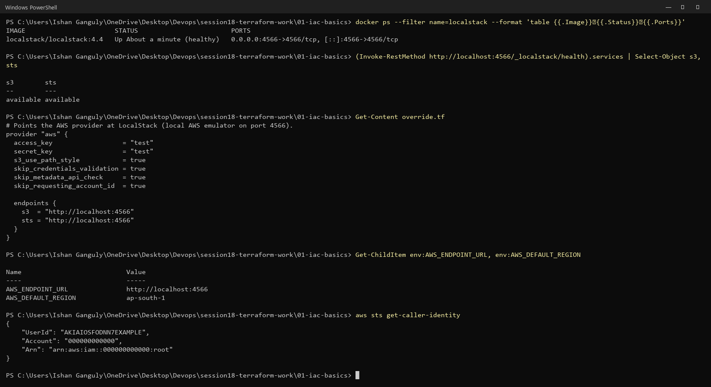

> `'yes' | terraform apply` pipes the confirmation into Terraform's `Enter a value:` prompt. It is the same as typing `yes` by hand.

## 1. What is Infrastructure as Code?

`01-iac-basics/main.tf` declares one S3 bucket with `bucket_prefix = "session18-iac-"` and an output `bucket_name`.

```powershell
terraform init
terraform fmt
terraform validate
```

`init` downloaded the AWS provider (`hashicorp/aws v6.67.0`), and `validate` printed `Success! The configuration is valid.`


```powershell
terraform plan
```

`Plan: 1 to add, 0 to change, 0 to destroy.` The bucket name is `(known after apply)` because Terraform generates the suffix after `session18-iac-`.


### Apply

```powershell
'yes' | terraform apply
```

`Apply complete! Resources: 1 added, 0 changed, 0 destroyed.` with `bucket_name = "session18-iac-3b0cb9ea4fa3b4545ba7d486e3"`.

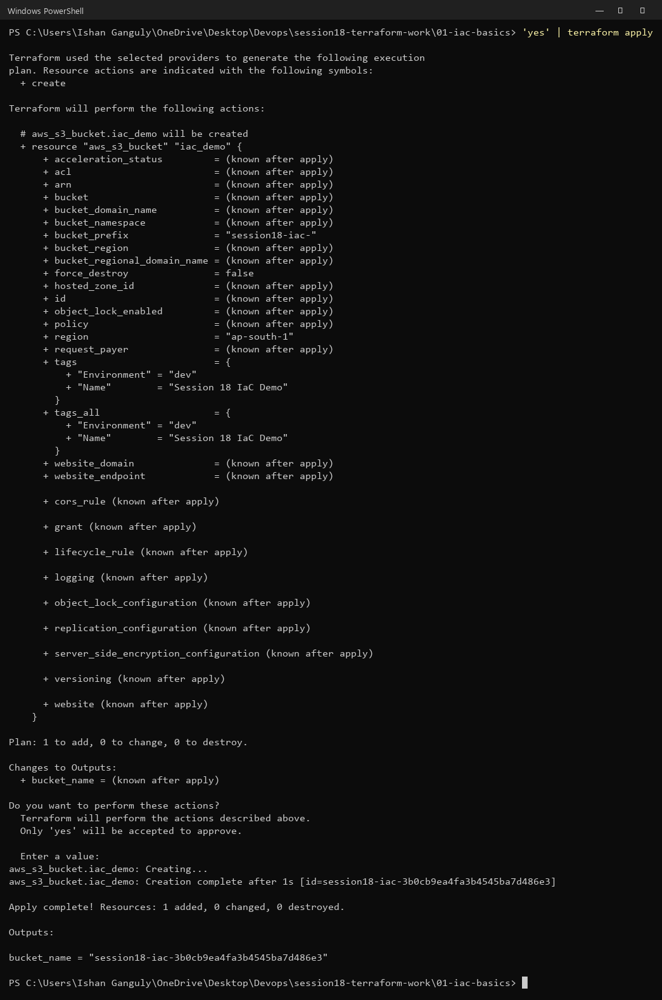

### Verify

```powershell
terraform output bucket_name
terraform state list
aws s3api head-bucket --bucket (terraform output -raw bucket_name)
```

`terraform state list` shows `aws_s3_bucket.iac_demo`, and `head-bucket` confirms that the bucket exists.

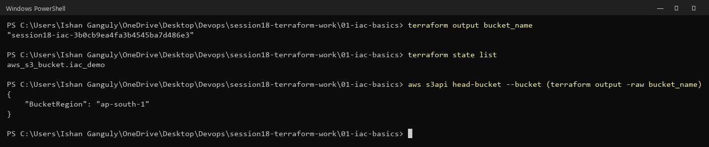

### Cleanup

```powershell
'yes' | terraform destroy
```

`Plan: 0 to add, 0 to change, 1 to destroy.` → `Destroy complete! Resources: 1 destroyed.`

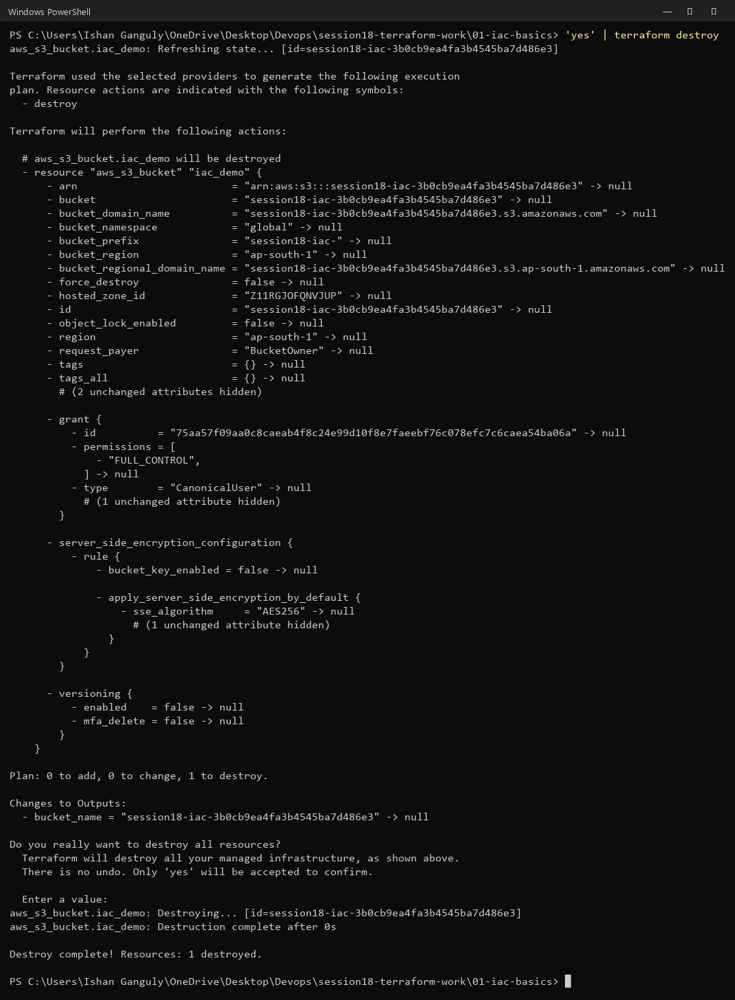

**Practice answers:**
1. **What happens if 10 engineers manually create the same infrastructure?** You get 10 slightly different setups: different names, settings and tags, plus forgotten steps. Nobody knows which one is "correct", problems are hard to reproduce, and there is no record of who changed what.
2. **How can Git help with infrastructure?** The `.tf` files are versioned like application code. Every change is reviewed in a pull request, the history shows who changed what and why, and a bad change can be reverted to a known-good version.
3. **What if we need the same infrastructure in another environment?** Apply the same code with different variable values (e.g. `environment = "test"` or `"prod"`, see lab 05). The new environment is identical by construction, not by copying console clicks.

## 2. Terraform Architecture

```text
Terraform configuration (HCL) → Terraform CLI → AWS provider plugin → AWS API (S3)
                                       │
                               terraform.tfstate
```

Terraform is **declarative**: the `.tf` file describes *what* should exist, and Terraform works out which API calls are needed by comparing configuration, state and the real world.


```powershell
'yes' | terraform apply
```

The apply ends with the `bucket_arn` output (`arn:aws:s3:::session18-architecture-...`).

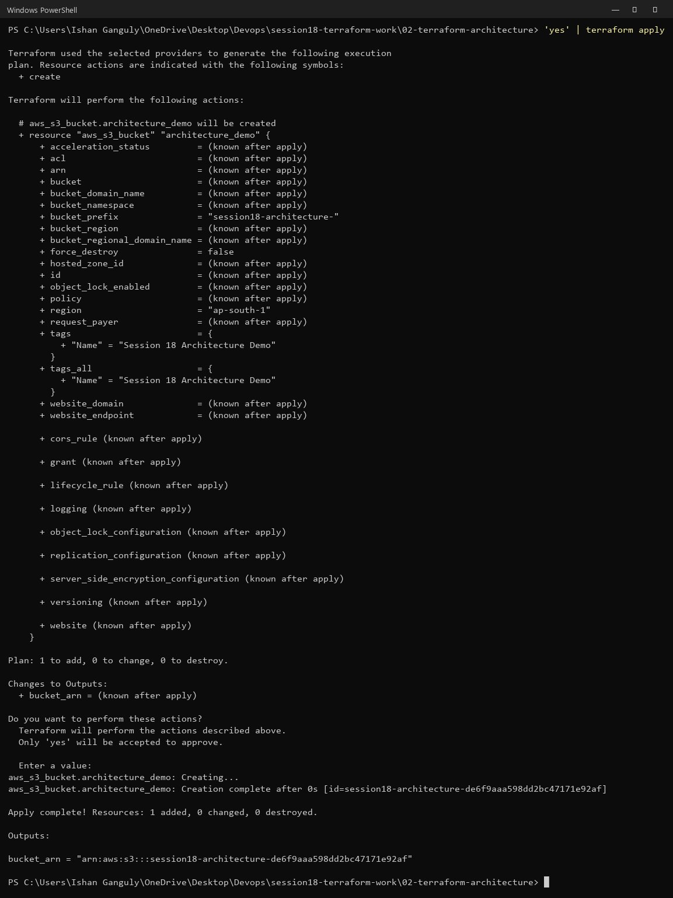

```powershell
terraform state list
terraform show
```

`terraform show` prints everything Terraform recorded in state for `aws_s3_bucket.architecture_demo`: `arn`, `bucket`, `bucket_domain_name`, `bucket_regional_domain_name`, `region`, tags and more.

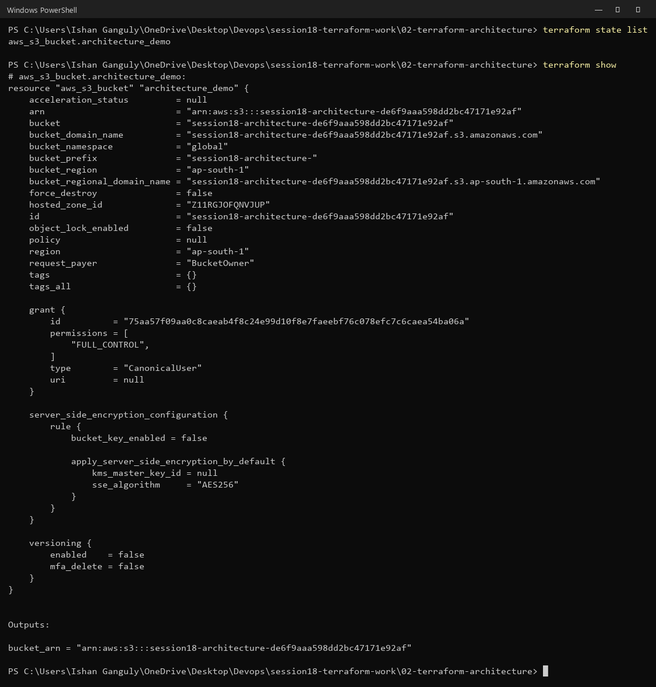

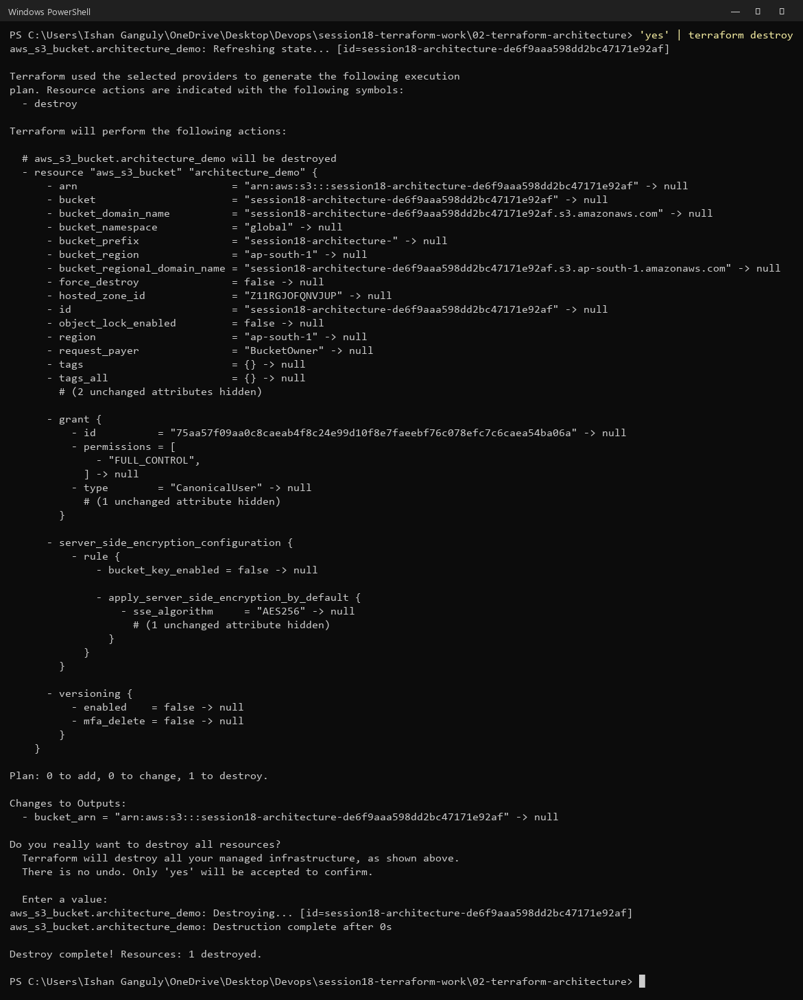

## 3. Providers

```hcl
terraform {
  required_providers {
    aws = {
      source  = "hashicorp/aws"   # namespace/type in the Terraform Registry
      version = "~> 6.0"          # any 6.x, never 7.0
    }
  }
}

provider "aws" {
  region = var.aws_region         # default "ap-south-1"
}
```

`terraform init` resolved `~> 6.0` to **v6.67.0** and recorded it in `.terraform.lock.hcl`. Credentials come from `aws configure` (`~/.aws/credentials`), **never** from `access_key` / `secret_key` in a committed `.tf` file. The `test` values in the LocalStack override are LocalStack's public dummy credentials, not real keys.


```powershell
aws sts get-caller-identity
terraform providers
'yes' | terraform apply
```

`terraform providers` shows the dependency `provider[registry.terraform.io/hashicorp/aws] ~> 6.0`. The apply ends with `bucket_id = "session18-provider-63bd0f0a81fefa6e3079d49645"`.

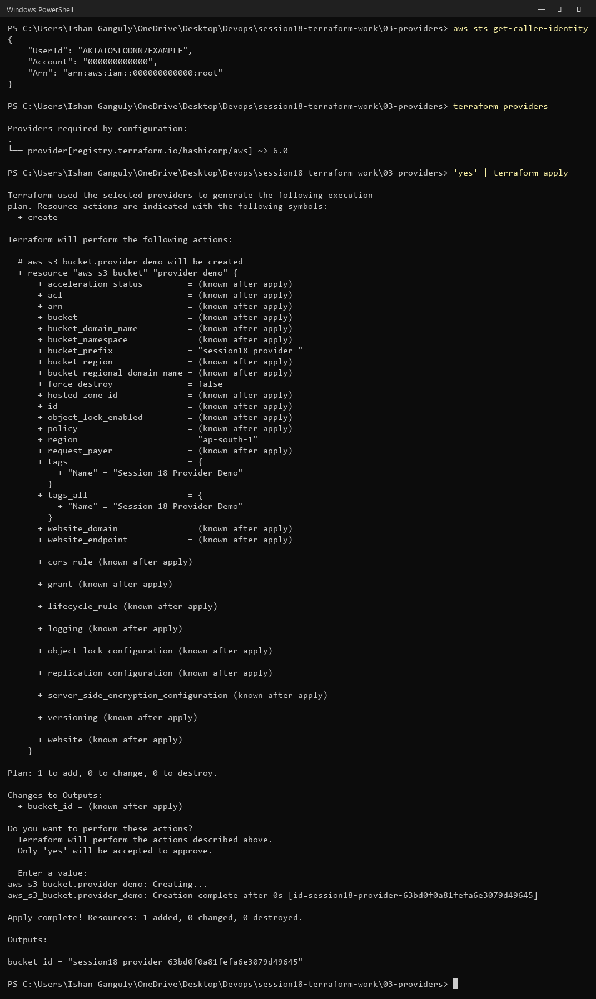

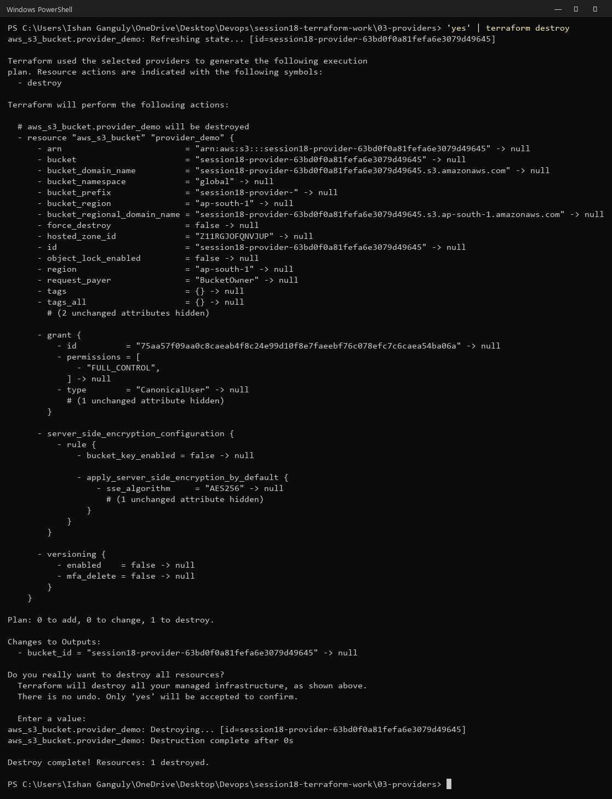

## 4. Resources

```hcl
resource "aws_s3_bucket" "demo" {
  bucket_prefix = "session18-resource-"
}
```

| Part | Meaning |
| :--- | :--- |
| `resource` | Resource block |
| `aws_s3_bucket` | Resource type (from the AWS provider) |
| `demo` | Local name; the address is `aws_s3_bucket.demo` |
| `bucket_prefix` | Argument |


```powershell
'yes' | terraform apply
terraform state list        # aws_s3_bucket.demo
terraform show
```

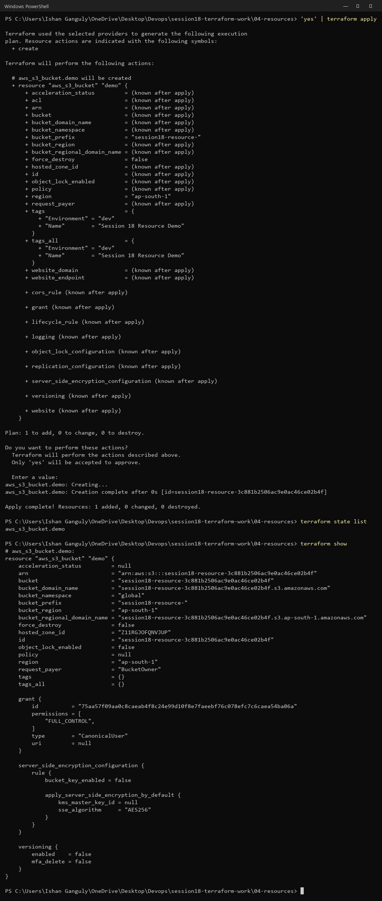

### Exercise: add tags

`Project = "terraform-training"` and `Owner = "student"` were added next to the existing `Environment = "dev"` tag, then:

```powershell
terraform fmt
terraform plan
'yes' | terraform apply
```

`terraform fmt` re-aligned the `=` signs in `main.tf` (it printed `main.tf` because it reformatted the file). The plan shows `aws_s3_bucket.demo` **updated in-place**, not replaced: `Plan: 0 to add, 1 to change, 0 to destroy.` Tags can be changed on an existing bucket, so no replacement is needed.

The plan lists all four tags as `+` (including the original `Name` and `Environment`) because LocalStack hadn't stored the tags sent at creation (see the LocalStack note). On real AWS, only `+ "Owner"` and `+ "Project"` would be added.

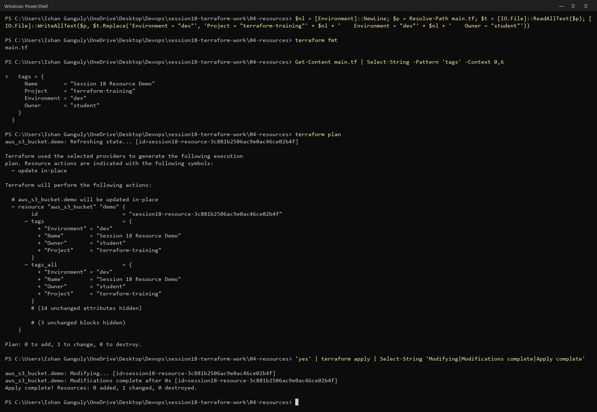

```powershell
'yes' | terraform destroy
```

`Plan: 0 to add, 0 to change, 1 to destroy.` → `Destroy complete! Resources: 1 destroyed.`

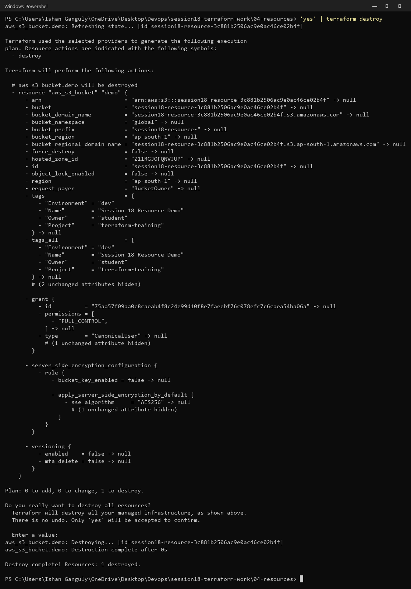

## 5. Variables

`05-variables/main.tf` builds the bucket prefix from variables:

```hcl
bucket_prefix = "${var.project_name}-${var.environment}-"
```


With only the defaults (`terraform-training`, `dev`):


### Values from `terraform.tfvars`

```powershell
Copy-Item terraform.tfvars.example terraform.tfvars
Get-Content terraform.tfvars
terraform plan
```

The values from `terraform.tfvars` override the defaults: `bucket_prefix = "student-project-dev-"` and `Environment = "dev"`.


### Exercise: change the environment

```powershell
(Get-Content terraform.tfvars) -replace 'environment  = "dev"', 'environment  = "test"' | Set-Content terraform.tfvars
terraform plan
terraform plan -var environment=prod
```

| Source | `bucket_prefix` | `Environment` tag |
| :--- | :--- | :--- |
| defaults | `terraform-training-dev-` | `dev` |
| `terraform.tfvars` (dev) | `student-project-dev-` | `dev` |
| `terraform.tfvars` (test) | `student-project-test-` | `test` |
| `-var environment=prod` | `student-project-prod-` | `prod` |

`-var` on the command line beats `terraform.tfvars`, which beats the `default` in the variable block.


**Practice answer: why does changing a variable change the desired infrastructure?** The resource's arguments are *expressions* built from variables. Terraform evaluates them on every plan, so a new variable value produces a new desired configuration (here a different `bucket_prefix` and tags). Terraform then compares that with state and the real bucket and plans whatever is needed to match. Because `bucket_prefix` can't be changed on an existing bucket, changing it on a deployed bucket would **replace** it.

`terraform.tfvars` itself is kept out of Git (`.gitignore`), since real projects often keep sensitive values there.

## 6. Outputs

```hcl
output "bucket_id"     { value = aws_s3_bucket.demo.id }
output "bucket_arn"    { value = aws_s3_bucket.demo.arn }
output "bucket_region" { value = "ap-south-1" }
```


The plan shows the outputs too: `bucket_arn` and `bucket_id` are `(known after apply)`, and `bucket_region = "ap-south-1"` is known right away.


```powershell
'yes' | terraform apply
```

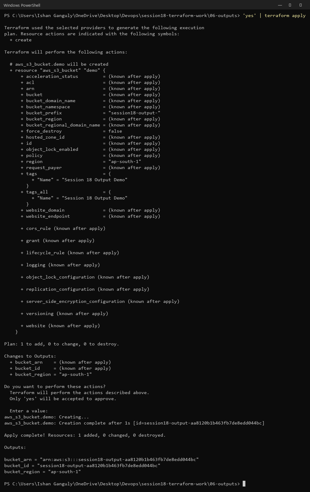

```powershell
terraform output
terraform output bucket_id
```

```text
bucket_arn    = "arn:aws:s3:::session18-output-aa8120b1b463fb7de8edd044bc"
bucket_id     = "session18-output-aa8120b1b463fb7de8edd044bc"
bucket_region = "ap-south-1"
```

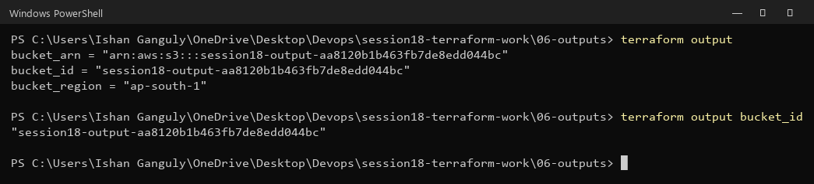

### Exercise: add `bucket_name`

```hcl
output "bucket_name" {
  value = aws_s3_bucket.demo.bucket
}
```

```powershell
terraform fmt
'yes' | terraform apply
terraform output bucket_name
```

The apply records the new output (`+ bucket_name = "session18-output-..."`), and `terraform output bucket_name` prints `"session18-output-aa8120b1b463fb7de8edd044bc"`.

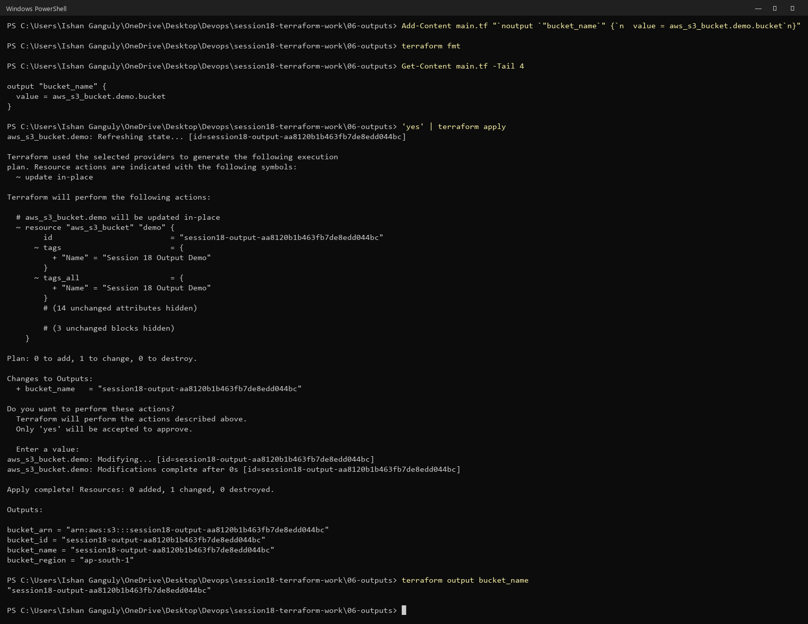

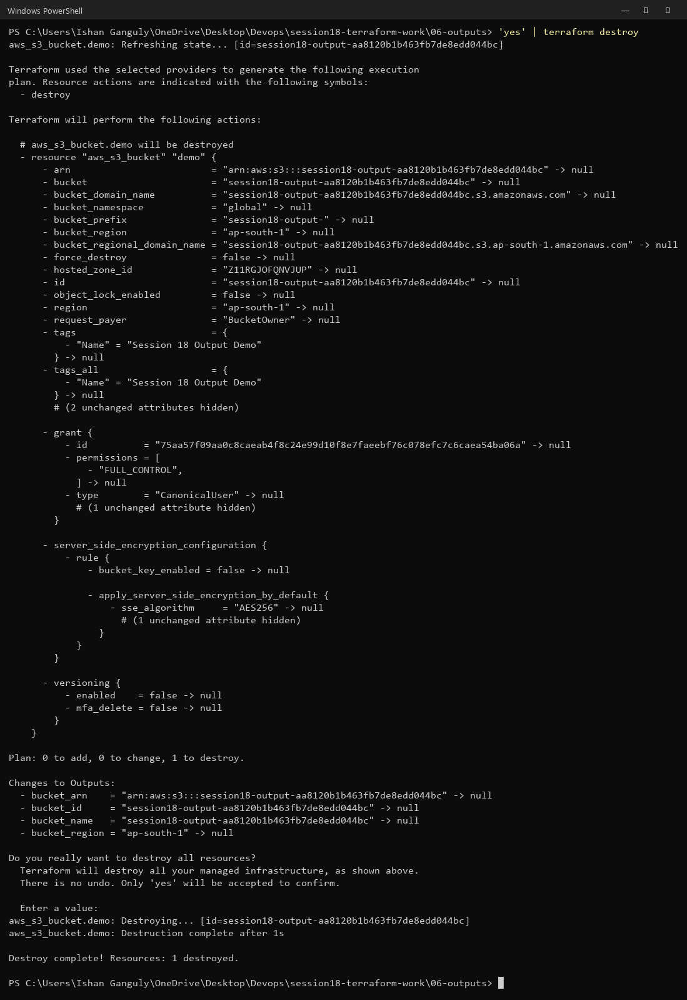

Outputs matter because they pass values to other modules, CI/CD pipelines and scripts (e.g. `terraform output -raw bucket_id`) without anyone opening the console.

## 7. Init, Plan and Apply

| Step | Command | Result |
| :--- | :--- | :--- |
| Init | `terraform init` | Provider `hashicorp/aws v6.67.0` installed, lock file created |
| Format | `terraform fmt` | Already formatted (no output) |
| Validate | `terraform validate` | `Success! The configuration is valid.` |
| Plan | `terraform plan` | `Plan: 1 to add, 0 to change, 0 to destroy.` |


Plan symbols: `+` create, `~` update in-place, `-` destroy, `-/+` replace.

### Saved plan → apply

```powershell
terraform plan -out=tfplan
terraform apply tfplan
```

`plan -out` saves the reviewed plan, and `apply tfplan` executes exactly that plan without asking again: `Apply complete! Resources: 1 added`, with `bucket_name = "session18-lifecycle-68c253058f2e24b5f33513b7b3"`.

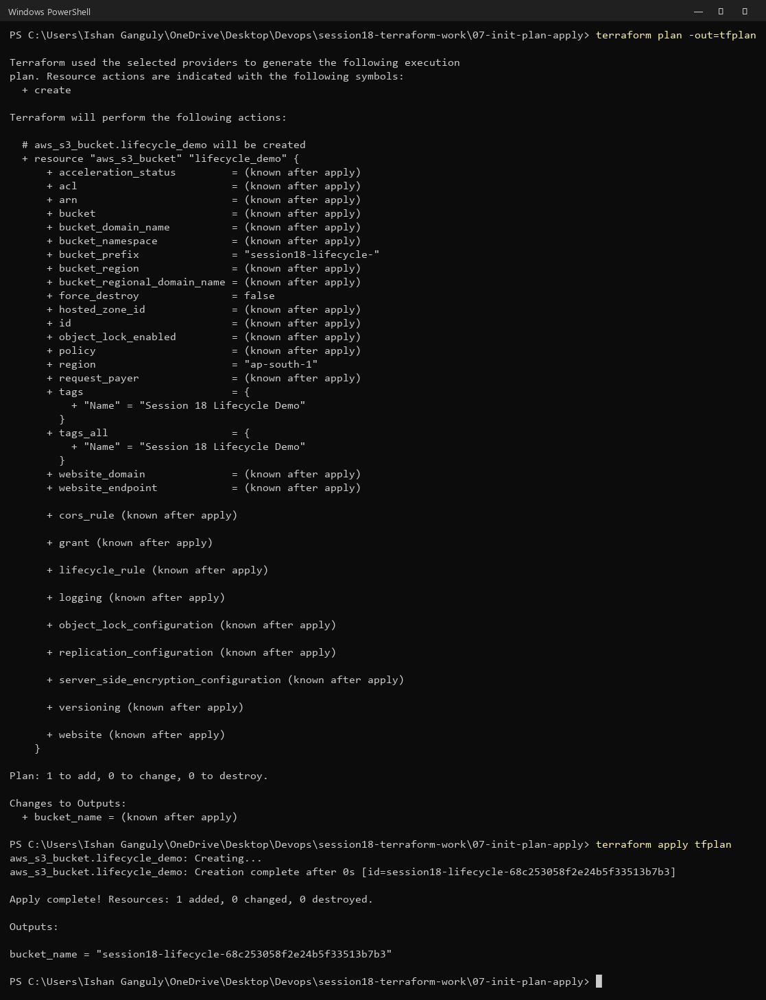

```powershell
terraform output
terraform state list
```

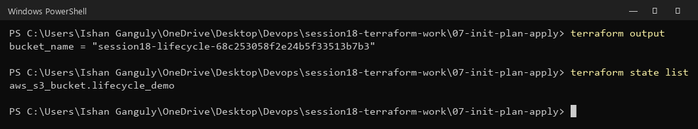

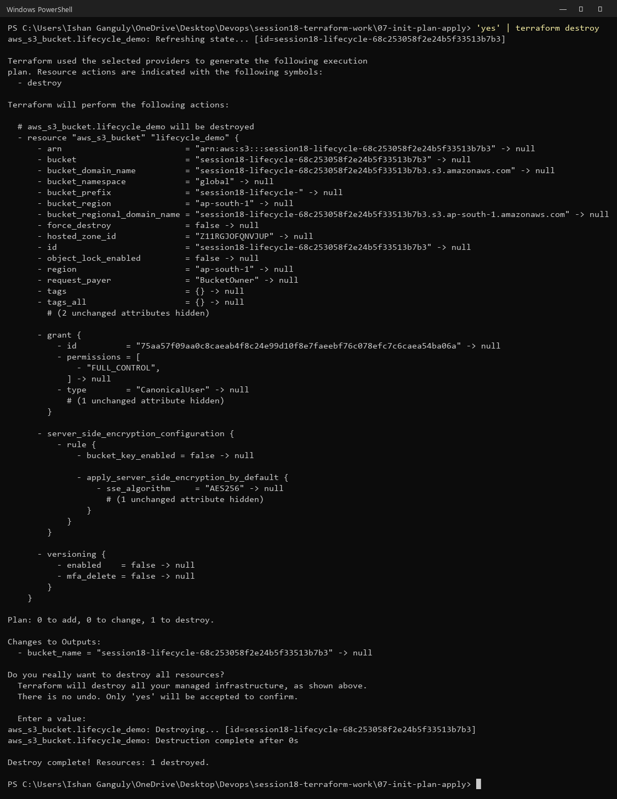

A **saved plan** makes `apply` execute exactly the plan that was reviewed. Without one, `apply` re-plans and could pick up changes made in between, which matters in CI/CD where plan and apply are separate approved steps.

## 8. Destroy


```powershell
'yes' | terraform apply
terraform state list        # aws_s3_bucket.destroy_demo
```

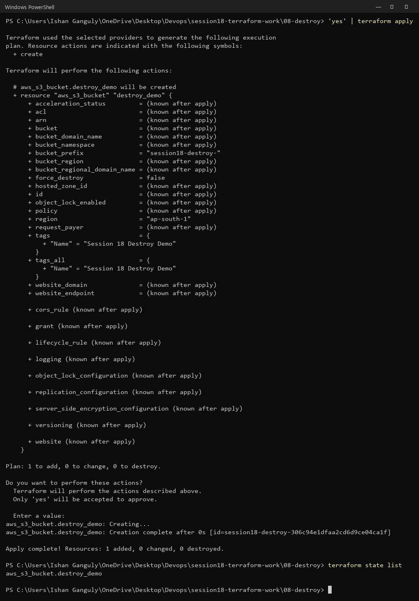

### Inspect first: `plan -destroy`

```powershell
terraform plan -destroy
```

`# aws_s3_bucket.destroy_demo will be destroyed`, every attribute shown `-> null`, and `Plan: 0 to add, 0 to change, 1 to destroy.` Nothing has been deleted yet.

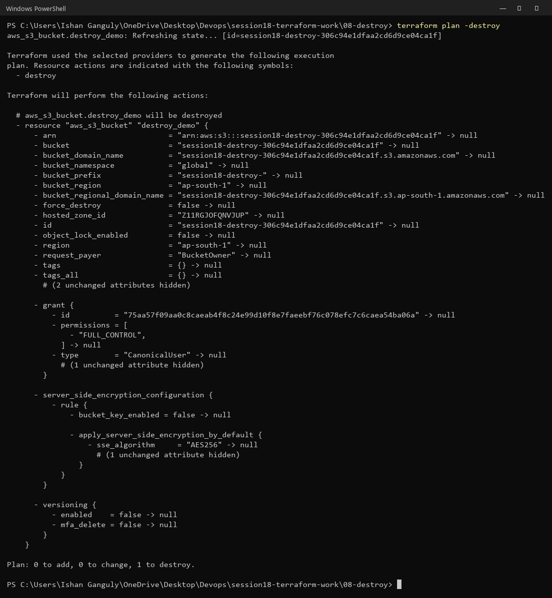

### Destroy

```powershell
'yes' | terraform destroy
terraform state list
```

`aws_s3_bucket.destroy_demo: Destruction complete` → `Destroy complete! Resources: 1 destroyed.` `terraform state list` is now empty.

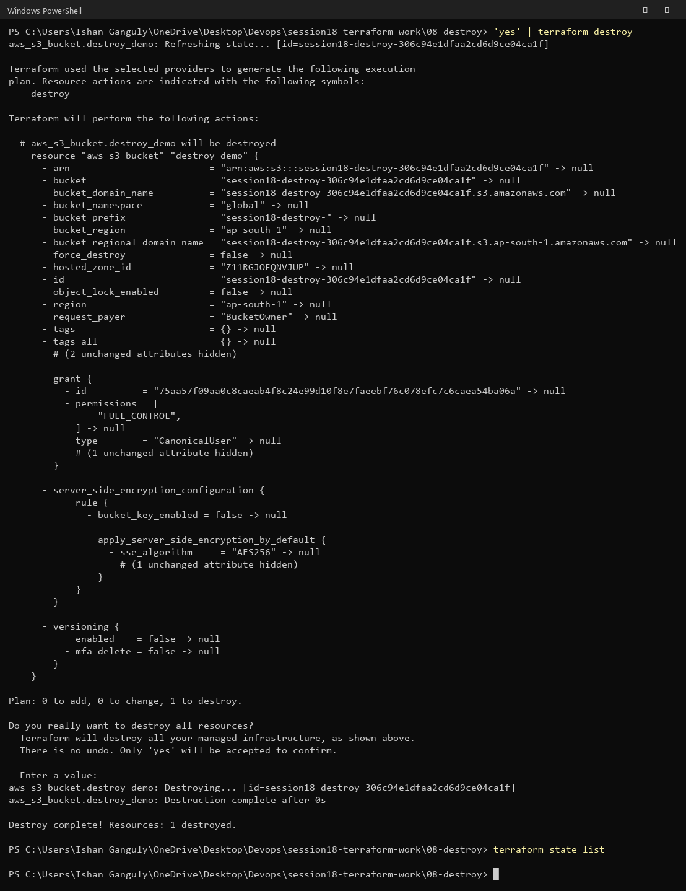

**Practice answers:**
1. **`plan` vs `apply`:** `plan` is read-only. It compares configuration, state and real infrastructure and *shows* what would change. `apply` *executes* those changes (after confirmation, or from a saved plan) and updates the state.
2. **What does `destroy` do?** It builds a destroy-mode plan for every resource in the state, asks for confirmation, then deletes those real resources and removes them from state.
3. **Why run `plan -destroy` first in production?** It is a dry run that lists exactly which resources would be deleted. That catches mistakes such as the wrong workspace, wrong account/region or an unexpectedly large state *before* anything irreversible happens. Deleted data such as bucket contents cannot be recovered.

## 9. State


**Steps 1–2:** apply and list the state.

```powershell
'yes' | terraform apply
terraform state list
```

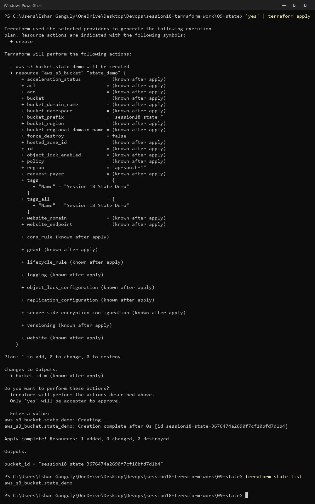

**Step 3:** show one resource, then pull the raw state.

```powershell
terraform state show aws_s3_bucket.state_demo
terraform state pull | Select-Object -First 25
```

`state show` prints the resource as Terraform recorded it (`arn`, `bucket`, `id = "session18-state-3676474a2690f7cf10bfd7d1b4"`, tags...). `state pull` prints the raw JSON state: `version`, `terraform_version`, `serial`, `lineage`, `outputs`, `resources`.

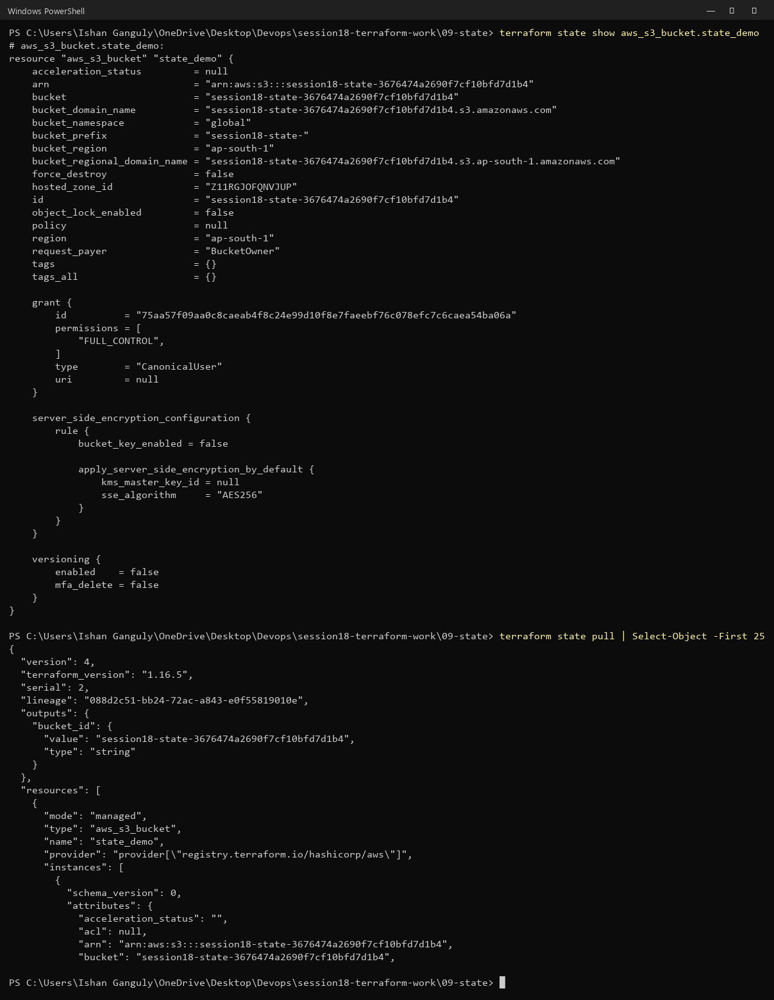

**Steps 4–8:** change the `Name` tag to `"Session 18 State Demo - Updated"`, then:

```powershell
terraform plan
'yes' | terraform apply
terraform show
```

Terraform refreshed the real bucket, compared it with the new configuration and planned `~ update in-place` for the tags only: `Plan: 0 to add, 1 to change, 0 to destroy.` After the apply, `terraform show` displays `"Name" = "Session 18 State Demo - Updated"`.

The plan shows `+ "Name"` rather than a change from the old value because LocalStack 4.4 had not stored the tag set at creation (see the LocalStack note). The refresh therefore found no tags, and Terraform planned to add the configured one. This illustrates that **`plan` compares configuration with the real infrastructure, not just with the last state**.

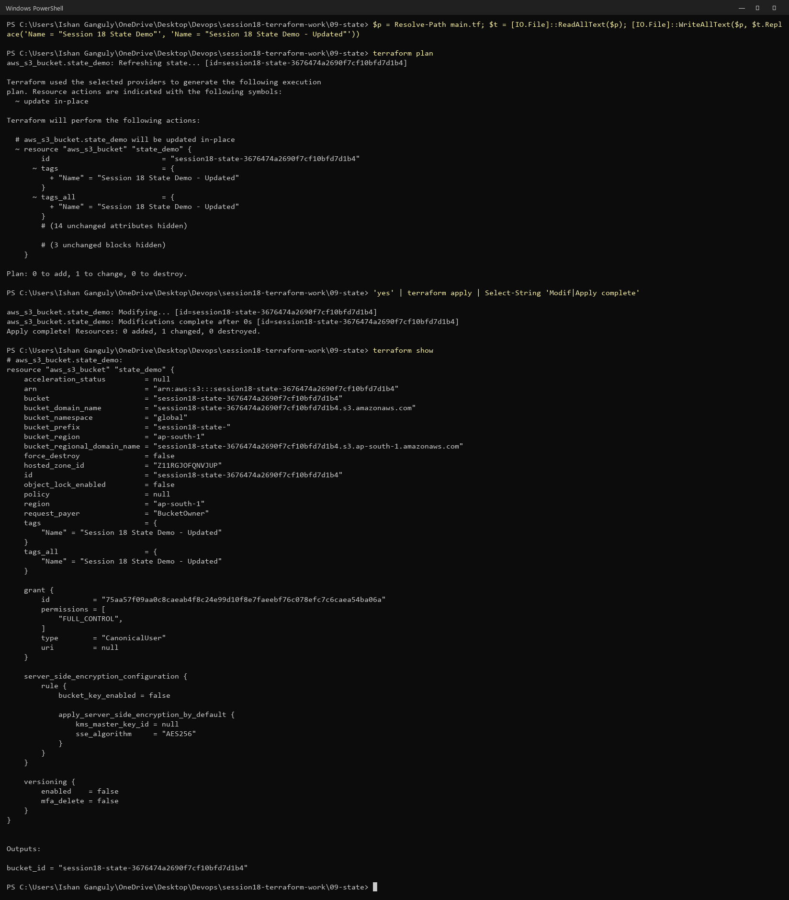

**Step 9:** destroy, then verify the state is empty.

```powershell
'yes' | terraform destroy
terraform state list
```

`Destroy complete! Resources: 1 destroyed.` `terraform state list` prints nothing: no managed resources remain.

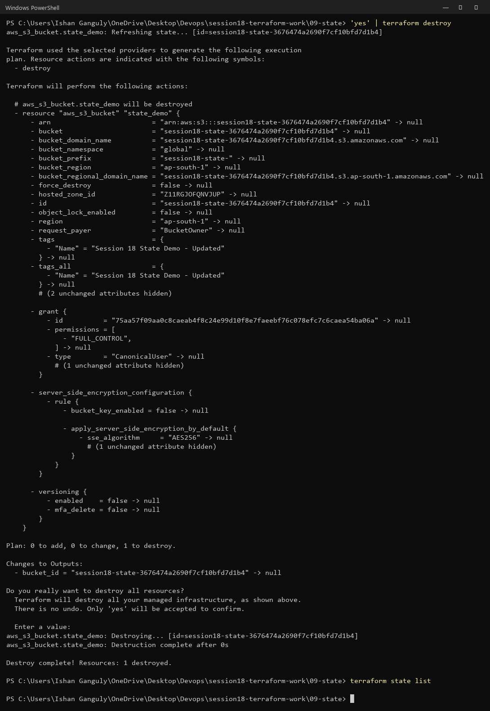

Key points:
- State maps each resource address (`aws_s3_bucket.state_demo`) to the real object (the bucket ID). Without state, Terraform can't tell what it manages.
- **Never commit** `terraform.tfstate*`. It can contain sensitive values. Teams use a remote backend (e.g. S3 with locking) instead of a local file.
- **Never edit state by hand.** Use `terraform state` subcommands (`list`, `show`, `mv`, `rm`, `import`).

## 10. terraform-s3-demo (multi-file project)

```text
terraform.tf      required Terraform / provider versions
providers.tf      provider "aws" { region = var.aws_region }
variables.tf      aws_region, bucket_name (default "yatri1107")
main.tf           aws_s3_bucket.devops553 (force_destroy = true, tags)
outputs.tf        bucket_name, bucket_arn, bucket_region
```


Issues found in this folder:

| Issue | Effect | Handling |
| :--- | :--- | :--- |
| The README uses `terraform state show aws_s3_bucket.demo` | The resource is actually named `aws_s3_bucket.devops553`, so the command would fail | Used `terraform state show aws_s3_bucket.devops553` |
| The README lists a `terraform.tfvars`, but the folder has none | `bucket_name` falls back to the default `yatri1107` | Created `terraform.tfvars` with a unique name |
| `bucket_name` defaults to `yatri1107` | S3 bucket names are **globally unique**; if anyone already owns it, `apply` fails with `BucketAlreadyExists` | Used `session18-demo-928417836223` |

### Complete demo

```powershell
aws sts get-caller-identity
Get-Content terraform.tfvars
'yes' | terraform apply
```

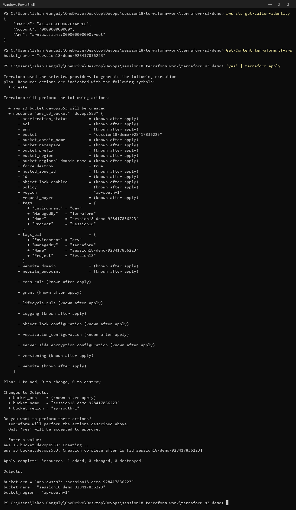

```powershell
terraform output
terraform output bucket_name
terraform state list
terraform state show aws_s3_bucket.devops553
aws s3api head-bucket --bucket session18-demo-928417836223
aws s3api get-bucket-tagging --bucket session18-demo-928417836223
```

The outputs are `bucket_arn`, `bucket_name` and `bucket_region = "ap-south-1"`. The state holds `aws_s3_bucket.devops553` (with `force_destroy = true`, AES256 encryption and the `FULL_CONTROL` owner grant), and `head-bucket` confirms that the bucket exists in `ap-south-1`.

`get-bucket-tagging` returns `NoSuchTagSet`, and the state shows `tags = {}`. This is a **LocalStack limitation**, not a problem with the code: LocalStack 4.4 drops tags sent *while the bucket is created*. On real AWS, the bucket would carry the four tags from `main.tf` (`Name`, `Environment = dev`, `ManagedBy = Terraform`, `Project = Session18`).

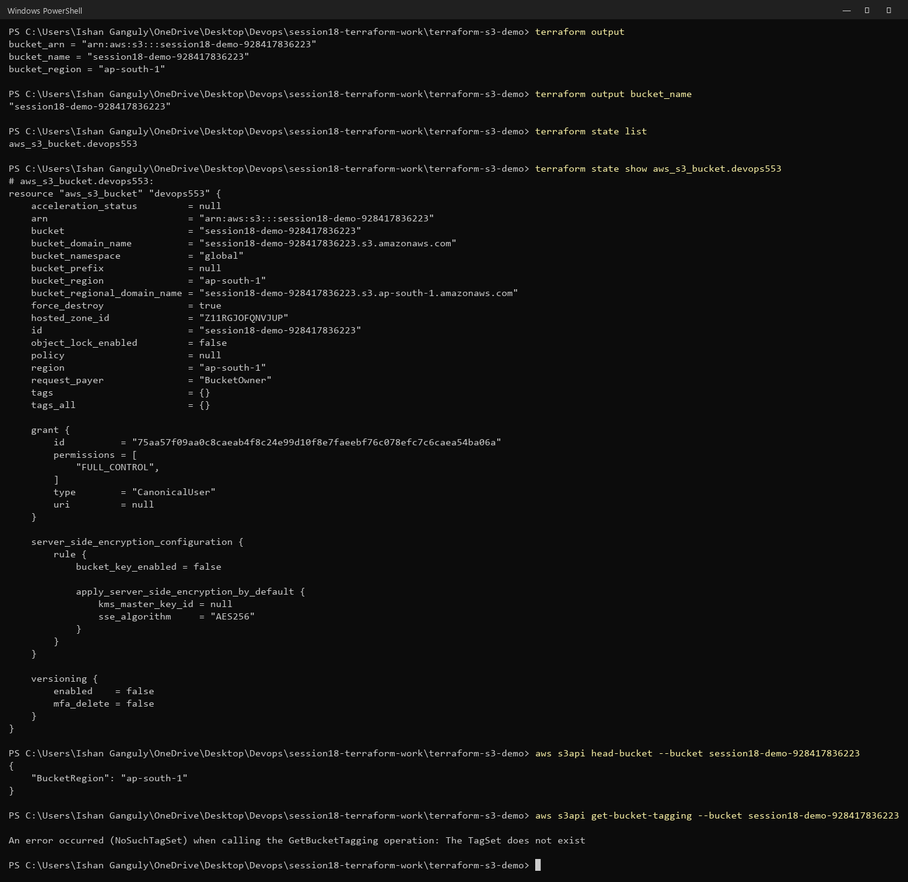

```powershell
terraform plan -destroy
'yes' | terraform destroy
```

`force_destroy = true` lets Terraform delete the bucket even if it still contains objects. `Destroy complete! Resources: 1 destroyed.`

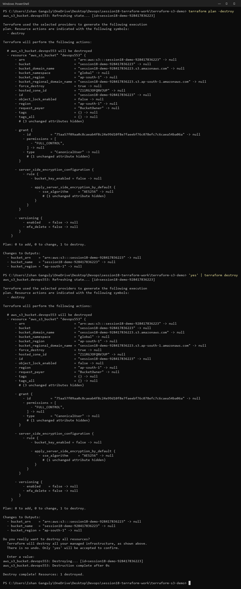

## AWS account note

`terraform plan` works with the AWS credentials, but every `apply` failed:

```text
Error: creating S3 Bucket (session18-iac-...): ... StatusCode: 403 ... AccessDenied:
User: arn:aws:iam::928417836223:user/terraform-student is not authorized to perform: s3:CreateBucket
... with an explicit deny in a service control policy:
arn:aws:organizations::542800097992:policy/o-ed97cd72mh/service_control_policy/p-u2e00eeh
```

A **Service Control Policy** (SCP) is set by the AWS Organization an account belongs to, and it overrides every IAM permission in that account. Two accounts were tried:

| Account | Organization | Result |
| :--- | :--- | :--- |
| `928417836223` | `o-ed97cd72mh` (management account `542800097992`) | `s3:CreateBucket` denied by SCP in every region tested |
| `014512981147` | `o-q8uz15yy0l` (management account `407708719375`) | `s3:CreateBucket` denied by SCP in every region tested |

Attaching `AmazonS3FullAccess` to the IAM user cannot override an SCP; only the organization's administrator can. (On the first account, `AmazonS3ExpressFullAccess` had been attached by mistake. That policy only covers S3 Express One Zone directory buckets, and was replaced with `AmazonS3FullAccess`.) For that reason the apply/destroy steps were run against LocalStack, as described in [LocalStack for apply / destroy](#localstack-for-apply--destroy).

## Key Learnings

- IaC turns infrastructure into reviewable, repeatable, version-controlled code.
- The workflow is `init → fmt → validate → plan → apply → destroy`; `plan` is always a safe, read-only preview.
- Providers are versioned plugins (`hashicorp/aws ~> 6.0` → 6.67.0), and the lock file pins the exact version.
- Variables make one configuration reusable across environments: `-var` beats `terraform.tfvars`, which beats the defaults.
- Outputs expose values for people, scripts and other modules.
- State is Terraform's source of truth for what it manages: keep it out of Git and never edit it by hand.
- Tag changes are `~ update in-place`; changing an immutable argument such as `bucket_prefix` forces a replacement.
- Credentials belong in the AWS CLI configuration or environment, never in `.tf` files.
- IAM permissions are not the whole story: an organization's **SCP** can deny an action even when the IAM policy allows it.
- `*override.tf` files change provider settings (e.g. point at LocalStack) without editing the main configuration.
