# Session 18 - Terraform & Infrastructure as Code

This assignment works through every Session 18 folder: IaC basics, Terraform architecture, providers, resources, variables, outputs, the `init → plan → apply` workflow, `destroy`, state, and the multi-file `terraform-s3-demo` project. All labs manage an **AWS S3 bucket** in `ap-south-1`.

> **Status:** `terraform init`, `fmt`, `validate` and `plan` were run against AWS for **all 10 labs**, and the variables lab (05) is complete. The `apply` / `output` / `state` / `destroy` steps are **pending**: the current AWS account's organization policy blocks S3 bucket creation (see [AWS account note](#aws-account-note)). Those sections are marked *Pending* and will be filled in with screenshots once a working key is available.

```text
.tf files → terraform init → terraform validate → terraform plan → terraform apply → AWS S3
                                                                         │
                                                                 terraform.tfstate
                                                                         │
                                                                 terraform destroy
```

## Prerequisites

All commands were run in **Windows PowerShell**.

| Tool | Version / note |
| :--- | :--- |
| Terraform | v1.16.5, installed with `winget install Hashicorp.Terraform` |
| AWS provider | `hashicorp/aws` **v6.67.0** (matches `~> 6.0`) |
| AWS CLI | 2.33.27, configured with `aws configure` (region `ap-south-1`) |

```powershell
aws configure
aws sts get-caller-identity
```

The labs were run from working copies of the folders outside the `devops-heros` repository, so Terraform's `.terraform/` directories, lock files and state files never end up in Git. Each lab folder's `.gitignore` already excludes `.terraform/`, `terraform.tfstate*` and `*.tfplan`.

## 1. What is Infrastructure as Code?

`01-iac-basics/main.tf` declares one S3 bucket with `bucket_prefix = "session18-iac-"` and an output `bucket_name`.

```powershell
terraform init
terraform fmt
terraform validate
```

`init` downloaded the AWS provider (`hashicorp/aws v6.67.0`), and `validate` printed `Success! The configuration is valid.`

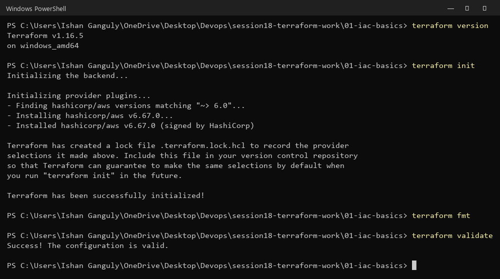

```powershell
terraform plan
```

`Plan: 1 to add, 0 to change, 0 to destroy.` The bucket name is `(known after apply)` because AWS generates the suffix after `session18-iac-`.

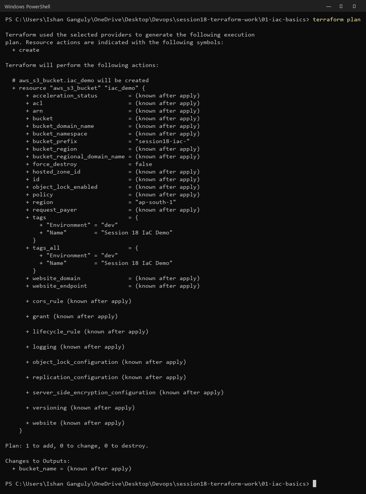

**Pending:** `terraform apply`, `terraform output bucket_name`, `terraform state list`, `terraform destroy`.

**Practice answers:**
1. **What happens if 10 engineers manually create the same infrastructure?** You get 10 slightly different setups: different names, settings and tags, plus forgotten steps. Nobody knows which is "correct", problems are hard to reproduce, and there is no record of who changed what.
2. **How can Git help with infrastructure?** The `.tf` files are versioned like application code. Every change is reviewed in a pull request, the history shows who changed what and why, and a bad change can be reverted to a known-good version.
3. **What if we need the same infrastructure in another environment?** Apply the same code with different variable values (e.g. `environment = "test"` or `"prod"`, see lab 05). The new environment is identical by construction, not by copying console clicks.

## 2. Terraform Architecture

```text
Terraform configuration (HCL) → Terraform CLI → AWS provider plugin → AWS API (S3)
                                       │
                               terraform.tfstate
```

Terraform is **declarative**: the `.tf` file describes *what* should exist, and Terraform works out which API calls are needed by comparing configuration, state and the real world.

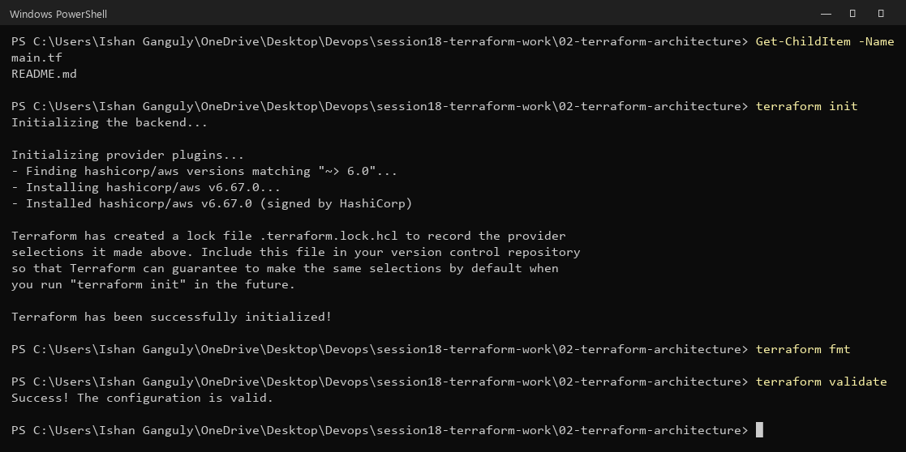

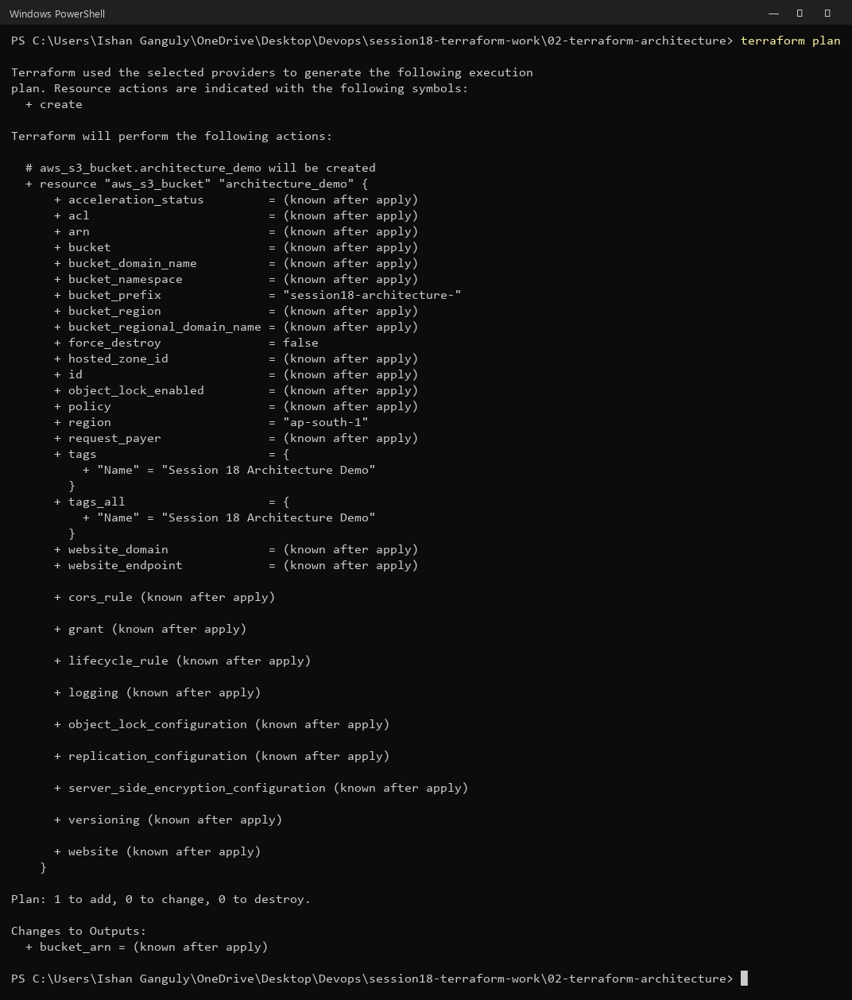

**Pending:** `terraform apply` (output `bucket_arn`), `terraform state list`, `terraform show`, `terraform destroy`.

## 3. Providers

```hcl
terraform {
  required_providers {
    aws = {
      source  = "hashicorp/aws"   # namespace/type in the Terraform Registry
      version = "~> 6.0"          # any 6.x, never 7.0
    }
  }
}

provider "aws" {
  region = var.aws_region         # default "ap-south-1"
}
```

`terraform init` resolved `~> 6.0` to **v6.67.0** and recorded it in `.terraform.lock.hcl`. Credentials come from `aws configure` (`~/.aws/credentials`), **never** from `access_key` / `secret_key` in the `.tf` file, which would leak them as soon as the code is committed.


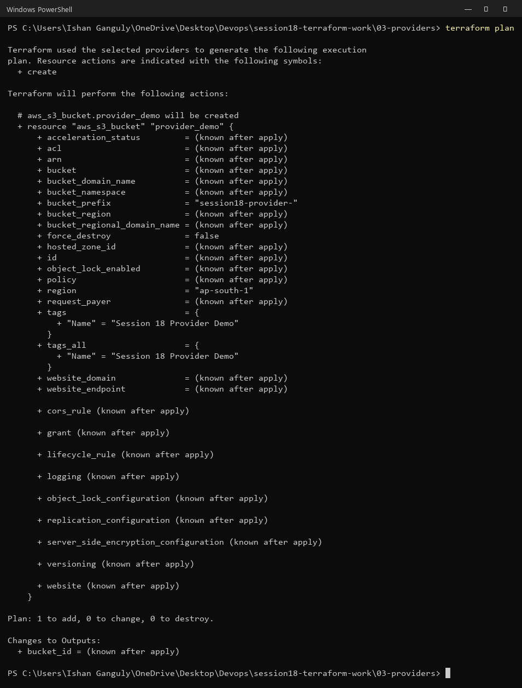

**Pending:** `aws sts get-caller-identity`, `terraform providers`, `terraform apply` (output `bucket_id`), `terraform destroy`.

## 4. Resources

```hcl
resource "aws_s3_bucket" "demo" {
  bucket_prefix = "session18-resource-"
}
```

| Part | Meaning |
| :--- | :--- |
| `resource` | Resource block |
| `aws_s3_bucket` | Resource type (from the AWS provider) |
| `demo` | Local name; the address is `aws_s3_bucket.demo` |
| `bucket_prefix` | Argument |


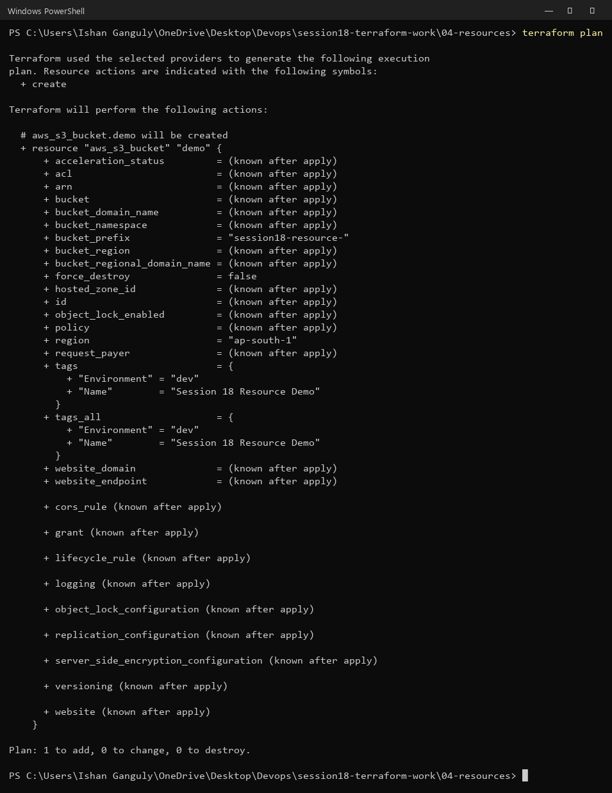

**Pending:** `terraform apply`, `terraform state list` (`aws_s3_bucket.demo`), `terraform show`, the tags exercise (add `Project`, `Environment`, `Owner` → `terraform fmt` → `terraform plan` shows `~ update in-place`), and `terraform destroy` (`Plan: 0 to add, 0 to change, 1 to destroy`).

## 5. Variables ✓

`05-variables/main.tf` builds the bucket prefix from variables:

```hcl
bucket_prefix = "${var.project_name}-${var.environment}-"
```

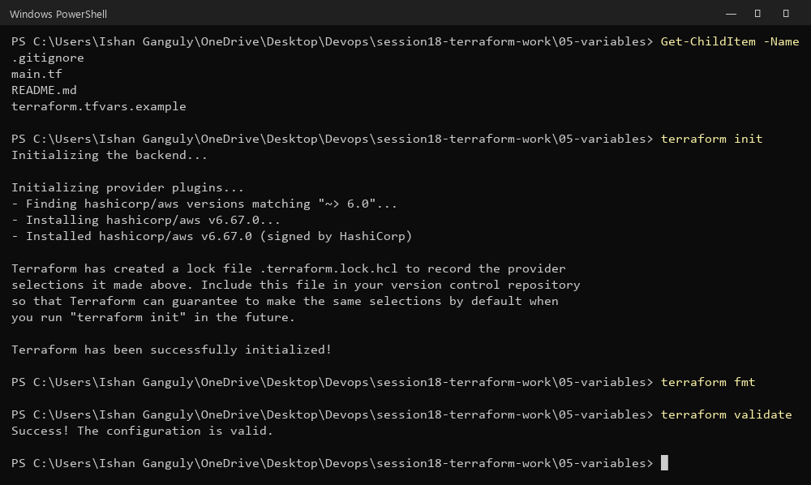

With only the defaults (`terraform-training`, `dev`):

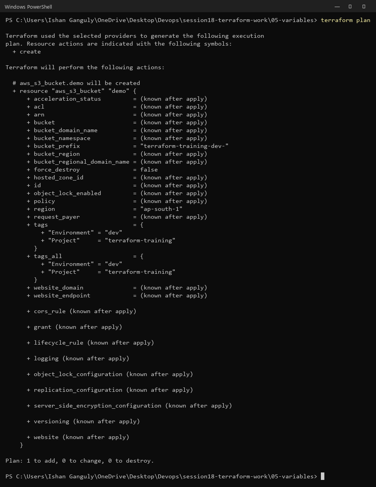

### Values from `terraform.tfvars`

```powershell
Copy-Item terraform.tfvars.example terraform.tfvars
Get-Content terraform.tfvars
terraform plan
```

The values from `terraform.tfvars` override the defaults: `bucket_prefix = "student-project-dev-"` and `Environment = "dev"`.

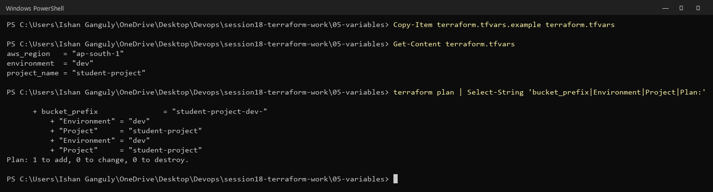

### Exercise: change the environment

```powershell
(Get-Content terraform.tfvars) -replace 'environment  = "dev"', 'environment  = "test"' | Set-Content terraform.tfvars
terraform plan
terraform plan -var environment=prod
```

| Source | `bucket_prefix` | `Environment` tag |
| :--- | :--- | :--- |
| defaults | `terraform-training-dev-` | `dev` |
| `terraform.tfvars` (dev) | `student-project-dev-` | `dev` |
| `terraform.tfvars` (test) | `student-project-test-` | `test` |
| `-var environment=prod` | `student-project-prod-` | `prod` |

`-var` on the command line beats `terraform.tfvars`, which beats the `default` in the variable block.

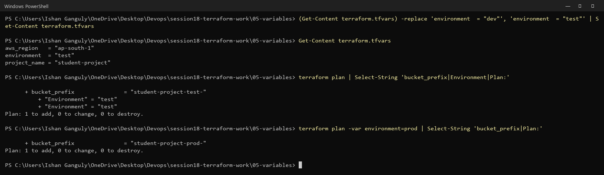

**Practice answer: why does changing a variable change the desired infrastructure?** The resource's arguments are *expressions* built from variables. Terraform evaluates them on every plan, so a new variable value produces a new desired configuration (here a different `bucket_prefix` and tags). Terraform then compares that with state and the real bucket and plans whatever is needed to match. Because `bucket_prefix` can't be changed on an existing bucket, changing it on a deployed bucket would **replace** it.

`terraform.tfvars` itself is kept out of Git (`.gitignore`), since real projects often keep sensitive values there.

## 6. Outputs

```hcl
output "bucket_id"     { value = aws_s3_bucket.demo.id }
output "bucket_arn"    { value = aws_s3_bucket.demo.arn }
output "bucket_region" { value = "ap-south-1" }
```

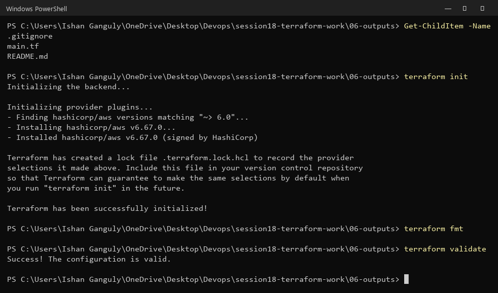

The plan shows the outputs too: `bucket_arn` and `bucket_id` are `(known after apply)`, and `bucket_region = "ap-south-1"` is known right away.

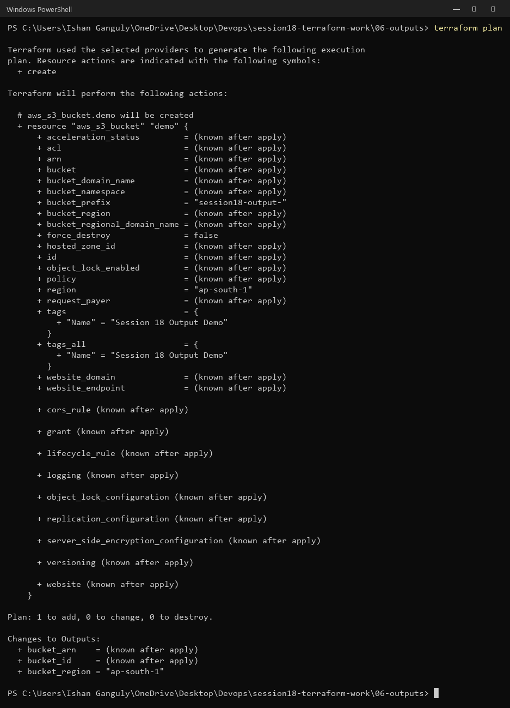

**Pending:** `terraform apply`, `terraform output`, `terraform output bucket_id`, the exercise (add `output "bucket_name"` → apply → `terraform output bucket_name`), `terraform destroy`.

Outputs matter because they pass values to other modules, CI/CD pipelines and scripts (e.g. `terraform output -raw bucket_id`) without anyone opening the console.

## 7. Init, Plan and Apply

| Step | Command | Result |
| :--- | :--- | :--- |
| Init | `terraform init` | Provider `hashicorp/aws v6.67.0` installed, lock file created |
| Format | `terraform fmt` | Already formatted (no output) |
| Validate | `terraform validate` | `Success! The configuration is valid.` |
| Plan | `terraform plan` | `Plan: 1 to add, 0 to change, 0 to destroy.` |

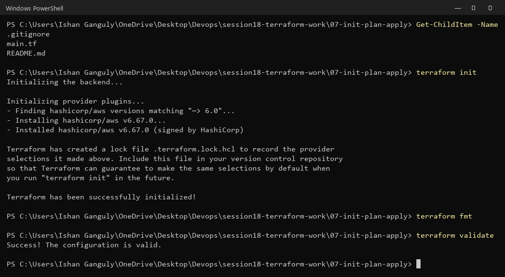

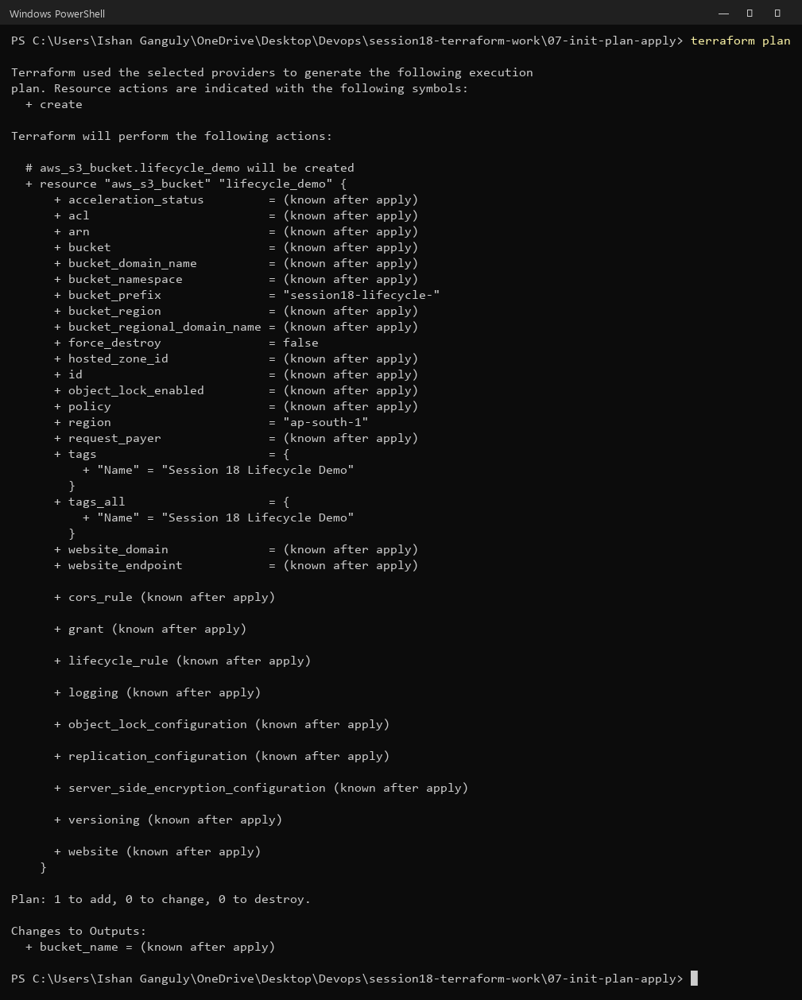

Plan symbols: `+` create, `~` update in-place, `-` destroy, `-/+` replace.

**Pending:** saved plan (`terraform plan -out=tfplan` → `terraform apply tfplan`), `terraform output`, `terraform state list`, cleanup.

A **saved plan** makes `apply` execute exactly the plan that was reviewed. Without one, `apply` re-plans and could pick up changes made in between, which matters in CI/CD where plan and apply are separate approved steps.

## 8. Destroy

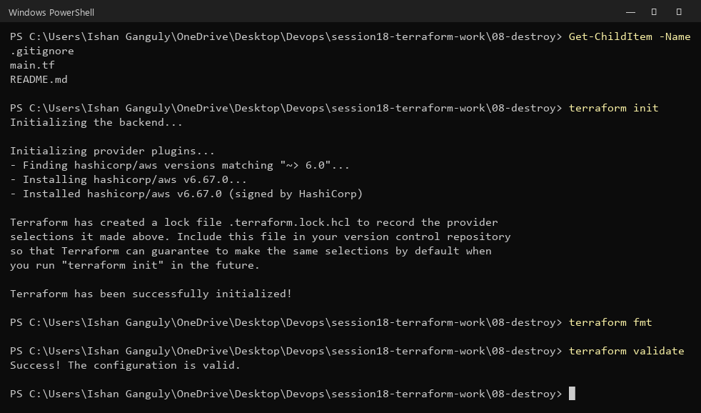

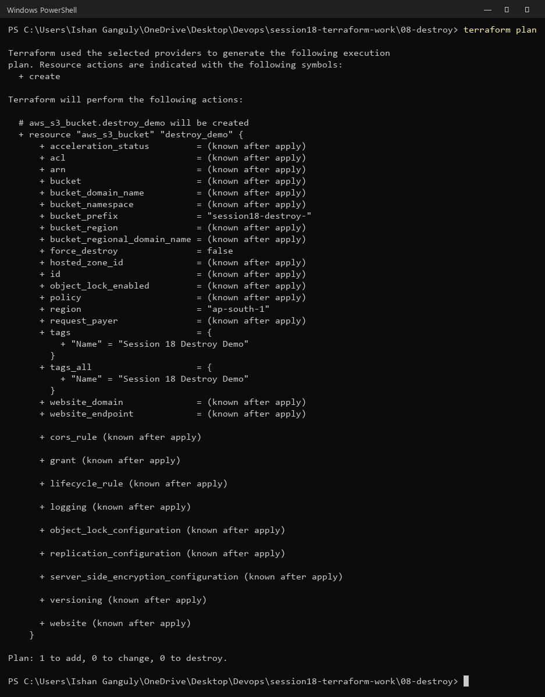

**Pending:** `terraform apply`, `terraform state list`, `terraform plan -destroy`, `terraform destroy` (`Destroy complete! Resources: 1 destroyed.`).

**Practice answers:**
1. **`plan` vs `apply`:** `plan` is read-only. It compares configuration, state and real infrastructure and *shows* what would change. `apply` *executes* those changes (after confirmation, or from a saved plan) and updates the state.
2. **What does `destroy` do?** It builds a destroy-mode plan for every resource in the state, asks for confirmation, then deletes those real resources and removes them from state.
3. **Why run `plan -destroy` first in production?** It is a dry run that lists exactly which resources would be deleted. That catches mistakes such as the wrong workspace, wrong account/region or an unexpectedly large state *before* anything irreversible happens. Deleted data such as bucket contents cannot be recovered.

## 9. State

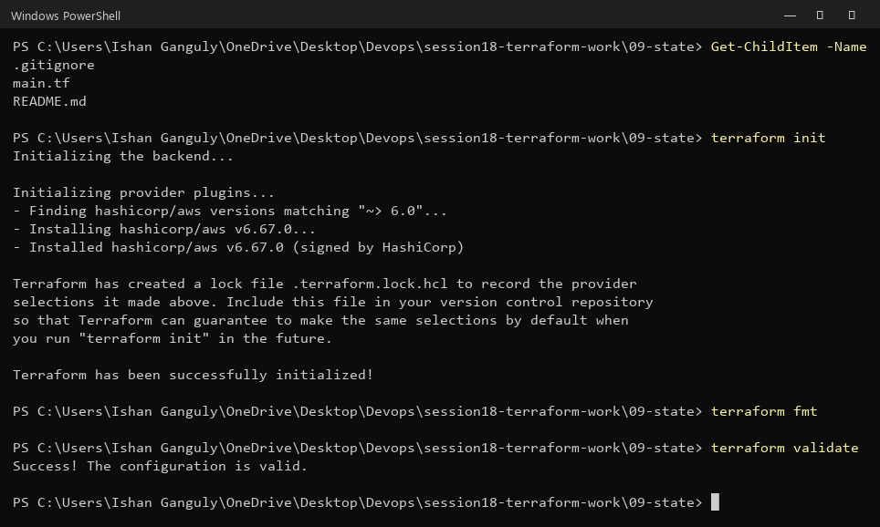

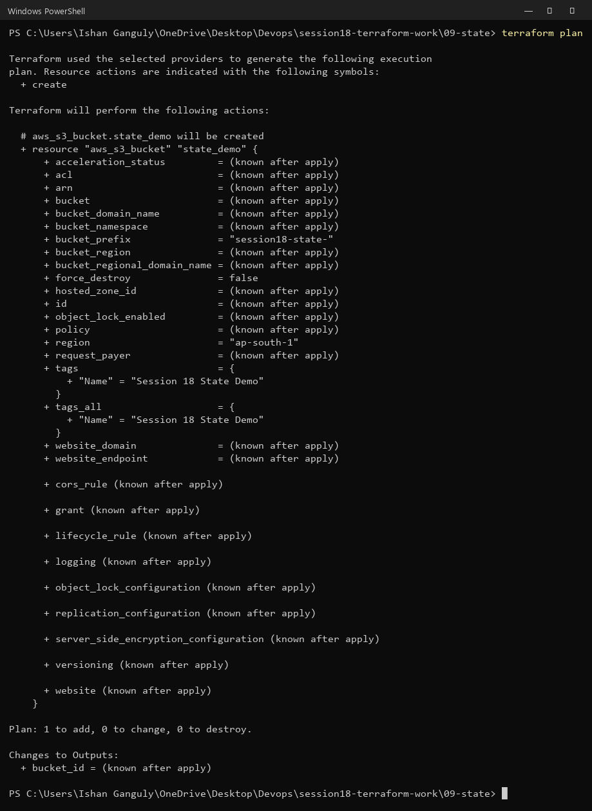

**Pending:** `terraform apply`, `terraform state list` (`aws_s3_bucket.state_demo`), `terraform state show aws_s3_bucket.state_demo`, `terraform state pull`, change a tag → `terraform plan` (`~ update in-place`) → apply → `terraform show`, `terraform destroy`, empty `terraform state list`.

Key points:
- State maps each resource address (`aws_s3_bucket.state_demo`) to the real object (the bucket ID). Without state, Terraform can't tell what it manages.
- **Never commit** `terraform.tfstate*`. It can contain sensitive values. Teams use a remote backend (e.g. S3 with locking) instead of a local file.
- **Never edit state by hand.** Use `terraform state` subcommands (`list`, `show`, `mv`, `rm`, `import`).

## 10. terraform-s3-demo (multi-file project)

```text
terraform.tf      required Terraform / provider versions
providers.tf      provider "aws" { region = var.aws_region }
variables.tf      aws_region, bucket_name (default "yatri1107")
main.tf           aws_s3_bucket.devops553 (force_destroy = true, tags)
outputs.tf        bucket_name, bucket_arn, bucket_region
```

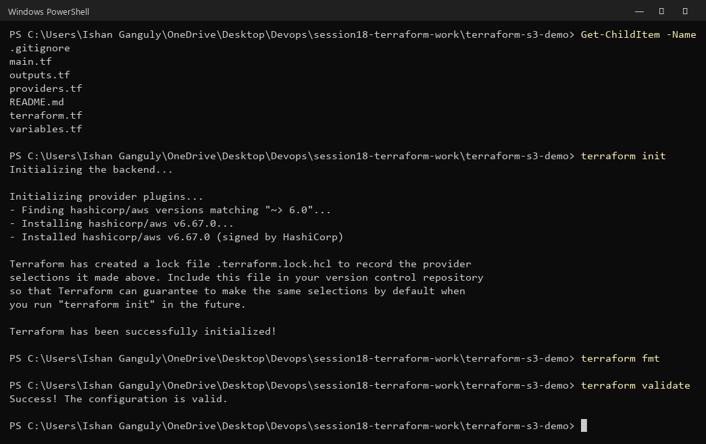

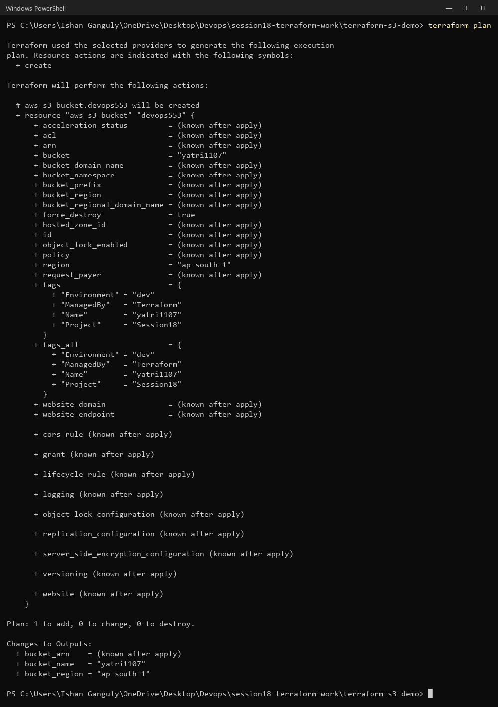

Issues found in this folder:

| Issue | Effect | Handling |
| :--- | :--- | :--- |
| The README uses `terraform state show aws_s3_bucket.demo` | The resource is actually named `aws_s3_bucket.devops553`, so the command would fail | Use `terraform state show aws_s3_bucket.devops553` |
| The README lists a `terraform.tfvars`, but the folder has none | `bucket_name` falls back to the default `yatri1107` | Create `terraform.tfvars` with your own name |
| `bucket_name` defaults to `yatri1107` | S3 bucket names are **globally unique**; if anyone already owns it, `apply` fails with `BucketAlreadyExists` | Use a unique name, e.g. `session18-demo-<account-id>` |

**Pending:** `terraform apply`, `terraform output`, `terraform state list`, `terraform state show aws_s3_bucket.devops553`, `aws s3api head-bucket`, `terraform plan -destroy`, `terraform destroy`.

## AWS account note

`terraform plan` works with the current AWS credentials, but every `apply` fails:

```text
Error: creating S3 Bucket (session18-iac-...): ... StatusCode: 403 ... AccessDenied:
User: arn:aws:iam::928417836223:user/terraform-student is not authorized to perform: s3:CreateBucket
... with an explicit deny in a service control policy:
arn:aws:organizations::542800097992:policy/o-ed97cd72mh/service_control_policy/p-u2e00eeh
```

A **Service Control Policy** (SCP) is set by the AWS Organization an account belongs to, and it overrides every IAM permission in that account. Account `928417836223` is a member of organization `o-ed97cd72mh`, managed by account `542800097992`, and that organization denies `s3:CreateBucket` in every region tested (`ap-south-1`, `us-east-1`, `us-west-2`, `eu-west-1`). Attaching `AmazonS3FullAccess` to the IAM user cannot override an SCP. The apply steps will be completed with credentials from an account that is not restricted by this organization.

## Key Learnings

- IaC turns infrastructure into reviewable, repeatable, version-controlled code.
- The workflow is `init → fmt → validate → plan → apply → destroy`; `plan` is always a safe, read-only preview.
- Providers are versioned plugins (`hashicorp/aws ~> 6.0` → 6.67.0), and the lock file pins the exact version.
- Variables make one configuration reusable across environments: `-var` beats `terraform.tfvars`, which beats the defaults.
- Outputs expose values for people, scripts and other modules.
- State is Terraform's source of truth for what it manages: keep it out of Git and never edit it by hand.
- Credentials belong in the AWS CLI configuration or environment, never in `.tf` files.
- IAM permissions are not the whole story: an organization's **SCP** can deny an action even when the IAM policy allows it.
