# Session 19 - Cloud Fundamentals & Terraform Networking

This assignment covers cloud service models, Regions and Availability Zones, and AWS networking (VPC, subnets, route tables, Internet Gateway, security groups). It then builds that network with Terraform: the VPC lab (06), the Terraform workflow (07) and the mini project (08).

> **How the labs were run:** `terraform init`, `fmt`, `validate` and `plan` ran against **real AWS** (account `014512981147`, region `ap-south-1`). The steps that create and delete resources (`apply`, `output`, `state`, AWS CLI checks, `destroy`) ran against **LocalStack**, a local AWS emulator. On the available AWS account, the IAM user has no EC2 permissions, and the account's AWS Organization blocks S3 bucket creation (see Session 18). The Terraform code and commands are unchanged; only the provider endpoint differs.

```text
Internet → Internet Gateway → Route Table (0.0.0.0/0 → IGW) → Public Subnet → Security Group → (EC2)
                                   VPC 10.0.0.0/16 · Region ap-south-1 · AZ ap-south-1a
```

## Prerequisites

All commands were run in **Windows PowerShell**.

| Tool | Version / note |
| :--- | :--- |
| Terraform | v1.16.5 |
| AWS provider | `hashicorp/aws` **v6.68.0** (matches `~> 6.0`) |
| AWS CLI | 2.33.27, region `ap-south-1` |
| LocalStack | `localstack/localstack:4.4` (community) with `SERVICES=s3,sts,ec2` |

The labs were run from working copies outside the `devops-heros` repository, so `.terraform/`, lock files, `terraform.tfvars` and state never end up in Git.

### LocalStack for apply / destroy

```powershell
docker run -d --name localstack -p 4566:4566 -e SERVICES=s3,sts,ec2 localstack/localstack:4.4
```

Each lab got an extra `override.tf`, which Terraform merges automatically, so the original `.tf` files stay unchanged. It points the AWS provider at LocalStack, using LocalStack's dummy `test` credentials:

```hcl
provider "aws" {
  access_key                  = "test"
  secret_key                  = "test"
  s3_use_path_style           = true
  skip_credentials_validation = true
  skip_metadata_api_check     = true
  skip_requesting_account_id  = true

  endpoints {
    ec2 = "http://localhost:4566"
    s3  = "http://localhost:4566"
    sts = "http://localhost:4566"
  }
}
```

The AWS CLI was pointed at LocalStack with `AWS_ENDPOINT_URL=http://localhost:4566`. LocalStack reports account `000000000000` and the `ap-south-1` Availability Zones `ap-south-1a/b/c`.

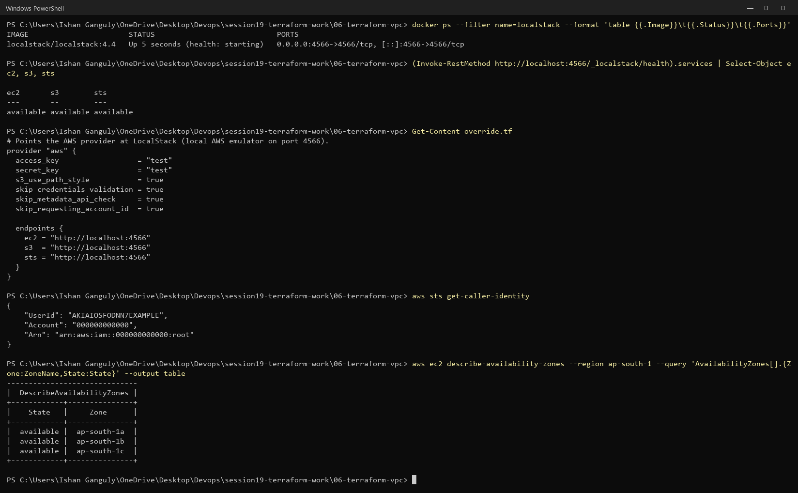

> `'yes' | terraform apply` pipes the confirmation into Terraform's `Enter a value:` prompt. It is the same as typing `yes` by hand.

## 1. Cloud Service Models

| Model | Cloud manages | You manage | Example |
| :--- | :--- | :--- | :--- |
| **IaaS** | Hardware, virtualisation, network, storage | OS, runtime, configuration, application | EC2, EBS, VPC |
| **PaaS** | Everything up to the runtime | Application code and data | Elastic Beanstalk, Azure App Service |
| **SaaS** | Almost everything | Your data and how you use it | Gmail, Google Docs, Microsoft 365 |

House analogy: IaaS is an empty rented house, PaaS is a furnished apartment, and SaaS is a hotel.

**Practice - classify:**

| Service | Model | Why |
| :--- | :--- | :--- |
| EC2 | IaaS | You get a virtual server and manage the OS and everything above it |
| Gmail | SaaS | You only use the finished application |
| Elastic Beanstalk | PaaS | You upload code; AWS runs the platform and servers |
| Google Docs | SaaS | You only use the finished application |
| Virtual Machine | IaaS | Raw compute you configure yourself |

The labs in this session use **IaaS** building blocks (VPC, subnet, security group).

## 2. Regions and Availability Zones

```powershell
aws configure get region
aws sts get-caller-identity
```

The CLI is configured for **`ap-south-1` (Mumbai)**, as IAM user `terraform-student` in account `014512981147`.

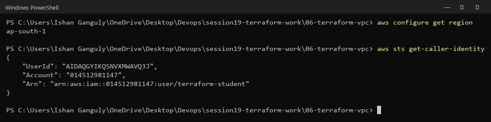

The LocalStack setup screenshot above lists the Region's AZs: `ap-south-1a`, `ap-south-1b`, `ap-south-1c`.

**Practice answers:**
1. **Is an AZ bigger than a Region?** No. A **Region** is a geographic area (like a city), and an **AZ** is one isolated location inside it. Region > AZ.
2. **Can one Region contain multiple AZs?** Yes. `ap-south-1` has three: `ap-south-1a`, `-1b`, `-1c`.
3. **Why use multiple AZs?** Fault isolation. If one AZ has a power, network or hardware problem, servers in the other AZs keep the application running. That is the basis of high availability.
4. **Is a subnet tied to a Region or an AZ?** A subnet lives in **exactly one AZ** (here `availability_zone = "${var.aws_region}a"` → `ap-south-1a`). The VPC is regional and spans all AZs.

## 3. VPC and Subnets

```text
VPC 10.0.0.0/16  (65,536 addresses, regional)
 ├── Public subnet  10.0.1.0/24  (256 addresses, ap-south-1a)
 └── Private subnet 10.0.2.0/24  (no route to an Internet Gateway)
```

The VPC and subnet built in labs 06 and 08 were verified with the AWS CLI (see [6. Terraform VPC Lab](#6-terraform-vpc-lab)).

**Practice answers:**
1. **What is a VPC?** A Virtual Private Cloud: your own logically isolated private network inside AWS, with its own IP range, subnets, routing and security rules.
2. **What is a subnet?** A smaller IP range carved out of the VPC, placed in one AZ. Resources such as EC2 instances are launched into subnets.
3. **Can a subnet be larger than its VPC?** No. A subnet's CIDR must fit inside the VPC's CIDR (`10.0.1.0/24` ⊂ `10.0.0.0/16`).
4. **What does `10.0.0.0/16` represent?** A private IPv4 range where the first 16 bits (`10.0`) are fixed and the last 16 bits vary: `10.0.0.0`–`10.0.255.255`, 65,536 addresses.
5. **Public vs private subnet?** A **public** subnet's route table has a route `0.0.0.0/0 → Internet Gateway`, so resources with public IPs can reach and be reached from the internet. A **private** subnet has no such route, so it is used for databases and internal services.

## 4. Route Tables and Internet Gateway

A **route table** says *where* traffic goes; an **Internet Gateway** connects the VPC to the internet. Creating an IGW alone doesn't make a subnet public. The subnet also needs a route table with `0.0.0.0/0 → igw-…` **associated** with it.

The mini project's route table, read back with the AWS CLI:

```text
Destination     Target
10.20.0.0/16    local                    (traffic inside the VPC stays inside)
0.0.0.0/0       igw-30eab47f6238367a4    (everything else → Internet Gateway)
```

**Practice - explain the path `Laptop → Internet → IGW → Route Table → Public Subnet → EC2`:** A request from the laptop crosses the internet to the instance's public IP. The **Internet Gateway** brings it into the VPC and maps the public IP to the instance's private IP. The VPC routes it to the **public subnet** where the instance runs. The reply goes back the other way: the subnet's **route table** sends `0.0.0.0/0` traffic to the IGW, and the IGW sends it out to the laptop.

**Why a route table doesn't replace a security group:** the route table only decides **where** packets *can* go; it never allows or denies them. Without a security group, there would be no control over **which** ports and sources may reach the instance. A route to the internet plus an open security group exposes everything. Route table = *where?*, security group = *allowed?*.

## 5. Security Groups

The labs' web security group, read back with the AWS CLI:

```text
Cidr        FromPort   Protocol   ToPort
0.0.0.0/0   80         tcp        80      (HTTP)
0.0.0.0/0   443        tcp        443     (HTTPS)
egress: all protocols to 0.0.0.0/0
```

SSH (22) is deliberately **not** opened.

**Practice answers:**
1. **What does a security group do?** It is a stateful virtual firewall attached to resources such as EC2 instances. It lists which traffic is allowed in and out, and everything else is denied.
2. **Inbound rule:** allows traffic *to* the resource (here TCP 80 and 443 from anywhere).
3. **Outbound rule:** allows traffic *from* the resource (here all IPv4 traffic, so the server can download updates).
4. **Why is `0.0.0.0/0` risky for SSH?** It lets the whole internet try to log in, which invites constant brute-force and exploit attempts. Restrict port 22 to a trusted IP, or use a bastion or AWS Systems Manager Session Manager instead.
5. **Security group vs route table:** a route table decides *where* traffic is sent; a security group decides *whether* traffic is allowed. Security groups are **stateful**: if a request is allowed in, its response is automatically allowed back out.

## 6. Terraform VPC Lab

Six resources: `aws_vpc.main`, `aws_subnet.public`, `aws_internet_gateway.main`, `aws_route_table.public`, `aws_route_table_association.public`, `aws_security_group.web`.

### Steps 1–4: tfvars, init, fmt, validate (real AWS)

```powershell
Copy-Item terraform.tfvars.example terraform.tfvars    # aws_region = "ap-south-1"
terraform init
terraform fmt
terraform validate
```

`init` installed `hashicorp/aws v6.68.0`, and `validate` printed `Success! The configuration is valid.`

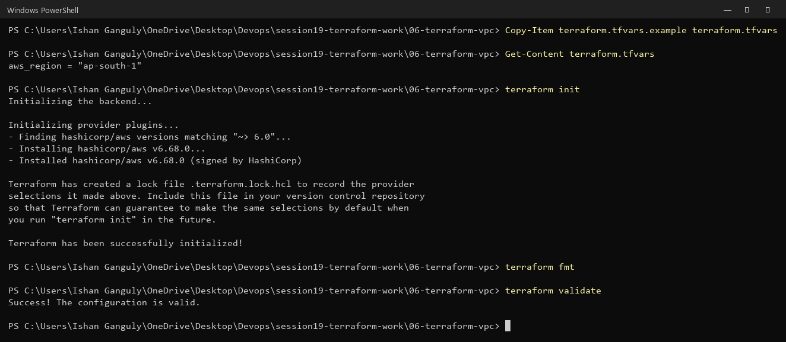

### Step 5: plan (real AWS)

```powershell
terraform plan
```

**`Plan: 6 to add, 0 to change, 0 to destroy.`** The plan shows the VPC (`10.0.0.0/16`, DNS support and hostnames enabled), the subnet (`10.0.1.0/24` in `ap-south-1a`, `map_public_ip_on_launch = true`), the IGW, the route table with `0.0.0.0/0`, the association, and the security group with ports 80/443.

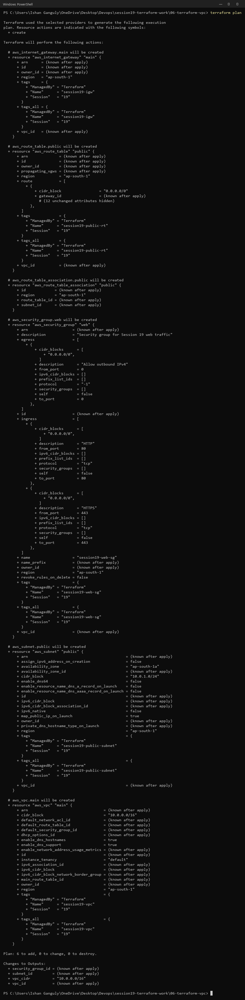

### Step 6: apply

```powershell
'yes' | terraform apply
```

Terraform created the resources in dependency order: VPC first, then IGW, subnet and security group, then the route table and finally the association. Result: **`Apply complete! Resources: 6 added, 0 changed, 0 destroyed.`**

> The lab README's example says "5 added", but the configuration has **6** resources, and its own `state list` and destroy sections also list 6.

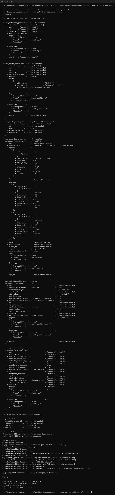

### Steps 7–8: state and outputs

```powershell
terraform state list
terraform output
```

```text
aws_internet_gateway.main
aws_route_table.public
aws_route_table_association.public
aws_security_group.web
aws_subnet.public
aws_vpc.main

security_group_id = "sg-4279ad5ff6b2c591f"
subnet_id         = "subnet-5f9f05af6f48e65d7"
vpc_cidr          = "10.0.0.0/16"
vpc_id            = "vpc-7a26a343ab157f772"
```

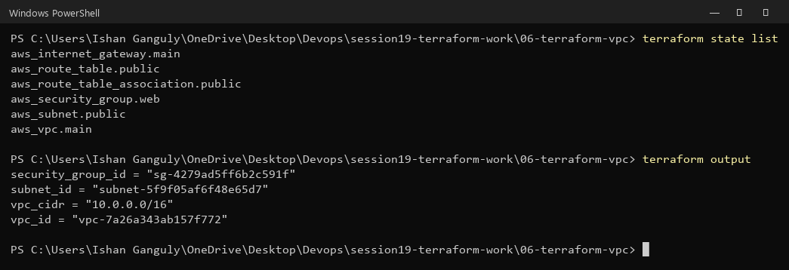

### Step 9: verify with the AWS CLI

```powershell
aws ec2 describe-vpcs --filters Name=tag:Name,Values=session19-vpc --query 'Vpcs[].{VpcId:VpcId,Cidr:CidrBlock,State:State}' --output table
aws ec2 describe-subnets --filters Name=tag:Name,Values=session19-public-subnet --query 'Subnets[].{SubnetId:SubnetId,Cidr:CidrBlock,AZ:AvailabilityZone,PublicIp:MapPublicIpOnLaunch}' --output table
aws ec2 describe-route-tables --filters Name=tag:Name,Values=session19-public-rt --query 'RouteTables[].Routes[].{Destination:DestinationCidrBlock,Target:GatewayId}' --output table
aws ec2 describe-security-groups --filters Name=group-name,Values=session19-web-sg --query 'SecurityGroups[].IpPermissions[].{FromPort:FromPort,ToPort:ToPort,Protocol:IpProtocol,Cidr:IpRanges[0].CidrIp}' --output table
```

> In PowerShell, the README's Bash line-continuation `\` doesn't work, so each command is on one line, and the filters are written without the inner double quotes.

The VPC is `available` with `10.0.0.0/16`, the subnet is `10.0.1.0/24` in `ap-south-1a` with public IPs on launch, the route table has `0.0.0.0/0 → igw-9e32d217f19feccf6`, and the security group allows 80/443.

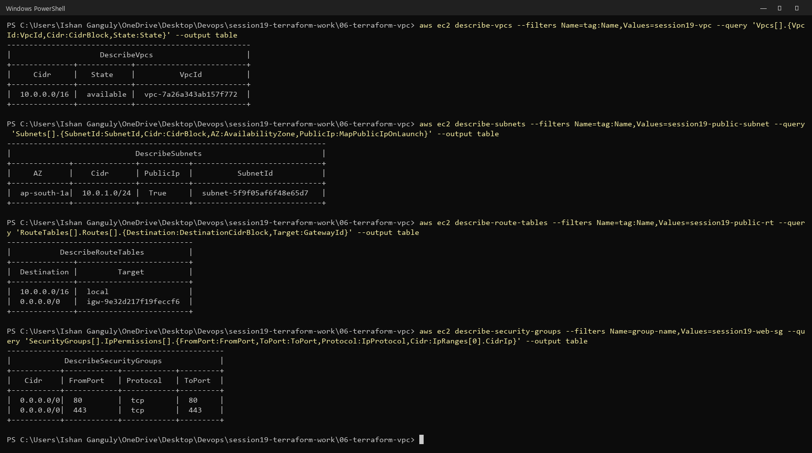

### Student exercise: change the CIDR

`10.0.0.0/16` → `10.10.0.0/16` and `10.0.1.0/24` → `10.10.1.0/24`, then:

```powershell
terraform fmt
terraform validate
terraform plan
```

```text
~ cidr_block = "10.0.0.0/16" -> "10.10.0.0/16"   # forces replacement
~ cidr_block = "10.0.1.0/24" -> "10.10.1.0/24"   # forces replacement
~ vpc_id     = "vpc-7a26a343ab157f772" -> (known after apply)   # forces replacement
Plan: 5 to add, 1 to change, 5 to destroy.
```

A VPC's CIDR **cannot be changed in place**, so Terraform must destroy and recreate the VPC. Everything that references `vpc_id` (subnet, IGW, route table, security group) is replaced with it, and the association is recreated. Only the IGW attachment is updated in place. On a real network, this means downtime and new IDs for everything. This is exactly why the README says *"Do not apply until you understand what Terraform plans to change."* The change was **not applied**, and `main.tf` was reverted.

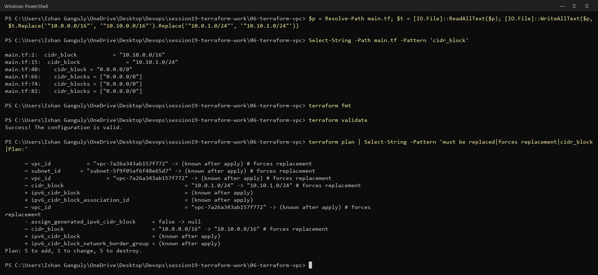

### Step 10: destroy

```powershell
terraform plan -destroy
'yes' | terraform destroy
terraform state list
```

`Plan: 0 to add, 0 to change, 6 to destroy.` Terraform deleted the resources in reverse dependency order: association and security group first, the VPC last. Result: **`Destroy complete! Resources: 6 destroyed.`** `terraform state list` is now empty.

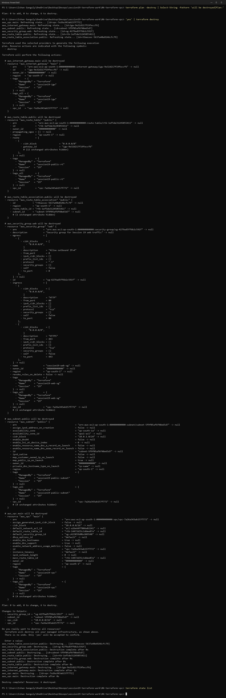

## 7. Terraform Workflow

The demo creates one S3 bucket (`bucket_prefix = "session19-workflow-"`).

```powershell
terraform init
terraform fmt
terraform validate
terraform plan        # Plan: 1 to add, 0 to change, 0 to destroy. (real AWS)
```

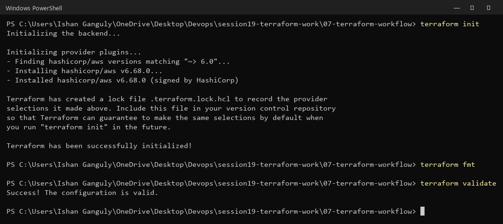

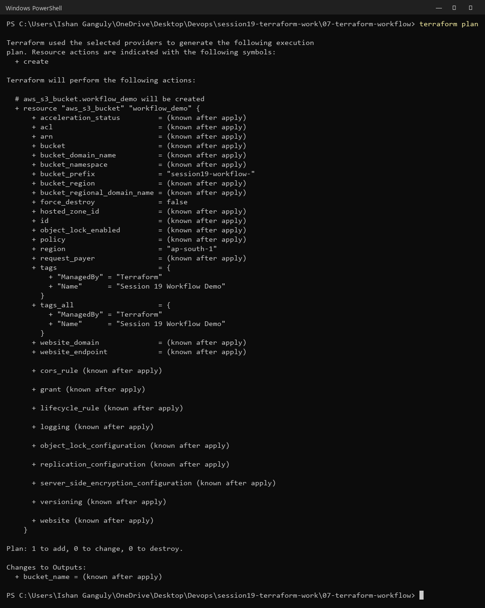

```powershell
'yes' | terraform apply
terraform output       # bucket_name = "session19-workflow-ec1a88d29c5d90d1c769586ac9"
terraform state list   # aws_s3_bucket.workflow_demo
'yes' | terraform destroy
```

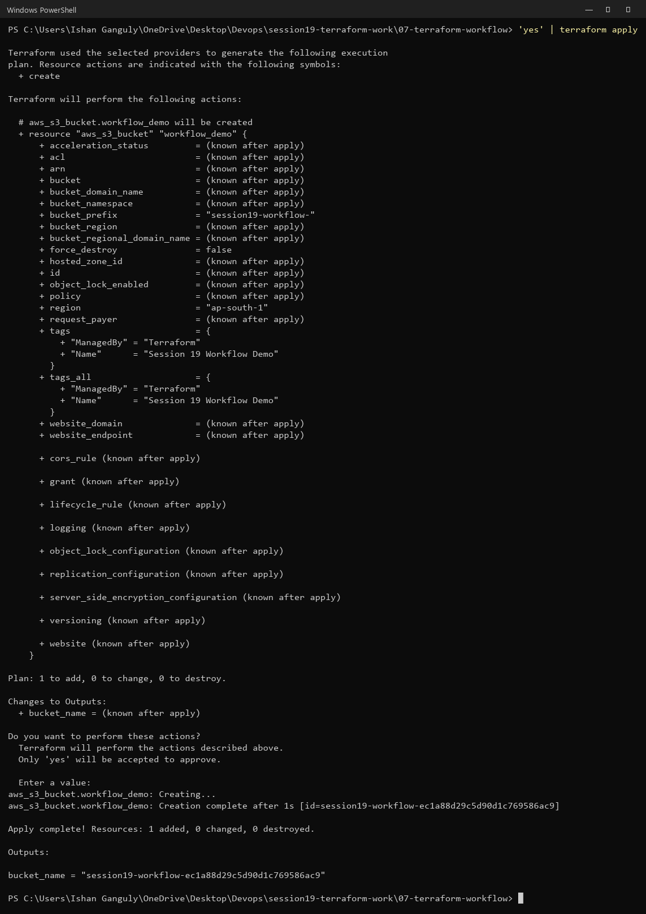

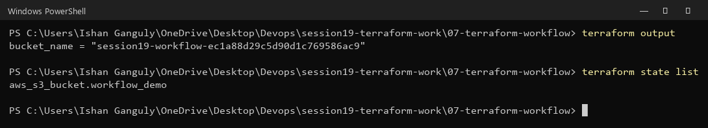

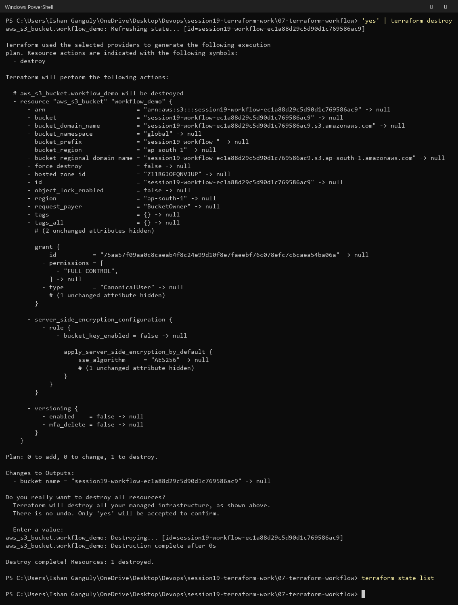

**Practice answers:**

| Question | Command |
| :--- | :--- |
| 1. Downloads providers | `terraform init` |
| 2. Formats code | `terraform fmt` |
| 3. Checks syntax and consistency | `terraform validate` |
| 4. Shows changes without applying | `terraform plan` |
| 5. Creates resources | `terraform apply` |
| 6. Removes resources | `terraform destroy` |

## 8. Mini Project

Requirements: VPC `10.20.0.0/16`, public subnet `10.20.1.0/24`, IGW, public route table, association, and web security group, named `session19-mini-*`.

```powershell
Copy-Item terraform.tfvars.example terraform.tfvars
terraform init
terraform fmt
terraform validate
```

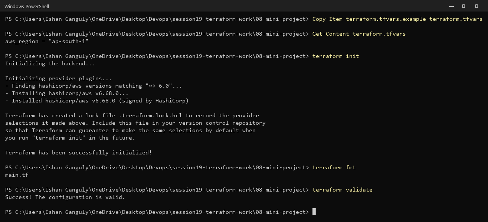

```powershell
terraform plan        # Plan: 6 to add, 0 to change, 0 to destroy. (real AWS)
```

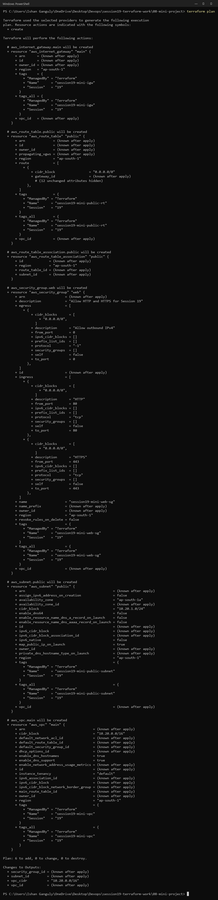

```powershell
'yes' | terraform apply   # Apply complete! Resources: 6 added, 0 changed, 0 destroyed.
```

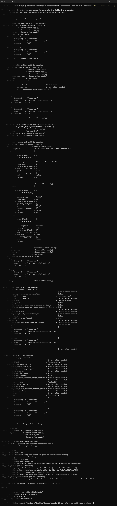

### Verify

```powershell
terraform state list
terraform output
```

All six resources are in state, and the outputs show `vpc_cidr = "10.20.0.0/16"`.


All four AWS CLI checks from the README (VPC, subnet, route table, security group):

| Check | Result |
| :--- | :--- |
| VPC `session19-mini-vpc` | `vpc-1a54140be5598537f`, `10.20.0.0/16`, `available` |
| Subnet `session19-mini-public-subnet` | `subnet-45a54359b5dcbc505`, `10.20.1.0/24`, `ap-south-1a`, public IP on launch |
| Route table `session19-mini-public-rt` | `10.20.0.0/16 → local`, `0.0.0.0/0 → igw-30eab47f6238367a4` |
| Security group `session19-mini-web-sg` | TCP 80 and 443 from `0.0.0.0/0` |

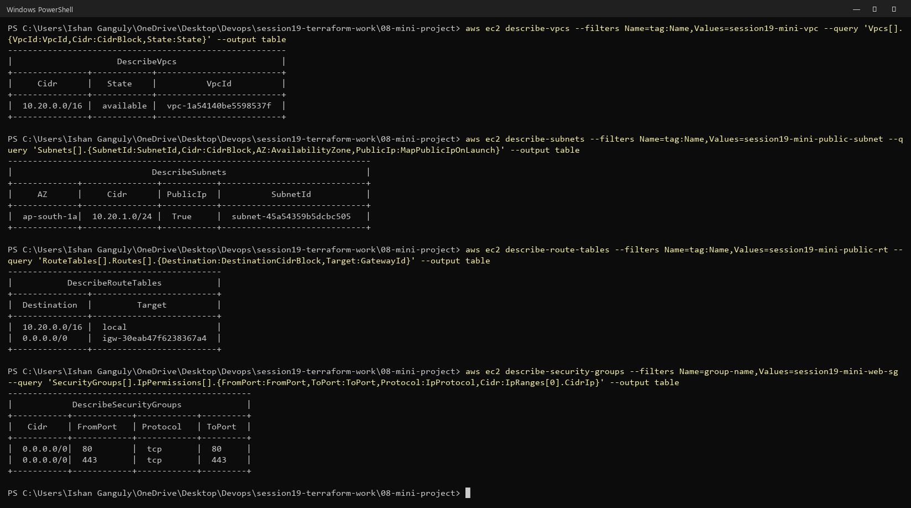

### Cleanup

```powershell
terraform plan -destroy
'yes' | terraform destroy   # Destroy complete! Resources: 6 destroyed.
terraform state list        # (empty)
```

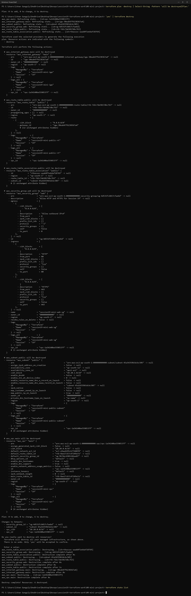

### Optional extension: EC2 (questions)

1. **Which subnet should the EC2 instance use?** The **public subnet** (`aws_subnet.public.id`), because it is the one routed to the Internet Gateway.
2. **Which security group?** The **web security group** (`aws_security_group.web.id`), via `vpc_security_group_ids`.
3. **Why does a public subnet need a route to the IGW?** Without `0.0.0.0/0 → IGW` in its route table, traffic has no path between the subnet and the internet, so the subnet is effectively private even if an IGW exists.
4. **What else makes an instance reachable from the internet?** A **public IPv4 address** (from `map_public_ip_on_launch = true` or an Elastic IP), a security group rule allowing the port, the network ACL allowing the traffic (the default allows all), and a service actually listening on that port inside the OS (plus no OS firewall blocking it).
5. **Why not open SSH to `0.0.0.0/0`?** It exposes the login port to the whole internet, inviting automated brute-force attacks. Allow port 22 only from your own IP, or use Session Manager with no inbound SSH at all.

### Interview questions

| Topic | Answer |
| :--- | :--- |
| IaaS vs PaaS vs SaaS | IaaS rents raw infrastructure (you manage the OS and up); PaaS runs your code on a managed platform; SaaS is finished software you just use |
| Region vs AZ | A Region is a geographic area; an AZ is an isolated location inside it. One Region has several AZs |
| VPC vs subnet | A VPC is your private network for a Region; a subnet is a smaller range inside it, in one AZ |
| Public vs private subnet | Public = route `0.0.0.0/0 → IGW`; private = no direct internet route |
| Route table | Rules deciding where traffic from a subnet is sent (`local`, IGW, NAT, …) |
| Internet Gateway | The VPC component that connects the VPC to the internet |
| Security group | A stateful firewall on a resource, allowing specific inbound/outbound traffic |
| Terraform | An IaC tool: declare resources in HCL, and Terraform plans and applies the API calls |
| `plan` vs `apply` | `plan` previews changes (read-only); `apply` executes them and updates state |
| `terraform state` | Terraform's record mapping resource addresses to real resource IDs |
| `terraform destroy` | Deletes everything in the state, after showing a destroy plan and asking for confirmation |

## Key Learnings

- IaaS gives the most control and the most responsibility; VPC, subnets and security groups are IaaS building blocks.
- A VPC is regional, but a subnet lives in exactly one AZ; use several AZs for high availability.
- A subnet is "public" only because of its **route** (`0.0.0.0/0 → IGW`), not because an IGW exists.
- Route table = *where traffic goes*; security group = *whether traffic is allowed* (and it is stateful).
- Terraform creates resources in dependency order and destroys them in reverse.
- Some arguments, such as a VPC's CIDR, **force replacement**. Always read the plan before applying.
- An IAM user needs the right service permissions (here EC2/VPC) as well as an unrestricted account; `plan` for new resources can still run without them.
